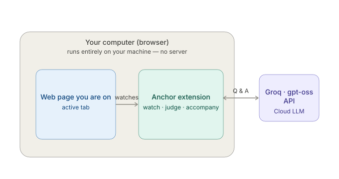
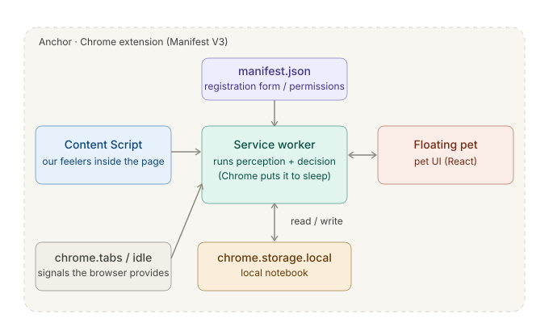
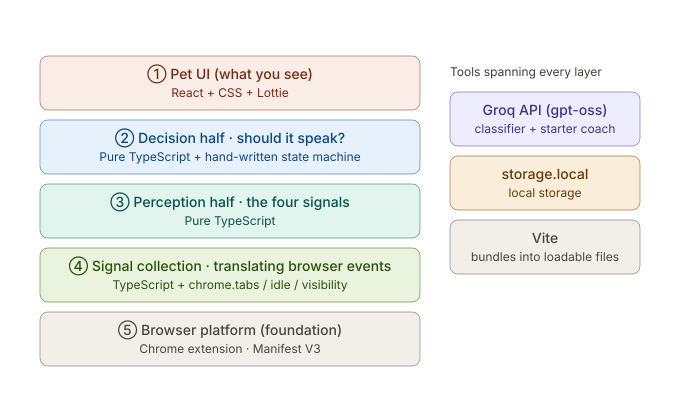

# Anchor

> A focus companion that notices when you drift — and gently pulls you back.

Anchor is a Chrome extension (Manifest V3). A small floating cat lives on whatever page you're reading, watches for the *shape* of drifting, and asks one gentle question when it's confident enough. It also helps you **start**: tell it what you're working on and it hands you one physical first action.

There is no server. Everything lives in `chrome.storage.local`. The only data that ever leaves your machine is a page title and your task sentence, sent to an LLM for a relevance verdict — see [Privacy](#privacy).

---

## Quick start (for reviewers)

**Requirements:** Node.js 20 or newer, Google Chrome (or any Chromium 116+).

```bash
git clone https://github.com/Joyyinred/Anchor.git
cd Anchor
npm install
npm run build
```

This produces a `dist/` folder. Then:

1. Open `chrome://extensions/`
2. Turn on **Developer mode** (top right)
3. Click **Load unpacked** and select the `dist/` folder
4. Open any website (e.g. a docs page or a YouTube video) — a cat appears in the bottom-right corner

That's enough to see the pet, the starter coach, check-ins, rest mode and the session summary. **You do not need an API key to run it** — every LLM call has a local fallback (see below). The key just makes the answers smarter.

### Optional: add a Groq API key (recommended for the full experience)

Anchor uses [Groq](https://console.groq.com) (free tier is plenty) for two things: judging whether a page is relevant to your task, and generating the starter coach's first action.

1. Get a free key at https://console.groq.com
2. Go to `chrome://extensions/` → Anchor → click **service worker** (opens the extension's console)
3. Paste and run:

```js
chrome.storage.local.set({ anchor_groq_api_key: 'gsk_your_key_here' })
```

Without a key: relevance classification falls back to a built-in blacklist plus a conservative `UNKNOWN`, and the starter coach falls back to a fixed first action. Nothing breaks — that's a design rule ([`docs/division-of-work.md` §5](docs/division-of-work.md), red line #2: *the LLM never blocks the engine, and every LLM path has a local fallback*).

### Optional: demo mode (30× faster)

Real thresholds are measured in minutes (5 min to confirm a drift, 15 min to suspect you're stuck, 15 min before a rest reminder). For a demo, compress every time constant 30×:

```js
chrome.storage.local.set({ anchor_demo_mode: true })
```

A five-minute drift now plays out in about ten seconds. Set it back to `false` to return to real timing. All scaling goes through a single function (`scaled()` in [`src/engine/types.ts`](src/engine/types.ts)) — nothing else in the codebase knows about the multiplier.

---

## How to use it

1. **Declare a task.** The first time the cat appears, it asks what you're working on. Type something like *"study neural networks"* or *"finish chapter 3 of the React docs"*. If it's too vague to ever judge pages against, it asks **one** follow-up — never more.
2. **Get a first step.** It replies with one physical action (*"Press play on the video you already have open"*). Click **Let's go**.
3. **Work.** The cat sits quietly. Hover over it for **Take a break** / **Done for today**; hover over the anchor badge by its ear to see how long you've been focused.

   Working with an AI assistant? On claude.ai, Anchor also reads your **latest message** — so if the conversation drifts from "neural networks" to "what's for dinner", the cat notices even though the tab never changed. (Only your most recent message, only on listed AI-chat sites — see [Privacy](#privacy).)
4. **When you drift**, a bubble appears with three options:
   - **Still on track** — clears this round of evidence
   - **This counts as work** — whitelists that page for the rest of the session
   - **Drifted — pull me back** — switches you back to the tab you left
5. **When you're stuck** (on the right page, no input for 15 min): *Deep in thought* / *Drifted — pull me back*.
6. **Take a break** silences everything until *you* click **Back to it**. After 15 minutes it checks in softly, with a **5 more minutes** option.
7. **Done for today** shows a short summary — how long, how many check-ins, how many breaks — and resets for the next session.

The side panel (click the toolbar icon) shows the same UI, and works on pages where an extension can't inject (`chrome://`, the Web Store, PDFs).

---

## Development

```bash
npm test              # 316 unit tests, offline, no Chrome needed
npm run typecheck     # two tsconfigs: engine (no DOM/chrome) and platform
npm run build         # production build → dist/
npm run dev           # Vite dev server (for the component preview below)
```

**Component preview** (all pet states, check-in variants, summary screens, side by side):

```bash
npm run dev
# then open http://localhost:5173/src/devpreview/index.html
```

**Starter-coach eval harness** — 17 fixed tasks, 13 mechanical checks, an action-shape distribution, run against the *production* prompt. Requires a Groq key in the environment (it hits the real API; it is deliberately not part of `npm test`):

```bash
export GROQ_API_KEY=gsk_...      # PowerShell: $env:GROQ_API_KEY = "gsk_..."
npm run eval:coach
npm run eval:coach -- --runs 3   # run the set three times to see variance
```


### Where the logs are

Two separate consoles:

- **Service worker** (`chrome://extensions/` → Anchor → *service worker*): signal frames, detection results, classification, starter coach.
- **The page's own console** (F12 on the website): content-script injection, the floating pet, chat-snippet extraction.

An error in one will never show up in the other.

---

## Architecture

Anchor is **not** an app with a server behind it — almost everything runs on your own machine. Two halves, one seam.



```
Chrome APIs ──► perception (A) ──► FeatureFrame ──► decision (B) ──► pet / bubble
  tabs, idle,     signals.ts         (the contract)    detector.ts        cat.tsx
  content script  perceiver.ts                          pet-state.ts       AnchorApp.tsx
                  classifier.ts                         wording.ts
```

- **Perception** collects four signals — context relevance, anchor detachment, interaction texture, jump pattern — into a `FeatureFrame`.
- **Decision** runs two independent channels, **DRIFT** and **STUCK**, on evidence *sustainers*: a channel fires only when its condition has held continuously for a 30-second window. After a check-in there's a cooldown, and evidence from before it is discarded.
- **The engine** (`src/engine/`) is pure TypeScript with no Chrome or DOM dependency, so it's fully unit-tested against recorded signal streams (`src/mock/`).
- **The floating pet** renders into a Shadow DOM on the host page; the side panel renders the same React tree. Neither host contains logic.

### Inside the extension



A Manifest V3 extension isn't one blob — several parts, separate jobs:

- **Service worker** (`src/platform/background/`) — the brain; both halves of the engine run here. Chrome puts it to sleep after ~30 s of idle and wakes it on demand, so every piece of state that matters is written to `chrome.storage.local` and re-hydrated on wake. (`Infinity` doesn't survive that round-trip through JSON — see the rest-mode note in [`contract-v4.md` §3.8](docs/contract-v4.md#38-rest-mode).)
- **Content script** (`src/platform/content/`) — injected into every page: reports keystrokes/scrolling/video play-pause (the *texture* signal), extracts your latest message on AI-chat sites, and mounts the floating cat.
- **The floating pet** — a Shadow DOM island on the host page: draggable, remembers its position, and clicks pass through everywhere the cat isn't standing.
- **Side panel** — the same React tree, kept as a fallback for pages an extension can't inject into (`chrome://`, the Web Store, PDFs).
- `chrome.tabs` / `chrome.idle` / `chrome.alarms` / `chrome.storage.local` — which tab is active, whether the system is idle, a one-minute heartbeat, and a local store that survives restarts.

### The stack



- **TypeScript everywhere** — the contract's `interface`s are enforced at compile time; pass the wrong field and the build fails.
- **Pure-TypeScript engine** — perception and decision touch no Chrome API, data in and data out, which is what makes 316 offline unit tests possible and let two people build both halves in parallel without surprises.
- **React + plain CSS + Lottie**, no Tailwind or component library. The cat runs on the `lottie_light` build, since MV3's CSP forbids the `eval()` the full build uses.
- **A 100-line hand-written state machine** (`pet-state.ts`) for the pet's three moods — XState was considered and dropped as overkill.
- **Vite + `@crxjs/vite-plugin`** compiles everything Chrome can load: `npm run build` → `dist/` → *Load unpacked*.

### What each feature relies on

| What you see | How it works | Built with |
|---|---|---|
| It knows which page you're on | Tab activation / navigation events | `chrome.tabs`, `chrome.webNavigation` |
| It knows you've walked away | System idle state | `chrome.idle` |
| It knows whether you're typing or scrolling | Content script listens to the page | Content script + Page Visibility |
| It decides whether a page is relevant | Domain + path + title (+ latest chat message on AI sites) → LLM → cached | Groq `gpt-oss-20b` + `storage.local` |
| "How long since you touched the anchor" | A timestamp in the perception half, reset on real interaction | Pure TypeScript |
| Whether to speak at all | Two channels (DRIFT / STUCK), each needing 30 s of sustained evidence, gated by cooldown, grace period and rest | Pure TypeScript (`detector.ts`) |
| A check-in that sounds like a friend | Templated wording with variant rotation, regex-tested against lecturing words | Pure TypeScript (`wording.ts`) — **not** an LLM |
| "Pull me back" actually switching tabs | `chrome.tabs.update` on the tab the anchor snapshot came from | `chrome.tabs` |
| One physical first step to start | One LLM call with the task + open page; falls back to a fixed step | Groq `gpt-oss-120b` |
| The cat's three moods | State machine over the evidence sustainers | `pet-state.ts` + CSS |
| "This counts as work" is remembered | Written to the session whitelist (per-page on mixed-content sites like YouTube) | `storage.local` |
| Still sane when offline | Built-in entertainment blacklist; everything else stays `UNKNOWN` | A constant table |
| Prompt changes are measured, not eyeballed | 17 fixed tasks, 13 mechanical checks, action-shape distribution | `evals/` (Groq, not part of `npm test`) |

**One honest caveat:** Groq is called directly from the client, which exposes the API key. A shipped product would put a small relay in front of it; for a hackathon the key lives in `chrome.storage.local`, pasted in by the user — and the extension works with no key at all.

### Project layout

```
Anchor/
├── manifest.json                  MV3 manifest — permissions, entry points
│
├── src/
│   ├── engine/                    Pure TypeScript, zero Chrome/DOM imports — fully unit-tested
│   │   ├── types.ts                 FeatureFrame / SessionContext / SignalPolicy — the core contract
│   │   ├── perceiver.ts             raw signals → FeatureFrame (the four-signal computation)
│   │   ├── detector.ts              FeatureFrame → DRIFT / STUCK (the sustained-evidence state machine)
│   │   ├── coach.ts                 starter-coach task parsing — local fallback + validation
│   │   ├── wording.ts               every user-facing string: check-ins, coach replies, summaries
│   │   ├── pet-state.ts             the pet's own state machine (idle / observing / checking-in / resting…)
│   │   └── *.test.ts                316 tests, offline, run against recorded signal streams
│   │
│   ├── platform/                  Chrome APIs + DOM — not unit-tested, verified on real devices
│   │   ├── background/
│   │   │   ├── index.ts             service-worker entry point, wires up every message listener
│   │   │   ├── frame-pipeline.ts    SignalEvents → frames; applies check-in answers; writes the whitelist
│   │   │   ├── classifier.ts        relevance-classification call (gpt-oss-20b)
│   │   │   ├── starter-coach.ts     task-breakdown call (gpt-oss-120b)
│   │   │   ├── groq.ts              shared Groq API wrapper both LLM calls go through
│   │   │   ├── heuristics.ts        domain lists — blacklist, mixed-content domains, AI-chat sites
│   │   │   ├── pull-back.ts         "Drifted — pull me back" tab-switching logic
│   │   │   └── rest.ts, session.ts, onboarding.ts, session-summary.ts, panel.ts, state.ts
│   │   ├── content/
│   │   │   ├── content-script.ts    injected into every page — captures interaction signals
│   │   │   ├── mount-floating.ts    mounts the floating pet into a Shadow DOM
│   │   │   └── chat-sites.ts        AI-chat message extraction (claude.ai selectors, etc.)
│   │   └── messages.ts            every message type crossing the content-script ↔ service-worker seam
│   │
│   ├── pet/
│   │   ├── cat.tsx                  the floating pet component
│   │   ├── assets/cat.json          the Lottie animation ("Kitty Cat Error 404")
│   │   └── types.ts                 pet-facing types — check-in answers, channels
│   │
│   ├── sidepanel/                 side-panel entry point — onboarding + session-summary screens
│   ├── ui/AnchorApp.tsx           shared React tree rendered by both the pet bubble and the side panel
│   ├── devpreview/                standalone preview of every pet state side by side (npm run dev)
│   └── mock/                      recorded SignalEvent / FeatureFrame streams the engine tests replay
│
├── evals/                         starter-coach prompt eval harness — hits the real Groq API
├── docs/                          design docs, submission write-up, pitch deck (see table below)
└── updateNote/updateNote.md       day-by-day engineering log — every bug found, and how
```

Full design docs (reconciled against the final code):

| Doc | What it covers |
|---|---|
| [`docs/contract-v4.md`](docs/contract-v4.md) | The contract: signal definitions, thresholds, both detection channels, rest mode, privacy — every number checked against the code |
| [`docs/product-plan.md`](docs/product-plan.md) | The product thesis, detection principles, scope and roadmap |
| [`docs/division-of-work.md`](docs/division-of-work.md) | Division of work, the five red lines |


---

## Privacy

- **No server.** State, session history and your API key stay in `chrome.storage.local`.
- **What is sent to the LLM:** your task sentence, the current page's title and URL, and — only on AI-chat sites like claude.ai / chatgpt.com — your most recent message in that chat (so Anchor can tell when the *conversation* drifts, not just the tab). Never full page content, never browsing history.
- **Permissions used:** `tabs`, `idle`, `storage`, `alarms`, `webNavigation`, `sidePanel`; host access on all URLs to inject the pet.

---

## Credits

The cat is *Kitty Cat Error 404* by [Sepehr Radfar](https://lottiefiles.com/free-animation/kitty-cat-error-404-fvL7jDNahz) (LottieFiles, Lottie Simple License). The original file is unmodified; the license text is in [`src/pet/assets/LICENSE.md`](src/pet/assets/LICENSE.md).

LLM inference via [Groq](https://groq.com) (`openai/gpt-oss-20b` for classification, `openai/gpt-oss-120b` for the starter coach).