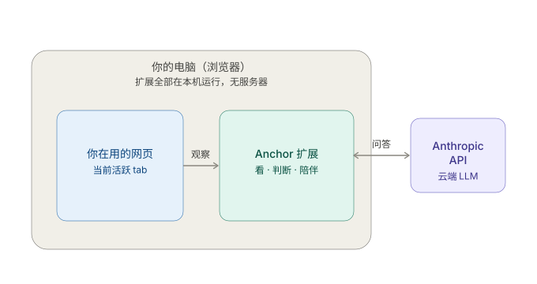
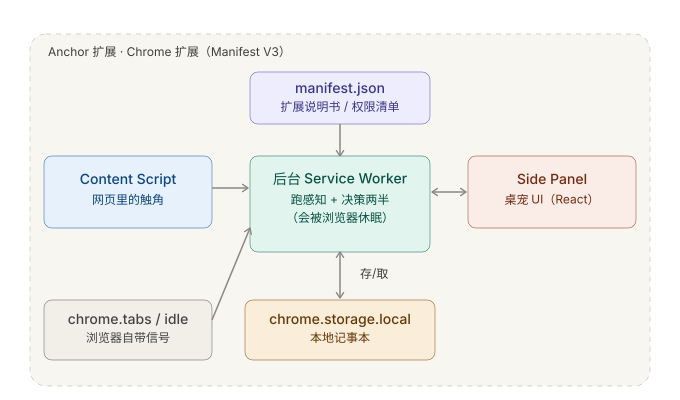
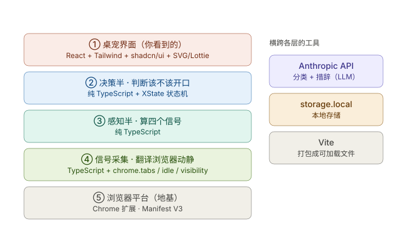

# Anchor · 架构一页纸

> 一眼看懂 Anchor 由哪几块拼成、各用什么、每个功能靠什么实现。

Anchor **不是**一个从应用商店下载、背后有服务器的 App，而是一个 **Chrome 扩展**——装进浏览器的小程序，代码几乎全部跑在你自己电脑上。整个系统唯一联网的地方，是偶尔问一下云端的 AI「这个网站和任务相关吗 / 这句话该怎么说」。

---

## 一、整体俯瞰：几乎全在你电脑里

左边灰框是你的电脑，里面所有东西——你正在用的网页、Anchor 扩展本身——都在本机运行，**没有任何自己的服务器**。右边那朵云是唯一在电脑之外的东西：Anthropic 的 AI。扩展只会把「当前网页的域名和标题」发过去做分类，或让它帮忙措辞。

> **隐私要点（值得对评委讲）**：你的完整浏览记录不会发去任何地方，因为压根没有一个「我们的服务器」能收。

---

## 二、扩展内部：由五块拼成

Chrome 扩展（Manifest V3 标准）不是一整块，而是几个各司其职的部件。

- **manifest.json（说明书）**：一个纯文本文件，声明「我有哪几个部件、需要哪些权限」。它不干活，只是登记表。
- **后台 Service Worker（后台大脑）**：中枢，两半引擎都跑在这里。有个必须知道的坑——**浏览器会在它闲着时把它休眠**、需要时再唤醒。这就是「平台风险」：A 得从第一天摸清它什么时候睡、醒来后计时器还在不在。
- **Content Script（网页里的触角）**：一小段被**注入到你正在看的网页内部**运行的代码。只有待在页面里，它才能感觉到你在打字还是在快速滚动，然后报给后台大脑。
- **Side Panel（桌宠的家）**：浏览器右侧面板，桌宠住这儿，用 React 做。它和后台大脑靠浏览器内部通信互相传话。
- **chrome.tabs / idle**：浏览器**自带**的能力，直接调用就知道「切到了哪个 tab」「多久没动」。**chrome.storage.local** 是本机小记事本，存任务、白名单、设置，关掉浏览器也还在。

---

## 三、每一层用什么语言和工具

把上面这些从「地基」到「你眼睛」叠成一摞，标清各用什么。

- **TypeScript / JavaScript**：JavaScript 是浏览器唯一听得懂的语言，整个扩展都是它。TypeScript 是「加了类型标签的 JavaScript」（契约里的 `interface` 就是标签），**打错、传错字段编译时就报错**。
- **两半引擎为什么是「纯 TypeScript」**：感知半、决策半刻意**不碰任何 chrome 接口**，只是「输入数据、输出数据」的纯逻辑。好处是能脱离浏览器、拿假数据单独测（Day 5 红/绿测试的前提），也是 A/B 各写一半、最后一拼即通的前提。
- **React + Tailwind + shadcn/ui**：搭界面。React 把界面拆成小积木（桌宠、弹窗、计时器各一块），Tailwind 快速上样式，shadcn/ui 提供现成好看的组件。
- **XState**：给「陪伴中 / 观察中 / check-in 中」三态建模，比一堆 if-else 更好在 deck 里讲清。
- **Anthropic API（LLM）**：你的代码通过网络发一段文字、收一段回复。两处用到：感知半判「相关吗」，决策半把 check-in 措成人话。
- **Vite**：打包工具，把源码编译成 Chrome 能直接读的文件。demo 用「加载已解压的扩展」丢进 Chrome 就跑，**不用上架、不用服务器**。

---

## 四、具体功能各靠什么实现

| 你看到的功能 | 靠什么实现 | 用到的东西 |
|---|---|---|
| 知道你切到了哪个网页 | 监听浏览器 tab 切换事件 | `chrome.tabs` |
| 知道你人离开 / 空闲了 | 监听系统空闲状态 | `chrome.idle` |
| 知道你在打字还是在刷 | 触角脚本听键盘和滚动 | Content Script + Page Visibility |
| 判断一个网站相不相关 | 把域名+标题发给 AI 分类，答案缓存下来 | Anthropic API + `storage.local` |
| 算「多久没碰锚点」 | 感知半里的计时器，碰一下归零 | 纯 TypeScript |
| 决定要不要打扰你 | 决策半把多信号攒成 0–1 置信度，越阈才开口 | 纯 TypeScript |
| 说出像朋友的 check-in | AI 按「飘去哪、飘多久」生成措辞 | Anthropic API |
| 桌宠三态表情、动来动去 | React 里的 SVG/CSS/Lottie 动画 | React + SVG/Lottie |
| 记住「我在查资料」白名单 | 用户一答就存进本地记事本 | `chrome.storage.local` |
| 断网也不乱报 | 内置写死的娱乐域黑名单兜底 | 代码里的常量表 |

---

## 五、跑在哪 · 怎么装 · A/B 各管哪层

**跑在哪**：除了那朵云（Anthropic API），全部在浏览器沙盒里跑，数据存本机。
**怎么装**：demo 阶段把 Vite 打包出的文件夹用「load unpacked」拖进 Chrome，一分钟的事；上架 Chrome 商店是推广阶段才需要，不影响 demo。
**一个诚实提示**：直接从扩展调 Anthropic API 会把密钥暴露在客户端，正式产品需一个极小中转服务藏起来；黑客松 demo 直接调够用，别为它增加复杂度。

**A/B 对上这张摞图**：

- **A（感知 + 采集 + 平台）** 管下面三层：地基、信号采集、感知半，外加平台的休眠/权限硬骨头。
- **B（决策 + 对话 + 呈现）** 管上面两层：决策半、桌宠界面，外加所有 LLM 措辞。
- 中间第 ③ 层顶部「感知半吐给决策半」的那条缝，就是 `FeatureFrame`。

整摞图从下往上读一遍，正好是一次走神从「被看见」到「被拉回」的全过程。
