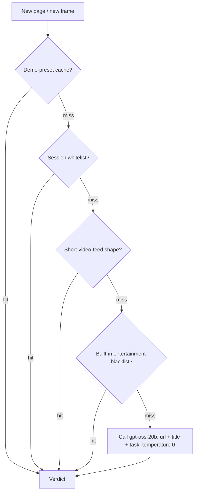
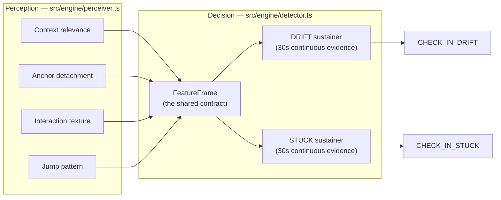
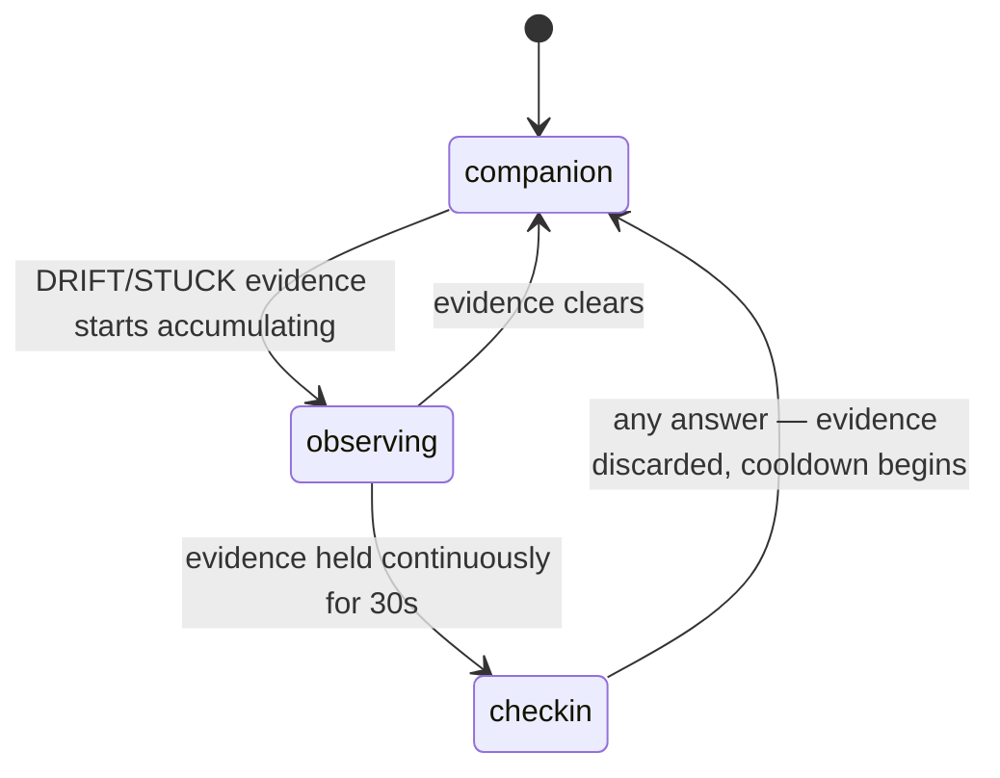
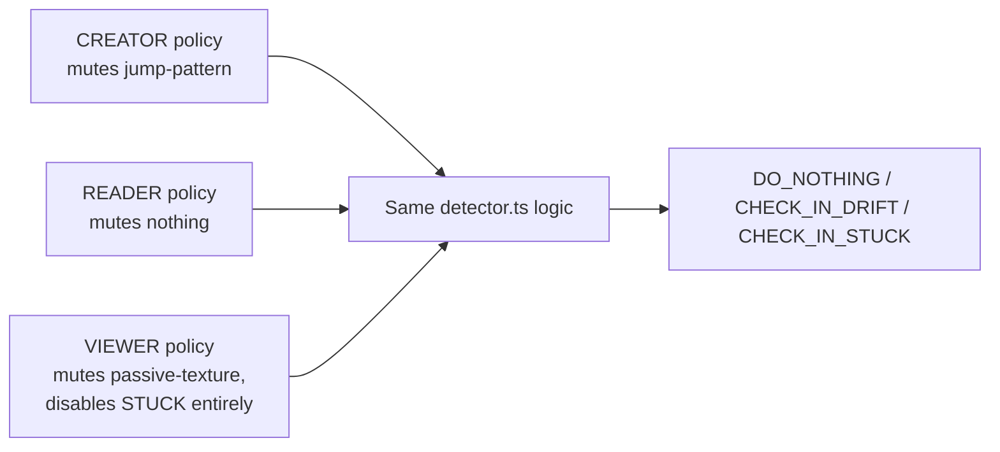

# Anchor — Product & Engineering Write-Up

Anchor is a Chrome extension (Manifest V3) that judges whether the page you're on is actually relevant to the task you declared — by reading its content, not its domain — and speaks up only when it's confident you've drifted. It also breaks a vague task into one small first action, so starting isn't the first obstacle.

This document covers what the product actually does and how each part is built.

**Contents**
1. [The standout features](#1-the-standout-features)
2. [What we think is genuinely well-built](#2-what-we-think-is-genuinely-well-built)
3. [Known limitations](#3-known-limitations-stated-plainly)
4. [Tech stack](#4-tech-stack)

---

## 1. The standout features

### 1.1 Content-level relevance judging, not domain-level blocking

The core mechanism: every page is judged by an LLM against the declared task — *"is this page, by its title and content, relevant to 'study neural networks'?"* — never by its domain. A site blocker can only say "youtube.com: blocked." Anchor can tell a tutorial from a distraction on the exact same domain.

Before the LLM is ever called, a page is checked against a priority-ordered stack of fast paths, each one able to return a verdict without a network call:



**Implementation:** `src/platform/background/classifier.ts` builds the prompt and calls Groq; the verdict is cached per `domain + path + title (+ chat snippet)`, so the same page is never classified twice in a row.

### 1.2 Two independent, evidence-gated detection channels

**DRIFT** (you left the relevant context) and **STUCK** (you're still there, but frozen) run as two separate state machines over the same `FeatureFrame`. Neither one fires on a single blip — each requires its evidence to hold **continuously for 30 seconds** before it's allowed to speak.



That evidence-gating is also what the floating pet visually reflects. It only ever has three states — never a fourth for "resting," which is a separate, orthogonal flag layered on top:



**Implementation:** `src/engine/detector.ts` holds a "sustainer" per channel — a timestamp of *since when* the evidence has been continuously true, reset to `null` the instant it breaks. `src/engine/pet-state.ts` derives the three-state pet display from those same sustainers, with a small hysteresis so a one-frame flicker in evidence doesn't visibly flip the pet back and forth. Both channels share cooldown, grace-period, and rest-mode gates, checked before any signal-specific logic runs — so "take a break" silences both at once without either one needing its own rest-awareness.

### 1.3 Signal weighting that adapts to how you work

The same raw behavior means different things depending on the task: rapid tab-switching is normal for a coder and alarming for someone who's supposed to be reading one paper; sitting still is normal for a reader and meaningless for someone watching a lecture. Rather than branching the detector's logic per use case, every profile difference is expressed as **data**, not code:



| | `CREATOR` | `READER` | `VIEWER` |
|---|---|---|---|
| For | Coding & building | Deep reading & study | Watching a lecture/course |
| Jump-pattern signal | muted — IDE↔docs↔AI-chat switching is normal | active | active |
| Passive-texture signal | active | active | muted — playback isn't drift |
| STUCK channel | enabled | enabled | **disabled entirely** |
| Anchor-detachment threshold | 5 min | 8 min | 20 min |
| Anchor match mode | exact URL | exact URL | path-prefix (a whole lecture playlist is one anchor) |

A worked example of why this matters: a `CREATOR` bouncing between an IDE, the docs, and an AI chat every few seconds produces a `jumpPattern` that would read as `rabbit_hole` under the default policy — but `CREATOR.muteJumpPattern = true` means the detector never even looks at that signal for this profile, so no false DRIFT fires. A `READER` doing the exact same rapid-switching *would* trigger it, because for someone who declared "read this paper," that behavior really is a departure. Same detector, same four signals, same 30-second sustained-evidence rule — the only thing that changes is which signals are allowed to count as evidence at all.

**Implementation:** `PROFILE_PRESETS` in `src/engine/types.ts` is a `Record<Profile, SignalPolicy>` — a typed, validated data table read by `detector.ts` on every frame. Adding a fourth profile is a data change, not a logic change.

### 1.4 Starter Coach — and what six prompt rewrites in three days taught us

Typing "study neural networks" isn't enough to start working. The coach turns a declared task into one absurdly concrete first action — small enough that refusing feels silly — using `gpt-oss-120b` with the task **and** the page already open in the tab, so the answer can be "press play on the video you already have open" instead of a generic "search for a tutorial."

This feature's prompt went through six real, numbered revisions in three days, and the version history is worth telling honestly, because each version broke in a *different* way than the one before it — this is the clearest example in the whole codebase of what "wrote a prompt" actually costs in practice:

| Version | What it produced in practice | Root cause | The fix |
|---|---|---|---|
| v0 | "Start writing the essay." / "Open your laptop." | One instruction and a few examples — no explicit ban on restating the goal or naming a precondition as if it were an action | Wrote each failure mode in as an explicit rule and a bad example, instead of trusting the model to infer them |
| v1 | Task: *"review computer network for the exam"* → **"Open the network textbook, flip to chapter 4."** (fabricated) | The rules explicitly required naming something specific ("if you cannot name the thing, you are being too vague"), and the model has no idea what book the user owns — so it invented one | Split "specific" from "true": a detail may only come from the task itself or be something generic the user can create on the spot |
| v2 | Task: *"prestudy advanced data structures"* → **"Pick up your notes and read the first line."** (notes that don't exist yet, for a course that hasn't started) | The fix above still allowed a "safe-sounding but generic" fallback — "your notes" — which is still a guess, just a vaguer one | Replaced "generic is safe" with a hard rule: an object is only usable if it's *named in the task* or *created on the spot* (a blank doc, a new tab) — nothing the user is assumed to already possess |
| v3 | Task: *"prestudy data structures and algorithms"* → **"Open a new doc, type down the course name."** — zero rule violations, zero progress | Every rule about *honesty* was satisfied; nothing yet required the action to actually produce or reveal anything new | Added the missing dimension explicitly: ten seconds later, the user must know or have something they didn't before — typing a name back doesn't count |
| v4 (first eval run, 12 cases) | 12/12 passed every rule — but **10 of 12 were "search for X"** | Four stacked constraints (no fabrication, no assumed ownership, must produce something, twelve words) had squeezed the solution space down to almost one shape: searching is the only action that's always safe | Gave the model the one piece of real, ungues­sable information available: the page already open in the browser (`anchorContext`) — reopening `OPEN_EXISTING` / `PLAY` / `READ` as legitimate answers |
| v5 | Task: *"study neural networks"* + Gmail open → risked **"Search your inbox for the course email"** | Handing the model a real anchor page created a new failure mode: eagerly using it even when it's unrelated — a fabrication with a real object instead of an invented one | Added an explicit counter-rule plus a matching bad-example: an irrelevant open page must be ignored completely, not incorporated |
| v5.1 | Task: *"finish chapter 3 of the react docs"* with react.dev already open → **"Open a new tab and search for React docs chapter 3"** (material was on-screen) | The rule said reuse the *name* the user gave — it never said stop sending them to search for something already in front of them | Tightened the rule to require directly opening/continuing the named material, not just repeating its name into a fresh search |

The same iteration pattern repeated, in miniature, for the separate task-quality prompt that decides whether a declared task is specific enough to judge pages against later. Its first version over-corrected and started asking a follow-up question for nearly every task — including clearly fine ones like "study neural network" — because its one bad example, "study for the exam," happened to share the same grammatical shape (verb + short phrase) as the good ones. The model appeared to be pattern-matching on sentence shape rather than judging content. The fix was to place a structurally-identical good/bad pair side by side in the prompt ("study neural network" vs. "study for the exam") so the only remaining difference the model could key on was the actual content: one names a topic you could match a webpage against, the other names an event you can't.

**Implementation:** `src/platform/background/starter-coach.ts` — `buildPrompt()` for the first-action call, `buildTaskQualityPrompt()` for the follow-up-or-not check. A second, independent line of defense (`hasFabricatedSpecific()`) regex-scans the model's output for numbered specifics ("chapter 4", "lecture 5") that never appeared in the task, purely as a string check with no Chrome dependency, so it's fully unit-tested rather than trusted on faith.

### 1.5 Reading the conversation, not just the tab title

On AI-chat sites, a browser tab's title often doesn't change mid-conversation — so a chat that's drifted from "neural networks" to "what's for dinner" can look unchanged from the outside. Anchor's content script watches for the user's latest typed message via `MutationObserver` and feeds *that* — not the stale title — into the relevance judgment, with the prompt explicitly told to weigh the live message over a title that may reflect an earlier, abandoned topic.

**Implementation:** `src/platform/content/chat-sites.ts` extracts the message; `SignalEvent.contentSnippet` carries it through the pipeline into the classifier prompt.

### 1.6 Whitelist appeals at the right granularity

If Anchor gets a page wrong, "this counts as work" fixes it instantly for the session — but *how much* it fixes depends on the site. For an ordinary domain, whitelisting the domain is fine. For YouTube, Reddit, or any AI-chat site, content varies wildly page to page, so the appeal is scoped to that exact page instead — correcting one video shouldn't silently clear every video on the domain.

**Implementation:** `SessionContext.sessionWhitelist` accepts two string shapes — a bare domain or a `domain+path` key — distinguished by whether they contain a `/`. `frame-pipeline.ts` picks the shape based on a `MIXED_CONTENT_DOMAINS` list (video, social, and AI-chat domains).

---

## 2. What we think is genuinely well-built

- **A pure-logic engine with zero Chrome dependency.** `src/engine/` — perception and decision — imports nothing from Chrome or the DOM. It's data in, data out, which means it's fully testable outside a browser (316 unit tests, offline, replaying recorded signal streams) and let two people build the perception half and the decision half in parallel against one shared contract, `FeatureFrame`, without stepping on each other.
- **Two different model sizes for two genuinely different jobs**, not one model doing everything: `gpt-oss-20b` for a fast, cheap, consistent per-page judgment; `gpt-oss-120b`, called far less often, for the reasoning-heavy work of writing a first action and every check-in's wording.
- **Every LLM call degrades, never blocks.** No API key, network failure, timeout, or malformed response ever stops the engine — classification falls back to a static blacklist plus a conservative `UNKNOWN`; the coach falls back to a fixed first action. This was an explicit rule from day one, not a patch added after something broke.
- **No backend at all.** Everything — session state, history, the user's own API key — lives in `chrome.storage.local`. The only network call is the LLM request itself.
- **A single scaling function for demo mode.** Every timing constant in the codebase is wrapped in one `scaled()` call reading one constant (`DEMO_TIME_SCALE`). Turning on demo mode compresses a five-minute threshold to about ten seconds without a second, separately-tuned code path to keep in sync.
- **Bugs become regression tests, not just fixes.** Real-device failures — a rest that silently ended itself, a video mistaken for being "stuck," one corrected video whitelisting an entire domain — each earned a permanent test in `src/engine/*.test.ts`. The suite is a record of real failures, not just a checklist written in advance.

---

## 3. Known limitations, stated plainly

- **Chat-message sensing is verified on `claude.ai` only.** Other recognized AI-chat sites are classified normally by URL and title; the extra live-message signal degrades harmlessly to "not present" until its selectors are verified against each site's DOM.
- **Single anchor, single window.** A two-monitor setup (an IDE on one screen, docs on another) isn't modeled as one task yet.
- **Offline, classification gets coarser**, not smarter: without a Groq key, relevance falls back to a static blacklist plus a conservative `UNKNOWN` rather than true content judgment.
- **"Pull me back" needs a tab to switch to.** If a user drifted by navigating *within* the anchor tab rather than opening a new one, there's nothing to switch back to.

---

## 4. Tech stack

Chrome Extension, Manifest V3 · TypeScript throughout, two `tsconfig`s enforcing an engine/platform boundary · Vite + `@crxjs/vite-plugin` · React for the side panel and an in-page floating widget (Shadow DOM), hand-written CSS, no component library · `lottie-web`'s light/no-eval build for the pet animation (MV3's CSP forbids the `eval()` the full build uses) · Groq (`gpt-oss-20b`, `gpt-oss-120b`) for the two LLM calls · `chrome.storage.local` for all state, no backend · Vitest for 316 offline engine tests, plus a separate eval harness (17 fixed tasks, 13 mechanical checks) that exercises the starter-coach prompt against the real API.

---

## Try it

```bash
git clone https://github.com/Joyyinred/Anchor.git
cd Anchor
npm install
npm run build
```

Load `dist/` as an unpacked extension at `chrome://extensions`. No API key required to see the full loop — every LLM path has a local fallback; a key just makes the answers smarter. See [`README.md`](../README.md) for the full quick-start, including demo mode.
