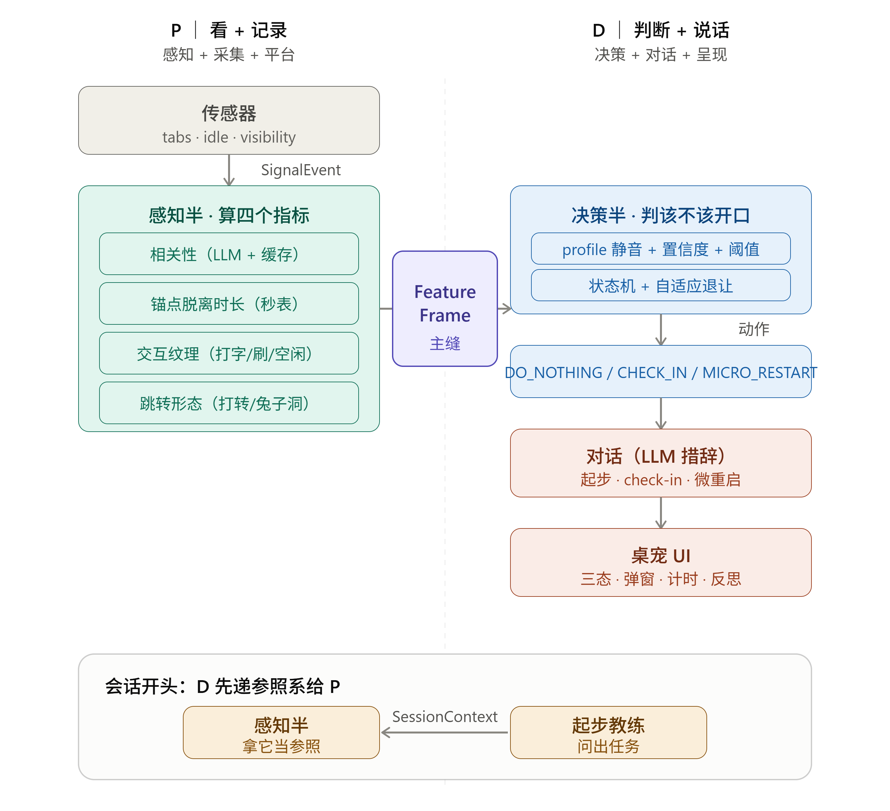

# Anchor — 25 天 / 2 人分工（定稿 v3 · 双引擎半分法）

> AI Builders Hackathon · Anchor 专注桌宠 · 执行计划
> 约束：2 人 · 25 天（8/21–9/15）
> 本版缘由：**两人都想做引擎核心。** 把引擎顺其天然接缝劈成「感知半 + 决策半」，两人各拿一半、都碰灵魂；平台与呈现沿同一条缝分掉，无人被发配去纯画图。

---

## 0. 相比 v2 改了什么

1. **引擎从「一人独做」改为「沿 `FeatureFrame` 缝劈两半」**：A 拿**感知半**（吃信号、算四信号），B 拿**决策半**（吃特征、出动作）。两半都是 AI 核心、都能独立测、都能写进简历。
2. **平台（MV3）沿「输入/输出」缝分掉**：A 管「读世界」（service worker + 权限 + 信号采集），B 管「显示桌宠」（side panel / PiP 渲染）。**最险的生命周期/权限在 A 这半，平台风险仍由 A 从 Day 1 扛。**
3. **契约从两条变三条**：`SignalEvent`（mock 入口约定）+ `FeatureFrame`（A→B，新的跨人主缝）+ `SessionContext`（B→A，起步教练建立参照系）。
4. **Day 5 检查点升级为「两半首次合流、5 场景端到端全绿」**：把集成风险也提前到 Day 5，而不是留到接真信号才发现两半对不上。

---

## 1. 架构与三条契约

**数据流主线：**

```
信号采集(A) → SignalEvent → 感知半(A) → FeatureFrame → 决策半(B) → DetectionResult → 桌宠UI(B)
                                  ↑
              起步教练(B) 在会话开头写 SessionContext，供两半共读作参照系
```

**三条缝（谁守哪条）：**

| 契约 | 方向 | 谁守 | 作用 |
|---|---|---|---|
| `SignalEvent` | 采集 → 感知 | **A 内部**（mock 入口）| `events.json` 假数据入口；将来喂真、现在喂假，同一入口 |
| **`FeatureFrame`** | **感知 → 决策** | **A ↔ B 共定** | ★两人之间的主缝：四信号算完的结果 |
| `SessionContext` | 起步教练 → 两半 | **B 写 / A·B 读** | 参照系：task / profile / anchor / 白名单 / 宽限期 |
| `DetectionResult` | 决策 → UI | **B 内部** | 动作 + 点亮的信号 + 措辞 |

> 真正跨人的只有两条：`FeatureFrame`（A→B）与 `SessionContext`（B→A）。守住这两条缝，两人全程可并行。

### 一图看懂两半怎么接

左半 A「看+记录」、右半 B「判断+说话」，中间紫色 `FeatureFrame` 是每秒都在传的状态报告；最底下黄色 `SessionContext` 是会话开头 B 递给 A 的参照系（全场唯一的反向箭头）。**中间这两个箭头，就是你俩全部的接口。**

---

## 2. 两人角色

### A ｜ 感知 + 信号采集 + 平台（「读世界」这一侧）
- **信号采集**：`chrome.tabs` / `chrome.idle` / Visibility → `SignalEvent`（含 `title`、`contentKind`）。
- **感知半引擎**：四信号计算 → `FeatureFrame`
  - 域-任务相关性分类（LLM，异步 + 惰性 + 缓存）
  - 锚点脱离时长（最强最便宜的信号）
  - 交互纹理（purposeful / passive / idle）
  - 跳转形态（task_orbit / rabbit_hole）
- **MV3 平台风险**（service worker 生命周期、权限模型）——**Day 1 就扛。**

### B ｜ 决策 + 对话 + 呈现（「显示桌宠」这一侧）
- **决策半引擎**：吃 `FeatureFrame` → `DetectionResult`
  - 置信度模型 + `applyProfileMuting`（profile 决定静音谁）+ 阈值 / 宽限期
  - 自适应退让（据 `CheckInFeedback` 调阈值）
  - 状态机（陪伴 / 观察 / check-in 三态，手写或 XState）
- **全部对话措辞**：起步教练拆解、check-in、微重启（**像朋友不像监工**，demo 成败点）。
- **呈现**：桌宠 UI + check-in 交互 + side panel / PiP 渲染 + 收尾反思。

**平局裁决**：谁有 kiosk 系统经验 → 拿 A（更贴系统）；谁对 UI/交互更有感觉 → 拿 B；都无所谓 → 掷硬币，两半都够硬。

---

## 3. 阶段一（Day 1–10）：两半各自站住 → 合流证明「聪明的不打扰」

### Day 1–2 ｜ 共定三契约（唯一必须两人现场结对的事）

这是**深度设计会**，不是敲接口壳。当场一起定死：
- **四信号的精确定义 + `FeatureFrame` 长什么样**——这就是你俩文档里说的「唯一值得两人结对的信号定义 + 评分逻辑」，必须一起拍。
- **置信度判定式草图**（四信号 AND / OR 怎么组合、profile 怎么静音）。
- `SignalEvent` / `SessionContext` 两个 schema。
- **两套 mock**：`events.json`（A 测感知）+ `frames.json`（B 测决策）。
- 定完立刻分头，进入并行。

### Day 3–5 ｜ 并行：A 攻感知 + 平台，B 攻决策 + 桌宠组件

**A（感知 + 平台，均不依赖 B）**
- MV3 骨架 + 权限 + service worker 生命周期跑通（**平台风险，先排**）。
- 信号采集：活跃 tab 域 / 切换序列 / idle → `SignalEvent`（**纹理先粗粒度，精细化留阶段二**，先保平台稳）。
- 感知半：四信号计算 → `FeatureFrame`；LLM 相关性分类接通（异步 + 缓存骨架）。
- 单元测：`events.json` → 断言 `FeatureFrame` 的 jumpPattern / texture / anchorDetachedMs / contextIrrelevant 正确。

**B（决策 + 桌宠组件，不依赖 A 的浏览器）**
- 决策半：置信度 + `applyProfileMuting` + `isDrifting` 阈值 + 宽限期 + 退让启发式 → `DetectionResult`。
- 手写 `frames.json`：把 5 场景「期望的 FeatureFrame」编出来，喂决策半（也顺便替 A 的感知半定好验收标准）。
- 独立 React 桌宠组件（陪伴 / 观察 / check-in 三态），**暂不进扩展**。
- 单元测：`frames.json` → 断言动作正确。

> **★ Day 5 硬检查点 ★（升级版：两半首次合流）**
> 把 A 的感知半和 B 的决策半用纯函数拼起来（都是 TS，拼接零成本），跑下面 5 场景**端到端**，全绿才进 Day 6：
> 1. 编程 · IDE↔docs↔AI↔SO 反复快切（全相关域）→ **全程 DO_NOTHING**（★切换不误报）
> 2. 深读 · 同页 20min 没切没动 → **DO_NOTHING**（深读不误报）
> 3. 编程 · 飘到 youtube + 锚点 10min 没碰 + 被动刷 → **CHECK_IN**（真走神抓得到）
> 4. 上条用户答「我在查资料」→ **DO_NOTHING 且此后该域不报**（自适应白名单）
> 5. 开场 2min 就切无关域 → **DO_NOTHING**（宽限期）
>
> 附：各自半的 smoke test 也要绿。
> **五条不全绿，不进 Day 6，就地打磨判定逻辑。** 这一步只花假数据，是最便宜的验证——且顺带证明 `FeatureFrame` 缝对齐了。

### Day 6–8 ｜ 合流：真信号进感知半 + 桌宠进扩展

- A 的真实 `SignalEvent` 流替换 `events.json` 喂进感知半——因 `FeatureFrame` 缝早已约定，**B 的决策半一行不用改**。
- 把 B 的桌宠组件接进 MV3 side panel，跑通「插件里真实触发一次 check-in」的完整闭环。
- 这一步 MV3 平台坑最多（权限 / 生命周期 / side panel），两人一起攻更快。

> **★ Day 8 硬检查点 ★**
> 真实浏览器里稳定复现两个反差瞬间：**疯狂切 tab 不打扰 + 飘去无关网站触发 check-in**。跑不稳 → 继续打磨，**不进 Day 9**。

### Day 9–10 ｜ 接起步教练，打通端到端

- B 接起步教练最小版（单次 LLM 调用出第一个物理动作 + 产出 `SessionContext`）。
- 确认 `SessionContext`（task / profile / anchor）正确喂给 A 的感知半——**这是 B→A 的缝，两人都要清楚**。
- 端到端跑通：起步 → 陪伴 → 真走神拉回 → 收尾反思。

---

## 4. 阶段二（Day 11–25）：核心稳了，三条线并行

### 线一 ｜ A：感知 + 平台深化（护城河的「感知」侧）
- Day 11–14：**内容级分类落地**（youtube / reddit / slack 按 `domain+path+title` 判并缓存，补最大漏洞）；LLM 分类异步 + 缓存 + 预热优化。
- Day 15–18：交互纹理精细化（keystroke / feed_scroll / media_seek 区分）；补更多 `contentKind`；短视频流形态硬判。
- Day 19–22：信号优雅降级（异常不崩、断网走本地黑白名单兜底）。
- Day 23–25：联调、修 bug、备技术 Q&A 弹药（误报率、缓存命中率等可量化数字）。

### 线二 ｜ B：决策 + 对话 + 呈现深化（护城河的「决策」侧 + demo 的脸面）
- Day 11–14：自适应退让单会话启发式打磨；状态机（XState）建模三态。
- Day 15–18：check-in / 微重启措辞反复调（**像朋友不像监工**，demo 成败点）；起步拆解 prompt 打磨；桌宠三态动画；check-in 交互 UI。
- Day 19–22：收尾反思视图 + 角落专注时长（**配角，别喧宾夺主**）；（有余量）`documentPictureInPicture` 悬浮桌宠。
- Day 23–25：与线三合流，主攻 demo 录制。

### 线三 ｜ 两人共担：deck + demo（约 30% 分，Day 11 起滚动推进）
- Day 11 起：建 deck 骨架，**每周填一次真实进展截图 / 数据**，别等最后写。
- Day 15：demo 脚本初稿定稿，开始走查，暴露「哪个反差瞬间演不稳」反推工程去补。
- Day 20–23：**录制备用 demo 视频**（现场触发有随机性，务必有兜底）。
- Day 24–25：deck 定稿 + demo 视频定稿 + repo README / 文档补全（硬性提交物）。

> **每日 15–20 分钟小会**：三条线并行最怕各自封闭到最后接口不匹配。每天对齐一次进度与接口，成本极低、回报极高。

---

## 5. 四条不可逾越的稳定性红线

1. **域名分类绝不阻塞引擎**：LLM 分类异步，判出前一律按 `UNKNOWN` 保守（不触发 check-in），判完写缓存；demo 前把要演的域名**预热进缓存**。
2. **必有本地黑白名单兜底**：断网 / API 失败时，靠内置娱乐域黑名单 + 会话白名单也能给合理判断，绝不整个哑掉。
3. **必录备用 demo 视频**：现场实时触发有随机性，提前录一条剪好的稳定版兜底。
4. **`FeatureFrame` 缝是两人并行的命根子**：任一方改 `FeatureFrame` 字段，**当天小会必须同步**，否则决策半会静默错判、且极难查。

---

## 6. 关键里程碑一览

| 日期 | 里程碑 | 性质 |
|---|---|---|
| Day 2 | 三契约敲定（`SignalEvent` / `FeatureFrame` / `SessionContext`）| 契约 |
| **Day 5** | **两半合流 · 5 场景端到端全绿** | **★关键点一★** |
| **Day 8** | **真实浏览器复现两个反差瞬间** | **★关键点二★** |
| Day 10 | 起步→陪伴→拉回→反思 端到端跑通 | 闭环 |
| Day 11 | deck/demo 常设线启动 | 交付物 |
| Day 15 | demo 脚本初稿、开始走查 | 交付物 |
| Day 22 | 备用 demo 视频录制完成 | 保险 |
| Day 25 | repo + 文档 + deck + demo 全定稿提交 | 终点 |

---

## 7. 总结

> **两人各守一半引擎，中间靠 `FeatureFrame` 一条缝相接。Day 5 两半合流用假数据、Day 8 用真信号，两次证明「编程切换时闭嘴、真走神时开口」是稳的。前 8 天就是全部风险所在。**
>
> 都碰了灵魂，都没人被发配画图。两次关键检验都过 → 产品成立，后面是执行；过不了 → 就地打磨判定逻辑。