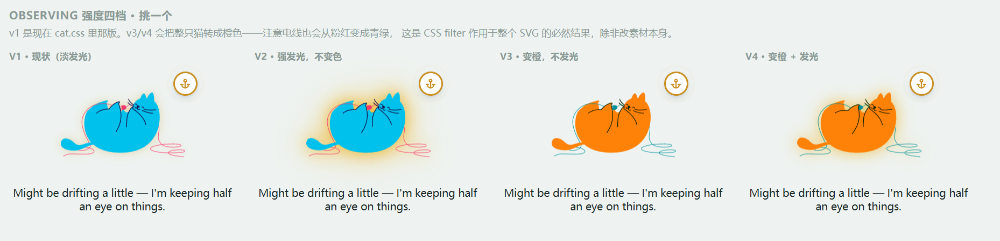
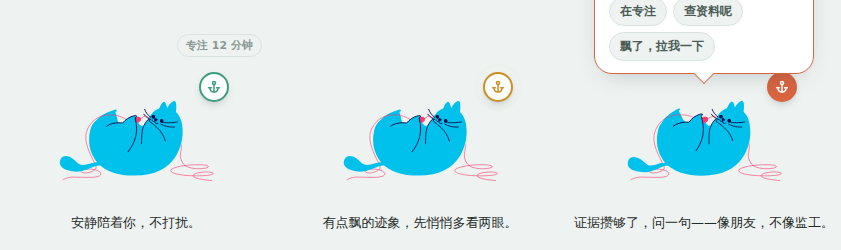

## 0824 
### joy
1. understand all docs and codes
2. based on docs and events add frames.json
3. update file structure
4. add schema interface to engine/types
5. todo-detector.ts and test, will do it later today or tmr

### jay
0. 工作流程表单：方便检查进度，会在我这边每日更新。
1. update `events.json` based on "契约v4: 4.场景"
2. Set up test environment:
    - `package.json`: devDependencies：
        - TypeScript 5.9、Vitest 3.2
        - cripts.test / scripts.test:watch：npm test
    - `tsconfig.json`: TypeScript compilation config. 开了 strict（严格类型检查）、noUnusedLocals/noUnusedParameters（防止死代码堆积）、resolveJsonModule（允许直接 import .json 文件，这样测试代码才能把 events.json/frames.json 当模块导入）。
    - `package-lock.json`（npm install 自动生成）: 锁定依赖的精确版本号，保证以后的 CI 装出来的包版本完全一致。
3. complete task A5, A6: 
    - `src/engine/perceiver.ts`: signal1 - `resolveContextRelevance`, signal2 - `computeAnchorSignal`, signal3 - `computeTexture`, signal4 - `computeJumpPattern`, `computeFeatureFrame` - combine signals and feed data to decision parts.
4. create test files and check J3:
    - `src/engine/perceiver.test.ts`: test perceiver.ts
    - `src/engine/integration.test.ts`: 把perceiver.ts & detector.ts真正接起来跑的端到端测试, "两半合流"。核心是一个"细粒度步进重放"模拟器：把 events.json 的 25 个场景，按真实时间轴一步步推进（不是只看最后一刻），因为 B 的判定逻辑需要证据"持续满 30 秒"才会真的触发提醒，必须真正把时间推进过去才能测出来。23 个可测场景（另外2个是独立函数验收，不适用这条主线）全部验证通过。
5. `detector.ts` debug and update: find one bug in integration test. 
    - DEMO_MODE（演示模式，时间压缩120倍）下，anchorDetachedThresholdMs（锚点阈值）和 stuckThresholdMs（卡住阈值）这两个策略常量一直没有被压缩函数 scaled() 包裹，导致"演示模式下 8 分钟阈值应该变成 4 秒"这条契约规定的行为实际没生效。
6. 跑项目目前需要的 commands：
    - `npm install`：装依赖（第一次拉仓库、或 package.json 有更新时跑一次，生成/更新 node_modules）
    - `npm test`：跑全部单测（perceiver.test.ts + integration.test.ts + detector.smoke.test.ts），一次性跑完就退出
    - `npm run test:watch`：跑测试并监听文件变化，改代码时自动重跑，开发时常驻用这个
    - `npx tsc --noEmit`：只做类型检查、不产出编译文件，提交前建议跑一下确保没有类型错误
    - `npx vitest run <文件路径>`：只跑某一个测试文件，比如 `npx vitest run src/engine/perceiver.test.ts`
    - `npx vitest run -t "关键词"`：只跑名字里含某关键词的用例，调试单个场景时好用（比如 `-t "场景 24"`）

## 0825
### Jay

complete A1234（A1 平台预研 + A2 分类黑白名单 + A3 扩展骨架 + A4 真实信号采集）, refined A2 BUILTIN_ENTERTSINMENT_BLACKLIST.

1. **A1 产出：`docs/MV3平台预研.md`**——写代码前先把 Chrome 扩展这个平台的"规矩"摸清楚。
    - 要申请哪些浏览器权限（tabs/idle/storage/alarms/webNavigation/sidePanel + host_permissions），以及各自为什么必须要。
    - 后台脚本会被浏览器随时"杀掉、清空内存"，怎么保证用户状态不丢。
    - 怎么在网页里监听用户的键盘/滚动/播放行为（content script 注入策略）。
    - 扩展各部件（网页脚本/后台/侧边栏）之间怎么互相传消息（消息链路设计）。
    - "判断用户是怎么进到这个页面的"这件事在哪些场景下拿不到准确信息、只能靠猜（entryIntent 可行性结论，SPA 内部跳转保守判 unknown）。
    - 用什么工具打包扩展（构建工具选型：CRXJS+Vite+TS）。
    - demo 演示模式的开关怎么存、怎么读（DEMO_MODE flag 存储方案）。

2. **A2 产出：`docs/分类prompt-v0.md`**——"AI 怎么判断一个网站跟当前任务相不相关"的说明书。
    - §1-2：判相关性用的 AI 提示词（按网页内容判断，不是按域名一刀切）+ 给 AI 输出结果定的规矩（AI 拿不准时强制标"未知"、结果要缓存、优先走更快的判断路径）。
    - §3：黑白名单兜底表——不用等 AI 判断，命中就直接放行/拦截，对应 `perceiver.ts` 里已经写好的 `DEMO_PRESET_CACHE`/`BUILTIN_ENTERTAINMENT_BLACKLIST`。
    - §4-5：给桌宠"开场白"（起步教练 B6）、"提醒话术"（check-in B7）用的提示词，顺带记一下避免以后重复写。

3. **A3：MV3 扩展骨架，从零搭建**——把扩展从"一堆空文件夹"变成"能装进 Chrome、真的会跑"的东西（新增文件）：
    - `manifest.json`：扩展的"说明书"，声明权限 + 后台 service worker + 侧边栏 + 网页采集脚本。
    - `vite.config.ts`：接入 `@crxjs/vite-plugin` 打包工具，把 `manifest.json` 处理成 Chrome 能直接读的 `dist/` 文件夹。
    - `tsconfig.engine.json` / `tsconfig.platform.json`：把原来一份 `tsconfig.json` 拆成两份——engine 版专门管 `src/engine`（不认识浏览器 API，保证这块纯逻辑代码能脱离浏览器单独测试），platform 版管 `src/platform`/`src/sidepanel`（认识浏览器 API）。根 `tsconfig.json` 改成继承 engine 版，编辑器默认按更严格的那份标准检查。
    - `src/platform/background/index.ts`：后台 Service Worker 的入口文件。注册了 1 分钟一次的心跳闹钟（`chrome.alarms`，专门防后台被浏览器闲置回收、记录后台启动/唤醒的日志、把网页脚本发来的消息转给对应逻辑处理。
    - `src/platform/background/state.ts`：负责往本地存储读写数据——存 demo 模式的开关、存状态持久化用的 key（对应契约里的 `BStatePersistable`）。
    - `src/platform/background/session.ts`：今天先给一个"默认设定"（因为真正的起步引导流程 B6/A13 还没做）——自动把当前打开的网页当作锚点、给个默认档位、给 2 分钟宽限期，存进本地供后面复用。
    - `src/platform/content/content-script.ts`：注入到所有网页里的采集脚本骨架，真正的采集逻辑见下方 A4 ）。
    - `src/platform/messages.ts`：定义网页脚本和后台之间传递消息的格式。
    - `src/sidepanel/index.html` + `main.ts`：侧边栏的占位页面（先显示"Anchor is running"），**后续由B负责，可以在这里建立真正的桌宠界面**。
    - `package.json`：新增了打包需要的几个依赖包，新增了 `build`（打包）、`dev`（开发模式）、`typecheck:engine`/`typecheck:platform`（分别检查两块代码的类型对不对）这几个命令。
    - 验证：`npm run build` 能正常产出 `dist/` 文件夹；用自动化脚本连了一次本地 Chrome，确认装上扩展后后台能成功注册、没有报错。

4. **A4：真实信号采集实现**——把"知道用户在干嘛"这件事真正接到浏览器 API 上（新增文件，用到 chrome.tabs/idle/webNavigation）：
    - `src/platform/background/heuristics.ts`：两个小工具函数。一个用简单的域名表猜"这个网页是代码/文档/视频/PDF/AI聊天中的哪一种"（比如 github→代码，youtube→视频）；另一个把浏览器给的"用户是怎么跳转过来的"原始信息，翻译成我们自己定义的分类，遇到单页应用内部跳转（比如 YouTube 自动换下一个视频）就统一标"未知"，因为这种情况本来就猜不准。
    - `src/platform/background/signals.ts`：今天 A4 的核心文件。监听"用户切了哪个 tab / 同一个 tab 里网址标题变了""用户是不是空闲了""用户是整页跳转还是单页应用内部跳转"这几类浏览器事件，把它们拼成一份完整的"当前信号快照"，再判断一下"这是不是用户设定的锚点页面"，最后打印到控制台方便检查数据对不对（今天还没做存储持久化，留给后面真正接入判断逻辑时再做）。
    - `content-script.ts` ：监听键盘、滚动（这两种事件很频繁，每 2 秒才发一次，避免刷屏）、页面是否被切到后台（不限流，立刻发）、以及视频的播放/暂停/跳转（用 `MutationObserver` 应对单页应用换视频时播放器被整个替换掉的情况，这是 A1 预研里提前标出来的风险点）。这些信息通过消息发回后台，后台只信任当前锚点页面发来的消息，避免被其他网页乱发消息干扰。
    - 验证方式（等我们后续手动测）：切 tab / 触发空闲 / 切走页面 / 播放视频，看后台控制台打出来的信号内容是否合理；心跳闹钟是否按时打日志。

5. 今日新增/常用 commands：
    - `npm run build`：`vite build`，产出 `dist/` 供 Chrome load-unpacked。
    - `npm run dev`：`vite`，CRXJS 开发模式（带 HMR）。
    - `npm run typecheck:engine`：`tsc -p tsconfig.engine.json --noEmit`，验证 `src/engine` 零 chrome 依赖。
    - `npm run typecheck:platform`：`tsc -p tsconfig.platform.json --noEmit`，验证平台层类型正确。
6. New Branch 'J4' is for integrating A,B's jobs when A7, B4 are completed. A will work on personal brance 'A7' before merging to J4. B is suggested to create own branch 'B4' and work on B1-B4 before merging to J4.

### Joy

complete B1、B2（引擎侧逻辑），B4 桌宠组件定稿并接入 Lottie 动画，8.26完成本地测试环境的踩坑排查。

1. **B1 产出：`src/engine/types.ts` + `src/engine/detector.ts`**
    - `defaultSessionContext()`：给一次新会话生成默认的 `SessionContext`（默认档位 CREATOR、2 分钟宽限期 `DEFAULT_GRACE_MS`、默认任务声明）。
    - `restReminderDue()` + `createRestState()`：休息提醒的节流逻辑（首次提醒延迟 + 之后按固定间隔重复提醒）。
    - 新增 `src/engine/metaScenarios.test.ts`（15 条用例，对着 `frames.json` 的 metaScenarios 规格验证），已直接改进项目、跑通。

2. **B2 产出：`src/engine/types.ts` + `src/engine/detector.ts`**
    - 新增 `CheckInChannel`/`CheckInAnswer`/`CheckInFeedback` 类型。
    - `applyCheckInFeedback()`：处理用户在气泡里点的三种回答——STUCK 通道下"在专注"会让阈值梯子往上爬一级（更难触发下次提醒）、"飘了"会把梯子重置到底；DRIFT 通道下清空对应的持续计时器。
    - 新增 `src/engine/b2.test.ts`（6 条用例，对着 `integration.test.ts` 里 `SCENARIO_OVERRIDES[7]` 的 fixture 验证），已跑通。

3. **B4 桌宠组件：`src/pet/CuteAnchorPet.tsx` + `.css` + `assets/cat.json`**
    - 经历了几轮设计迭代（软糖水滴 → CSS/SVG 猫耳猫尾 → 像素画风 → 最终定稿：从Lottie网站找到的矢量动画猫，可以免费试用，版权问题8.26会再次确认）。
    - 猫本体是一份 Lottie JSON，三态（陪伴/观察/check-in）不靠猫变色区分，改成猫耳朵旁边的小锚徽章（描边/描边+波纹脉冲/实心）+ check-in 气泡颜色。
    - 组件用 `lottie-web`（不是 `lottie-react`）手动挂载动画，并在加载完成后裁剪 SVG 的 `viewBox`，让猫撑满容器、徽章能贴着耳朵而不是飘在空中；`state` 切换不会重新加载动画，只影响徽章样式和气泡。
    - 新依赖：`lottie-web`（还需要 `react`/`react-dom`/`@vitejs/plugin-react` 等 React 相关依赖，项目里原来没有）。
    - 附带交付了一个临时的本地预览工具（`devpreview.vite.config.ts` + `devpreview/`），不影响扩展本身构建，纯粹用来肉眼确认三态长什么样。
    - 
    - 
    - 我觉得无背景气泡的更符合桌宠的感觉？but feel free to give advice for this.

4. **今日本地测试环境排查**（还在进行中，未完全解决）：
    - 发现 `tsconfig.platform.json` 的 `include` 里漏了 `src/pet`，导致编辑器对 `CuteAnchorPet.tsx` 按默认严格规则检查、给 `.css` 引入标红线（命令行 `tsc` 实际不受影响，因为 `moduleResolution: bundler` 本身就允许非 JS 后缀的引入）——这是个真实遗漏，修法是把 `src/pet` 加进 `tsconfig.platform.json` 的 `include` 数组，已修复
    - `devpreview` 本地预览服务器起得来（`vite` 终端显示 `ready`），但浏览器和 `curl` 都连不上 `127.0.0.1`，且失败前有 ~2 秒延迟（不是瞬间拒绝）——判断是本机防火墙/安全软件在拦截 Node 监听的端口，还没确认具体是哪个软件，待我8.26本机排查后回填结论。

5. **0826todo**
   - debug pet preview failure problem
   - 版权问题
   - 根据意见修改b4 pet ui, 对话会改成英文
   - finish b5,b6

## 0826
### Jay

昨天 `/code-review` 挑出来的6条问题，先修了2条真 bug（域名匹配漏了 www. 前缀、SW 被回收后信号会哑掉），今天把剩下4条也一并修完：

1. **`onActivated` 切 tab 时的竞态问题**：监听器里有个 `await` 查 tab 信息，如果用户手速很快连续切了好几个 tab，理论上后发的请求可能反而先返回，把新数据被旧数据覆盖掉。修法是给每次触发编个递增的号，`await` 结束后先看看自己是不是最新那次，不是就不写。查代码时顺便发现 `ensureCurrentTab()`（昨天加的、SW 醒来后补状态用的那个函数）也有一模一样的问题，一起修了。

2. **`prefix` 锚点匹配模式没做边界检查**：判断"当前网页算不算命中锚点"时，`prefix` 模式原来直接用字符串 `endsWith`，会把 `notexample.com` 误判成命中锚点 `example.com`（只是字符串结尾一样，其实完全不相关的两个网站）。这个问题昨天修黑名单匹配 bug 时其实已经顺手在 `perceiver.ts` 里写对了一份（`domainMatches`，判断"同一个域名，或者是它的子域名"），今天把这个函数导出，`signals.ts` 和 `heuristics.ts` 都改成调用它，不再各自维护一份容易漏改的判断逻辑。

3. **两份 tsconfig 拆开后没有一个命令能一次测两边**：加了 `npm run typecheck`，一条命令顺序跑 `typecheck:engine` 和 `typecheck:platform`。另外在 `src/platform/`、`src/sidepanel/` 文件夹里各放了一个只有一行"继承平台版配置"的 `tsconfig.json`，这样编辑器打开这两个文件夹下的文件时能自动找到正确的配置（认识 chrome API），不会再显示一堆假的类型错误。

4. **`domainOf()`（从网址里提取域名的小函数）写了两份一模一样的**：新建了 `src/platform/background/domain.ts` 专门放这一个函数，`session.ts` 和 `signals.ts` 都改成从这里引用，删掉各自的重复代码，这样改动这个函数时不用改两个文件，避免因忘记改其中一个而出bug。

验证：`npm run typecheck`（新命令）、`npm test`（57/57 全绿）、`npm run build` 都过了。今天这几条属于代码内部逻辑修正，没有加新的自动化测试——`domainMatches` 的边界判断已经在 `perceiver.test.ts` 里测过了，`signals.ts` 这边涉及真实 chrome API，项目目前还没有 mock chrome API 的测试基建。

5. **完成 A7：真实信号正式接进感知半**——之前 A4 只是把采集到的 `SignalEvent` 打印出来看看形状对不对，今天把它真正接进 `perceiver.ts` 的 `computeFeatureFrame`，算出真实的 `FeatureFrame`（相关性/锚点脱离时长/交互纹理/跳转形态四个信号），相当于把"喂给感知半的数据源"从假的 `events.json` 换成了真实浏览器信号——契约里约定好的 `FeatureFrame` 接口没变，所以 B 那边的决策代码完全不用动。
    - 新增 `src/platform/background/frame-pipeline.ts`：维护一份事件历史，每来一条新事件就存进去（内存 + 存到 `chrome.storage.local`，这样后台被浏览器回收重启后历史不会丢），再拿完整历史跑一次感知半算出当前这一帧。历史只留最近 4 小时/500 条，防止长时间挂着不关内存一直涨。
    - `signals.ts` 现在每收到一个事件，除了打印原始信号，还会打印算出来的 `FeatureFrame`，方便手动检查真实场景下算出来的数值合不合理。
    - 域名相关性判断还是用现成的黑白名单兜底表，真正的 LLM 判断（A8）还没接，判不出的先按"未知"处理，不会卡住整个流程。
    - 验证：`npm run typecheck`、`npm test`（57/57，没碰引擎代码所以数量没变）、`npm run build`（新文件正常被打包进去）都过了。这块也是真实 chrome API 代码，跟 signals.ts 一样，暂时没有自动化测试覆盖。

6. **合并 `B4` → `J4`**：把 Joy 的 B1/B2/B4 分支合并进当前分支，`ort` 策略自动合并成功，两边都改过的 `detector.ts`/`types.ts`/`perceiver.ts` 没有冲突标记。合并后跑了一遍全套验证：`npm run typecheck` 两边干净、`npm test` **78/78 全绿**（多了 Joy 的 `b2.test.ts` 6 条 + `metascenario.test.ts` 15 条）、`npm run build` 正常出包。

7. **自动代码审查发现 10 个问题**：
    - **①休息功能没真正接上**（`detector.ts` 的 `createRestState()`）：点"休息"后应该让走神/卡住提醒暂停，但这个函数算出的结果从没被存回真正生效的状态里，休息期间提醒照样弹。
    - **②提醒冷却没生效**（`detector.ts` 的 `state.lastCheckInTs`）：弹过一次提醒后本该等 5 分钟才能再弹，但"上次弹了没"这个记录从来没人写过，等于没做冷却，可能连续弹好几次。
    - **③休息提醒的触发算法不现实**（`detector.ts` 的 `restReminderDue()`）：算法要求时间点"精确对上"才触发，但真实的定时检查节奏和用户点休息的时刻基本对不齐，实际几乎永远不会触发。
    - **④隐藏按钮仍可被键盘触发**（`src/pet/cat.tsx` 的 check-in 按钮）：按钮不该出现时只是用样式藏起来，没真正从页面里去掉，键盘用户 Tab 过去按回车依然能触发，等于用户没看到提示就被"代答"了。
    - **⑤ VIEWER 模式下重置会失效**（`detector.ts` 的 `applyCheckInFeedback()`）：用户答"飘了"应该无条件把进度清零，但代码加了个条件，导致 VIEWER 这种没有进度阶梯的画像下，这个重置悄悄不执行。
    - **⑥默认配置数组是共用引用，不是真拷贝**（`types.ts` 的 `defaultSessionContext()`）：看起来在复制一份默认设置，数组部分其实还指向同一份数据，以后谁改了自己那份会连带改坏全局默认值。
    - **⑦本地预览工具路径写错，打不开**（`src/devpreview/main.tsx` + `Devpreview.vite.config.ts`）：文件目录写错了。`main.tsx` 的 `'../src/pet/cat'` 多写了一层 `src/`（应为 `'../pet/cat'`），`Devpreview.vite.config.ts` 的 `root` 也应为 `'src/devpreview'` 而非 `'devpreview'`。
    - **⑧默认会话逻辑写了两份**（`types.ts` 的 `defaultSessionContext()` 和 `session.ts` 的 `getOrInitSessionContext()`）：两个文件各自维护一套一样的"新会话默认值"，以后改一处容易忘了改另一处。
    - **⑨同一个类型定义分开写了两份**（`src/pet/types.ts` 和 `src/engine/types.ts` 的 `CheckInAnswer`）：两边各写了一份一样的类型没有互相引用，容易改一边忘另一边；桌宠组件回传答案时也少传了一个关键信息（是哪个通道触发的）。
    - **⑩重复代码可以合并**（`detector.ts` 的 `applyCheckInFeedback()`）：同一行判断逻辑在两个分支里各写了一遍，跟具体是哪个分支无关，可以提出来共用一次。

8. fix all 10 bugs. See details in 工作流程表单.

### Joy

昨天 todo 里的"改 b4 pet ui + 英文化 + 完成 b5/b6"今天都做完了，另外顺手把 b7 也提前做了（依赖只有 B1，不卡 Jay 那边）。

1. **B4 桌宠 UI 按反馈调整**（`src/pet/cat.tsx` + `.css`）：
    - 发现 check-in 气泡一开始会被浏览器顶部截断——气泡实际高度比预留的空间大，往上量了一下实际尺寸后把预留空间从 60px 一路调到 236px，气泡的 `top` 偏移也从 -6px 调到 -30px，跟锚徽章之间留出干净的间距，不再互相遮挡。
    - 气泡改成从锚徽章那个位置"弹出来"的动画：用 `transform-origin` 钉在徽章的坐标上，缩放起点从 0.9 改成 0.2，看起来更像是从徽章里长出来的，配合徽章自己也加了一下小弹跳动画（`ap-badge-pop`），两个动作像是同一个手势。
    - "专注 12 分钟"这个标签原来常驻在右上角，改成悬停在锚徽章上才弹出来的小提示（纯 CSS `:hover` + 相邻兄弟选择器，不用 JS），常态不占地方，符合它"配角，别喧宾夺主"的定位。
    - 全部对话文案（三态说明文字、check-in 按钮、气泡默认消息、专注时长标签）统一改成英文——这是个英文项目，之前是中文占位。

2. **B5 产出：`src/engine/frames.test.ts`**——单元测试：`frames.json` 25 场景里可测的 22 条，直接喂给 `evaluateFrame()`，断言算出来的动作和 `frames.json` 里写的 `expectedAction` 一致（不经过感知半，用 `frames.json` 自带的 `initialState.*SinceOffset` 抄近道直接摆好证据持续器的起始状态，省得逐帧重放）。
    - 过程中揪出 `frames.json` 场景14 一个真的数据 bug：两步之间少了一个"刚越过阈值"的中间帧，导致持续器从来没被正确播种，永远判不出该有的 `CHECK_IN_STUCK`。照着场景6的两步节奏，补了 `900001ms`/`931001ms` 这组边界值（阈值严格大于才算数，卡在整数边界上不算越过）修好，22/22 全绿。

3. **B6 产出：`src/engine/coach.ts` + `coach.test.ts` + `docs/起步教练prompt-v0.md`**——起步教练最小版。
    - `runStarterCoach()` 落实契约v4 §5.5 的追问义务：任务声明不够 8 个字符就追问，最多追问 2 轮，不占用"单次 LLM 调用"这个额度；够格之后才真正调用一次注入进来的 LLM 函数，产出"第一步物理动作"这句话。
    - 真正的 LLM 调用没有写死在代码里，是通过一个参数注入进去的——跟 `perceiver.ts` 判断网页相关性时用的 `ClassificationCache` 是同一个思路，换供应商不用改这个文件，单测也不用真的打网络请求。
    - `SessionContext` 复用已经写好并测过的 `defaultSessionContext()`，只把里面的任务声明换成校验通过的用户输入，没有重新发明一遍。
    - LLM 调用失败（网络问题/超时）有兜底文案，不会让刚打开插件的第一步就卡死。11/11 测试绿。

4. **B7 产出：`src/engine/wording.ts` + `wording.test.ts`**——check-in / 微重启措辞 v1。
    - 关键点：DRIFT 和 STUCK 两种提醒问的不是同一件事，不能共用一套文案逻辑——DRIFT 是"你已经离开了"，问的是离开前那件事（数据来源 `lastAnchorSnapshot`，这是契约里特别强调的一条★）；STUCK 是"你还在这，但很久没动"，问的是当前停留的这件事（数据来源当前页标题），两者搞反了措辞会文不对题。
    - 用户点按钮之后紧跟的那一句短反馈（"在专注"/"查资料呢"/"飘了"三种回答对应三句不同的话）也在这里，一句话说完不追问、不说教。
    - "像朋友不像监工"这条要求不只是嘴上说说，测试里专门用正则挡掉了"should/stop/again/why"这类说教味的词，防止以后改措辞的时候不小心改回监工语气。13/13 测试绿。

5. **英文化扫尾**：`types.ts` 的 `DEFAULT_TASK_DECLARATION`（用户跳过起步教练时会看到的默认任务文案）原来是中文，一并改成英文，跟今天新加的其他用户可见文案保持一致。内部代码注释还是保持中文，跟仓库现有习惯一致，只统一了真正会展示给用户看的字符串。

6. 验证：`npm run typecheck`（engine+platform 两边都干净）、`npm test` **128/128 全绿**（今天新增 `frames.test.ts` 22 条 + `coach.test.ts` 11 条 + `wording.test.ts` 13 条）、`npm run build` 正常出包。

7. **0827todo**
    - B9：状态机建模（陪伴/观察/check-in 三态转换）——依赖只有 B1，是真正会调用今天写的 `buildCheckInMessage`/`buildMicroRestartMessage`、把结果接进 `cat.tsx` 的 `message` prop 那一层，不卡 Jay。
    - B8（协助桌宠接入 side panel）和整条 J4/J5/J6 线，要等 Jay 的 A11（chrome 消息链路）落地才能真正推进，暂时排不上。
    - 版权问题（B4 那只 Lottie 猫的授权条款）昨天的 todo 里提过，今天没顾上，还是待确认。

## 0827
### Jay

今天先把 A7 分支（落后于 J4，缺 B6/B7/桌宠组件）合并 J4 对齐，再完成 A11（桌宠接入 side panel）+ A8（真实 LLM 分类）+ A9（随 A8 一并满足），过程中靠 Jay 手动真机测试暴露出两个真 bug 顺手修了，最后跑了一轮 `/code-review` 把今天新代码的 5 条发现也修完。128/128 测试全程保持绿，`npm run build` 正常出包。

1. **A11 产出：桌宠组件真正接入 side panel（感知半→UI 消息链路）**
    - `vite.config.ts` 接入 React 插件（`@vitejs/plugin-react` 之前装了没注册，`cat.tsx` 这样的 JSX 文件构建不进 side panel 产物）。
    - 新增 `src/platform/panel-state.ts`（background 和 side panel 共享的 `PanelState` 形状）+ `src/platform/background/panel.ts`（把 `DetectionResult` 翻译成 `PanelState`：`CHECK_IN_DRIFT`/`CHECK_IN_STUCK` 调 B7 的 `buildCheckInMessage()` 生成真实文案，`DO_NOTHING` 先占位成 `companion`）。
    - `src/sidepanel/main.tsx`（新，替换占位 `main.ts`）：真正的 React 入口，`chrome.storage.onChanged` 订阅 `PanelState`，渲染 `CuteAnchorPet`，`onAnswer` 把用户回答通过 `chrome.runtime.sendMessage` 发回 SW。
    - `src/platform/messages.ts` 新增 `CheckInAnswerMessage`；`background/index.ts` 收到后调 `frame-pipeline.ts` 新增的 `applyCheckInAnswer()`（内部调 B2 的 `applyCheckInFeedback()`）。
    - 真机装上验证：侧边栏能打开、桌宠能渲染、真实浏览（YouTube/Gemini Notebook）触发的 `SignalEvent`→`FeatureFrame`→`DetectionResult` 全链路日志正常。

2. **真机测试顺手揪出的两个真 bug**：
    - Lottie 猫渲不出来，Inspect 报 CSP 拦 `eval`——`lottie-web` 默认打包（AE expressions 功能）内部用 `eval()`，MV3 扩展页面 CSP 硬性禁 `unsafe-eval`。换成不含 expressions 的 `lottie-web/build/player/lottie_light` 构建，一行 import 改掉，构建产物还小了 138KB。
    - 真实播放 YouTube 视频 8 分钟，`DetectionResult.action` 一直 `DO_NOTHING`——查出心跳 alarm 从来没有真正重新跑过 `computeFeatureFrame`/`evaluateFrame`，只靠离散 DOM 事件触发评估，安静看视频不产生新事件就永远不会被重新检查。这正是契约v4 §3.1"事件静默 >60s 补帧"要求的行为，之前规划过没真正做。`frame-pipeline.ts` 新增 `recomputeOnHeartbeat()`，心跳周期性用当前时刻重新评估（不需要新事件）。

3. **A8 产出：`classifyDomainRelevance` 真实实现**（`src/platform/background/classifier.ts` + `groq.ts`）
    - API： `classifyDomainRelevance()` 正常走 Groq `gpt-oss-20b` → 降级为`UNKNOWN` 。
    - `frame-pipeline.ts` 新增 `triggerLazyClassification()`：只在感知半已经把当前页判成 `UNKNOWN` 时才异步触发（意味着黑名单/白名单/预置缓存全没命中），fire-and-forget，不阻塞当前帧，结果写回 `classificationCache` 供下一次重新计算帧用。
    - 顺带把 Groq `gpt-oss-120b` 接进 B6 起步教练已有的 `StarterCoachLLMCall` 注入口（新增 `src/platform/background/starter-coach.ts`），还没接线——起步教练 UI 本身还没建。

4. **A9（本地黑白名单降级路径）随 A8 一并满足**：`classifyDomainRelevance` 任何失败（没配 key/网络/超时/解析失败/低置信度）都安全落回 `UNKNOWN`，不影响 A2 已有的 `DEMO_PRESET_CACHE`/`sessionWhitelist`/黑名单短路优先级——断网/API 挂了，表现跟"还没接 LLM 之前"完全一样。

5. **`/code-review` 全部修完**：
    - check-in 答完 side panel 不刷新（按钮留在 UI 上能再点一次，会把 `applyCheckInFeedback` 重复触发）→ 新增 `pushCompanionState()`，答完立刻推。
    - `BState` 持久化了 `types.ts` 明确标注"不持久化"的持续器字段（`driftSustainer`/`stuckSustainer`/`passiveSince`），SW 回收重启后可能拿旧证据误判 → 新增 `toPersistable()` 只存该存的一半，顺带把本来重复造的本地 storage key 逻辑改成 `state.ts` 里早就有但没人调用的 `getBState`/`setBState`。
    - 心跳里两次 `Date.now()` → 改成只取一次复用。
    - `classifier.ts`/`starter-coach.ts` 各写一份 JSON 提取逻辑 → 提到 `groq.ts` 的 `extractJsonObject()` 共用。

6. **今日遗留问题**（记录，暂未处理）：
    - **A8 和 B6 完全没接上**：`session.ts` 的 `getOrInitSessionContext()`（`taskDeclaration` 唯一写入点）只调 `defaultSessionContext()`，从不知道 `runStarterCoach()` 的存在；`runStarterCoach()`/`groqStarterCoachCall` 目前只有测试文件在调用，没有任何 UI/消息通道能让用户真正声明任务。后果：`ctx.taskDeclaration` 永远是占位文案，这正是这几天测试时 A8 分类经常判 `UNKNOWN` 的根因——模型被问"这页面跟'没有任务'相关吗"答不出来是它的正确保守回答，不是分类链路本身的锅。这个缺口卡在 B6 和 A13 之间，两边现有任务描述都没直接点出来。
    - ~~**DRIFT 通道有一个契约本身的设计边界，真机测试才浮出来**：`texture: 'idle'`...~~ **已修复，见下方第 9 条**——跟 Jay 确认过这是设计漏洞不是边界，改掉了。
    - **check-in 答 FALSE_POSITIVE 不会真正写回 `sessionWhitelist`**：`detector.ts` 注释里写明这是调用方的责任，`applyCheckInAnswer()` 目前只清空 `driftSustainer`，没有真正把当前域名加进白名单。
    - `panel.ts`/`classifier.ts`/`groq.ts`/`starter-coach.ts` 这批新代码依赖真实 `chrome.storage`/`fetch`，仓库目前没有 chrome API mock 的测试基建，都还没有自动化测试覆盖（跟之前 `signals.ts`/`session.ts` 是同一类已记录过的遗留缺口）。

7. **DRIFT 通道 `texture: 'idle'` 缺口修复**（`src/engine/detector.ts`，B1/B3 的内容，改了 `detector.ts`）：`texture: 'idle'`（120s 窗口内连 `PASSIVE_SCROLL` 都没有）语义上比 `'passive'`（至少还在被动滚动/僵尸连播）更强的走神证据，之前却被排除在 DRIFT 的纹理证据之外。
    - `isContinuouslyPassive()` 改名 `isContinuouslyDisengaged()`：原来 `f.texture !== 'passive'` 就重置计时器（等于只认 `'passive'`，`'idle'` 会被当成"没证据"处理）；改成只有 `f.texture === 'purposeful'` 才重置——`'passive'`/`'idle'` 现在都算连续非主动纹理证据，两者共用同一个 60s 累计窗口。`isDrifting()` 里的调用处同步改名，STUCK 通道（`isStuck`）没有改动。
    - 补了 `src/mock/frames.json` 场景25 作为回归测试——照抄场景3（`passive` 纹理的三步触发过程）复制一份，只把 `texture` 换成 `'idle'`，其余时间轴/期望动作完全一致（证明这两种纹理现在走同一套逻辑）。
    - `src/engine/frames.test.ts` 22→23 条（新增场景25），全套 `npm test` 129/129 全绿，`npm run typecheck`/`npm run build` 都过。

## 0827
### Joy

今天把 B8/B9 做完，并把昨天写好却一直没人调用的 B6 起步教练真正接上了 UI——`runStarterCoach()`/`groqStarterCoachCall` 从此有了调用方，这是 0827 遗留问题里"A8 和 B6 完全没接上"那一条的正面解决。之后第一次做完整真机测试，暴露出 6 个 bug，修掉 2 个（都在我自己的代码里），另外 4 个在感知半（Jay 的 `signals.ts`/`perceiver.ts`）和 `types.ts` 里，记录在下方第 5 条。`npm test` 147/147 全绿，`npm run typecheck` 两边干净，`npm run build` 正常出包。

1. **B6 起步教练 UI 落地**（补上 0827 记录的那个缺口）
    - 新增 `src/platform/onboarding-state.ts`：background ↔ side panel 共享的 `OnboardingState` 形状（`PENDING`/`NEEDS_FOLLOWUP`/`READY`/`DONE` 四态），跟 `panel-state.ts` 同一个模式，属于传输层不进引擎契约。
    - 新增 `src/platform/background/onboarding.ts`：SW 侧逻辑。`handleOnboardingSubmit()` 真正调用 `runStarterCoach()` + `groqStarterCoachCall`，结果推回 `ONBOARDING_STATE_KEY`；`pushOnboardingStatus()` 判断该显示输入框还是直接显示桌宠——判据是 `SessionContext.taskDeclaration` 是否还是那句默认占位文案，**不额外维护一个"onboarding 做过没"的独立标记**，省得两处状态哪天不同步。
    - 新增 `src/sidepanel/OnboardingPanel.tsx` + `onboarding.css`：起步输入框 UI，纯展示层（跟 `cat.tsx` 同一个原则），契约v4 §5.5 的追问闸门逻辑全在 SW 侧的 `runStarterCoach()` 里，这里只转发输入、显示 SW 推回来的状态。
    - `messages.ts` 新增 `ONBOARDING_STATUS_REQUEST`/`ONBOARDING_SUBMIT` 两条消息；`session.ts` 新增 `saveSessionContext()`（起步教练产出的真实 `SessionContext` 写回 `getOrInitSessionContext()` 读的那同一个 key）；`background/index.ts` 接住这两条消息。
    - **意义**：`ctx.taskDeclaration` 现在第一次会是用户真实声明的任务，不再永远是占位文案。0827 记录的"A8 分类经常判 UNKNOWN"的根因（模型被问"这页面跟'没有任务'相关吗"）从这里被解掉。
    - 起步教练LLM调用测试通过，可以正常对话并分解任务

2. **B7 的微重启文案终于被调用**（`panel.ts` 新增 `pushMicroRestartToast()`）
    - `buildMicroRestartMessage()` 0826 就写好也测过，但一直没有调用方——用户答完 check-in 是直接变空白陪伴态，点了按钮没有任何回应。
    - 现在答完先显示那句反馈（"Good, carry on." / "No worries, let's head back."），2.5 秒后自己摘回空白 companion。
    - 为此改了 `cat.tsx`/`cat.css`：气泡显隐从"是不是 checkin 态"改成"这一刻有没有话要说"（新增 `data-bubble-visible` 属性驱动），**没有引入第四个 PetState**（组件注释明确禁止）。气泡边框色改成跟着 `--ap-state` 走，否则一句"没关系，回去吧"套着橙色警示框，看着像在质问用户。
    - 测试通过，checkin消息弹出后有互动

3. **B9 状态机**（`src/engine/pet-state.ts` + `pet-state.test.ts`，16 条单测）
    - 解决的问题：桌宠画了三态，但 `observing` 从头到尾没有任何代码会产出——`panel.ts` 之前把 `DO_NOTHING` 一律映射成 `companion`，实际只演得出两态。
    - **`observing` 的信号来源**（`panel.ts` 顶部注释留的那个问题）：`DetectionResult` 确实不带"证据接近阈值"，但 `BState` 的两个证据持续器带——`driftSustainer.since`/`stuckSustainer.since` 一旦不是 null，就意味着"证据已开始累积、还没满持续窗口"，正好就是"有点飘的迹象，先悄悄多看两眼"那一刻。**不需要给 `DetectionResult` 加字段，也不需要动 `detector.ts` 的判定逻辑。**
    - 优先级：`checkin` > 休息期强制 `companion` > 证据累积 `observing` > `companion`。
    - 两个额外设计决定：①**迟滞防抖 `MIN_OBSERVING_MS = 15s`**，证据消失后 observing 至少再保持 15 秒——不加的话真实浏览里 `texture` 每几秒翻一次，桌宠会在两态之间明显闪烁；②**休息期强制 companion**，因为休息期 `isDrifting`/`isStuck` 是在闸口直接 return false 的、持续器不会被清空，不显式挡一道的话用户点了"休息"反而会看到桌宠一直在"盯着你"。
    - `detector.ts` 把 `scaled()` 加了 `export`（原来私有）——迟滞窗口在 demo 模式也得压缩，按红线5「DEMO_MODE 时间压缩常量只在一个地方改」必须复用同一个函数，不能自己再写一份 `1/120`。

4. **B8 接线**（`frame-pipeline.ts` / `panel.ts` / `signals.ts` / `index.ts`）
    - `frame-pipeline.ts` 是全项目唯一同时拿得到 `action` 和 `BState` 的地方，所以状态机实例放在那里推进（模块级内存变量，跟 `previousTexture` 同一个理由：纯 UI 表现状态，SW 回收后从 companion 重来无害，不值得多一次 storage 往返），算出的 `PetState` 跟 `DetectionResult` 一起返回。
    - `panel.ts` 退化成纯翻译层，不再自己判断 PetState；`signals.ts`/`index.ts` 各一行透传。

5. **真机测试暴露的 6 个 bug**

    **已修（2 个，都在我自己的代码里）：**
    - **① 起步教练把锚点弄丢了**（`onboarding.ts`，我写这个文件时漏传参数）：`runStarterCoach()` 没传 `inferredAnchor`/`sessionId`，导致起步一完成 `anchor` 就被覆盖成 `{ domain: '', url: '' }`。空锚点匹配不上任何页面 → 没有任何事件被判成"在锚点上" → `lastAnchorTs` 恒为 0 → **`anchorDetachedMs` 直接等于当前 epoch 时间戳**（真机日志里是 `1787883284236`，而不是"脱离了多久"），`lastAnchorSnapshot` 也拿不到真实标题。修法：查一次当前活动 tab 当锚点（跟 `session.ts` 取的是同一个东西、复用它的 `domainOf`），`sessionId` 固定成 `'default'`——BState/事件历史都按 sessionId 分 storage key，每次起步生成新 id 的话旧 key 会永远堆在 `chrome.storage.local` 里没人清。
    - **② check-in 文案报出天文数字**（`wording.ts`）：上面那个 bug 的连带表现，真机上弹出的是 `You drifted from "what you were working on" 29798077 minutes ago`（≈56 年，即 `now - 0`）。根因修了，但退化情况本身也该防住——快照仍是初始值（`ts <= 0` 或标题为空）时改成**完全不说"多久以前"**：宁可少一条信息，也不能报一个一眼假的数字，那比没有信息更伤可信度。补了 2 条回归测试，其中一条用正则挡掉 4 位以上数字。

    **未修（4 个，需要 Jay 确认后再动，因为都在她的文件或会影响既有测试断言，供你参考，只是我这边今天跑了测试的结果）：**
    - **③ `signals.ts`：切 tab 会永久卡死**（我测试时开着工作网页和油管不相关视频切了很多次，会停留在之前的tab上很久，必须重新关掉油管重新进入才能检测到，不知道你那边明天测试会如何，所以暂时先写进来，我没有切双屏）。`onActivated` 里 `if (!tab.url) return;` —— 新开的标签页（`chrome://newtab/`）`tab.url` 是空字符串，于是**早退且没更新 `currentTab.tabId`**，`currentTab` 继续指向上一个标签。而 `onUpdated`/`onCommitted`/`onHistoryStateUpdated` 三个监听器全都有 `currentTab.tabId !== tabId` 的门禁，那个新标签页后来导航到 YouTube 时带的是新 tabId，**全部被丢弃**。`ensureCurrentTab()` 也救不了（第一行 `if (currentTab) return;`，非空只是过期）。真机日志表现：SW 心跳持续报 `currentTitle: '扩展程序'`，人已经在 YouTube 上好几分钟了完全检测不到。**临时绕过**：切到任意别的普通网页再切回来（这次 `tab.url` 非空，能正常更新）。建议改法：不管 url 是否为空都先把 `tabId` 切过去，url 留空等 `onUpdated` 补，只是暂时不发事件。
    - **④ `signals.ts`：没有监听 `chrome.windows.onFocusChanged`**（grep 全文 0 处）。`tabs.onActivated` 只在同一窗口内切标签时触发，**跨窗口切换完全静默**。测试时 SW 控制台是独立窗口很容易踩到，真实用户双屏工作也会。
    - **⑤ `perceiver.ts`：`texture` 在没有新事件时会"冻住"**——这是挡住 DRIFT 的直接原因。`computeTexture` 里 `if (windowEvents.length < 1) return previousTexture;`（冷启动沿用上次判定）。**安静看视频压根不产生事件**（content script 只在键盘/滚动/播放暂停时才发），所以纹理窗口空空如也 → 每帧都走冷启动 → `previousTexture` 是什么就永远是什么。真机日志里连续多次心跳 `texture: 'purposeful'` 纹丝不动。DEMO 模式下更糟：`TEXTURE_WINDOW_MS` 120s 被压成 **1 秒**，几乎必然落进冷启动分支。后果：`isDrifting` 的 `textureEvidence` 要求 passive/idle，CREATOR 档 `muteJumpPattern: true` 让 `jumpEvidence` 恒 false，于是 `evidence` 恒 false，**"安静刷视频"这个最典型的走神场景反而永远抓不到**。手动滚动几下页面能绕过（`PASSIVE_SCROLL` 进窗口），今天就是靠这个才验证通链路的。建议改法：超过一个窗口长度没有任何事件应判 `idle`，而不是无限期回显上一次——但会影响 `perceiver.test.ts`/`integration.test.ts` 的既有断言，需要 Jay 确认。（我在工作台手动改为passive后就正常了）
    - **⑥ `types.ts`：`graceUntil` 没有做 DEMO_MODE 压缩**。`defaultSessionContext()` 里 `graceUntil: now + DEFAULT_GRACE_MS`（2 分钟），**没有 `isDemoMode` 参数**，算出来是绝对时间戳，demo 压不到它。而 `runStarterCoach()` 内部正是调它造新 context——**用户做完起步教练那一刻，宽限期重新开始算 2 个真实分钟**，紧接着切走会被公共闸口 `if (now < ctx.graceUntil) return false;` 全部静默。违反红线5「时间压缩常量只在一个地方改」的精神，`scaled()` 漏了这一处。临时绕过是控制台手动把 `graceUntil` 改成 0，但 J10 走查/J11 录 demo 时很容易翻车。

6. **manifest 缺 `action` 字段**（`manifest.json`，不算 bug 但影响 demo 观感）：没有声明 `action`，**工具栏上没有可点的 Anchor 图标**，只能从 Chrome 自带的侧边栏下拉菜单里翻出来。录 demo 时让评委看这个过程观感会差很多。改法：manifest 加一个空的 `"action": { "default_title": "Anchor" }`，`background/index.ts` 加 `chrome.sidePanel.setPanelBehavior({ openPanelOnActionClick: true })`，就能"点图标直接弹出桌宠"。

7. **真机测试正确姿势**（踩坑记录，下次测试/demo 前照着来）
    - 每次重测起步教练都要 `chrome.storage.local.clear()` + `chrome://extensions` 刷新扩展——onboarding 靠 `taskDeclaration` 是否为占位文案判断该不该显示。
    - Groq key 手动配：`chrome.storage.local.set({ anchor_groq_api_key: 'gsk_...' })`，配在 **Anchor 自己的 Service Worker 控制台**里（不是网页控制台，storage 是分开的）。
    - **声明完任务后必须先在锚点页面上滚动/敲字几下再切走**——`computeAnchorSignal` 要求 `isAnchor` + `ACTIVE_INPUT`/`PASSIVE_SCROLL`/`MEDIA_PAUSE`/`MEDIA_SEEK` 才写快照，光把锚点设对了不够。否则 check-in 文案只能说兜底的 "what you were working on"。**这条要编进 demo 脚本**，评委看的路径很容易踩到。
    - demo 模式：`chrome.storage.local.set({ anchor_demo_mode: true })`，120x 压缩（不开的话触发一次 DRIFT 要 8 分钟锚点脱离 + 60s 被动 + 30s 持续 ≈ 10 分钟起）。注意心跳 alarm 最短 1 分钟是 Chrome 硬性下限，demo 模式也压不了。

## 0828
### Jay

核对了 Joy 昨天 B4 分支的记录（B6/B7/B8/B9 + 6 个真机测试 bug），跟代码逐条核实无误，合并进 J4（`715032e`）。然后按顺序把你留的 ③④⑤⑥ 四条都修了。`npm test` 147→150（`perceiver.test.ts` +2、`metascenario.test.ts` +1），`npm run typecheck` 两边干净，`npm run build` 正常出包。

1. **③ `signals.ts`：新标签页会让 `currentTab` 永久卡死**
    - `chrome.tabs.onActivated` 里 `if (!tab.url) return;` 会在切到 `chrome://newtab/` 这类内部页面时早退且不更新 `currentTab.tabId`——之后不管这个 tab 导航到哪，`onUpdated`/`onCommitted`/`onHistoryStateUpdated` 三个监听器全靠 `currentTab.tabId` 门禁，全部会被判成"不是当前 tab"丢弃，表现正是 Joy 描述的"必须重新关掉再进入才能检测到"。
    - 修法：`tabId` 无论如何先切过去（`url`/`domain`/`title` 留空），只有 `tab.url` 非空才真正 `emitSignalEvent`——等 `onUpdated` 把真实 url 补上后自然会走信号发送路径，不用等用户手动切到别的 tab 再切回来。

2. **④ `signals.ts`：没有监听 `chrome.windows.onFocusChanged`**
    - grep 全文确认 0 处。`tabs.onActivated` 只在同一窗口内切标签时触发，跨窗口切换（真实用户双屏工作很常见，Joy 测试时 SW 控制台是独立窗口也踩到了同一类问题）完全静默。
    - 新增该监听器：`windowId === chrome.windows.WINDOW_ID_NONE`（焦点离开 Chrome 本身，切到别的应用）时忽略；否则查一次新窗口里当前激活的 tab，按跟 `onActivated` 一样的逻辑处理，复用同一个 `activationSeq` 过期保护（两者会互相竞态，必须共享同一套"只认最新一次"）。

3. **⑤ `perceiver.ts`：`computeTexture` 冷启动会无限期冻结**（Joy 认为的 DRIFT 根因）
    - `windowEvents.length < 1` 时原来无条件 `return previousTexture`。安静看视频完全不产生新事件（content script 只在键盘/滚动/播放暂停时才发），纹理窗口永远空，于是每一帧都走冷启动分支，`previousTexture` 是什么就永远是什么——真机日志里连续多次心跳 `texture: 'purposeful'` 纹丝不动，`isDrifting` 要求的 passive/idle 纹理证据永远等不到。
    - 关键发现：`current`（`events` 数组里时间戳最大的那条）必然满足自己的 domain 过滤条件，所以 `windowEvents` 为空当且仅当①压根没有任何事件，或②最近一条事件已经比一整个纹理窗口（120s）还旧——不存在"刚切换域名、证据不够"这种中间态需要额外处理，两种情况天然就是所有可能性的全部。
    - 修法：`current` 不存在（真正的会话起点）才沿用 `previousTexture`——没有信息，不该编造判定；只要曾经有过事件，windowEvents 为空就意味着一整个窗口的彻底沉默，直接判 `'idle'`——这本身就是最有力的证据。补了 `perceiver.test.ts` 2 条回归测试（真沉默判 idle / 真起点仍沿用 previousTexture）。
    - **连带发现并更新设计漏洞**：这个修复会让场景15（READER 精读课件，滚动间隔原本是 5/15/30 分钟）误报 STUCK——之前它能过纯粹是靠这个 bug 意外挡住的（`texture` 冻结在 `'purposeful'`，STUCK 的 `f.texture !== 'idle'` 硬闸门直接拦下）。这不是逻辑错误，是 fixture 的滚动密度不真实——真实精读远比 5-15 分钟一次滚动频繁。现把场景15的滚动间隔改成 100s 一次（小于 120s 纹理窗口，texture 全程不冷启动），场景意图（精读不算走神）不变。

4. **⑥ `types.ts`：`graceUntil` 没有做 DEMO_MODE 压缩**
    - `defaultSessionContext()` 里 `graceUntil: now + DEFAULT_GRACE_MS` 原来是绝对时间戳，没有 `isDemoMode` 参数——起步教练一做完宽限期就会重新算 2 个**真实**分钟，demo 模式压不到它，紧接着切走会被 `detector.ts` 的公共闸口 `now < ctx.graceUntil` 全部静默。
    - 修的时候发现根因不只是"漏了一处 `scaled()`"：`detector.ts` 和 `perceiver.ts` 各自维护了一份几乎一样的 `scaled()`/`DEMO_TIME_SCALE` 实现（互相看不到对方），`types.ts` 里的 `defaultSessionContext()` 想用哪一份都会造成循环依赖（两个文件都 import `types.ts`）——这正是"没有一个大家都能安全 import 的公共位置"，跟分工v2.md §5 红线5「时间压缩常量只在一个地方改」的精神直接冲突。
    - 修法：把 `scaled()` 的规范实现搬到 `types.ts`（engine 内两个文件共同依赖的叶子模块，天然不会产生循环依赖）；`detector.ts` 改成从 `types.ts` import 后原样重新导出（`export { scaled }`），`pet-state.ts` 现有的 `import { scaled } from './detector'` 完全不用改；`perceiver.ts` 删掉自己那份本地实现，改成从 `types.ts` import。`defaultSessionContext()` 新增 `isDemoMode?: boolean` 参数，`graceUntil` 改用 `scaled(DEFAULT_GRACE_MS, isDemoMode)`。两个调用方跟着改：`session.ts` 的兜底路径读一次 `getDemoMode()` 传进去；`coach.ts` 的 `runStarterCoach()` 新增 `isDemoMode` 参数透传给 `defaultSessionContext()`，`onboarding.ts` 的 `handleOnboardingSubmit()`/`index.ts` 的 `ONBOARDING_SUBMIT` 处理器跟着接上 `getDemoMode()`。补了 `metascenario.test.ts` 一条 DEMO_MODE 回归测试。

5. **J5 启动：真机走查两个反差瞬间，先补 manifest 观感缺口，再修 5 个真机暴露的问题**
    - `manifest.json` 加 `"action": { "default_title": "Anchor" }` + `background/index.ts` 加 `chrome.sidePanel.setPanelBehavior({ openPanelOnActionClick: true })`——点工具栏图标直接弹侧边栏，不用再从 Chrome 下拉菜单翻（Joy 08-27 记录的第6条，非 bug 但影响 demo 观感，顺手做掉）。
    - **check-in 气泡一闪而过（真 bug）**：根因是 `evaluateFrame()` 触发 check-in 那一刻会把 `state.lastCheckInTs` 设成 `now`（它自己 5 分钟冷却闸门要用），于是紧接着**任意一次**新事件（键盘/滚动/切 tab，不用是在回答）触发的下一次 `evaluateFrame()` 都会被冷却闸门拦成 `DO_NOTHING`，而 `panel.ts` 原来每帧无条件覆盖 storage——气泡因此在用户读完/回答之前就被顶掉，跟按不按回车没关系，是任何后续事件都会触发。修法：`panel.ts` 的 `pushPanelState()` 先看当前是不是已经在显示未回答的 check-in，是的话跳过覆盖，只有用户真正点按钮（`pushCompanionState`/`pushMicroRestartToast`）才会让它消失。
    - **`cat.tsx` 的状态文案读起来像内部判定说明**：原文案"Enough signs now — asking like a friend, not a supervisor."把"像朋友不像监工"这条设计原则直接说给用户听了，改成第一人称口语化："Might be drifting a little — I'm keeping half an eye on things."（observing）/ "Just checking in for a sec."（checkin）。
    - **`contextRelevance` 长期卡 UNKNOWN，排查困难**：`callGroq`/`classifyDomainRelevance` 原来所有失败路径（没配 key/网络错误/超时/低置信度）全部静默落 `UNKNOWN`，控制台里长得一模一样，没法区分。补了诊断日志（`console.warn`，明确区分"没配 key"/"请求失败(状态码)"/"网络超时"/"置信度不够"）——真机排查确认是 `chrome.storage.local.clear()` 顺手把 Groq key 也清掉了，不是分类逻辑本身的锅；顺带发现一个非 bug 但值得记录的边界：`amazon.se` 不在黑名单里（只登记了 `amazon.com`，不是同一个域，匹配不上），classifier 判不出来时会保守走 STUCK 通道而不是 DRIFT——这是设计上正确的行为（`contextRelevance` 不是确认的 `IRRELEVANT` 时 DRIFT 闸门本来就不该开），不是 bug。
    - **气泡顶部被 Chrome 原生 side panel 标题栏遮挡**：①真实页面标题（YouTube 标题常见 60-80 字符）会把气泡撑得比预留高度还高，`wording.ts` 新增 `truncateTitle()`（60 字符截断+省略号），DRIFT/STUCK 两条措辞里嵌入的页面标题都过一遍，补了 2 条 `wording.test.ts` 回归测试；②即便如此气泡顶部仍紧贴标题栏，`cat.css` 的 `.anchor-pet-stage` 顶部内边距从 236px 再加到 320px。
    - 验证：`npm run typecheck` 两边干净，`npm test` **152/152 全绿**（150→152：`wording.test.ts` +2），`npm run build` 正常出包。

**J5 完成**：重新配好 Groq key 后完整复测"疯狂切 tab 不打扰"+"飘走触发 check-in"两个反差瞬间，均确认通过——★关键检查点二达成。

6. **给 Joy 的建议：完成休息模式 UI**——grep 了一遍 `startRest()`/`restReminderDue()`（`detector.ts`，B1 早就写好并测过）的调用方，`src/pet/`、`src/sidepanel/`、`src/platform/background/{panel,index}.ts`、`messages.ts` 里没有任何一处引用它们——整条休息模式功能目前有引擎逻辑、零 UI、零入口，用户根本点不到"休息"。
    - **契约v4 §3.8 功能简述**：
      - 用户主动点"休息" → `restUntil = now + 20min`，期间 DRIFT/STUCK 双通道全静默（`state.restUntil > now` 这条闸门 B1 已经实现），A 侧感知半照常上报不受影响。
      - 休息满 15 分钟且用户还没回来 → 第一次轻声提醒"休息够啦，要继续吗？"；之后每 5 分钟重复提醒，直到用户回来（`restReminderDue()` 已经实现，帯 60s 心跳节拍容差）。
      - 提醒期间用户可以随时"继续专注"或"结束专注"两个选项。
    - **需要 B 做的**：①桌宠/side panel 上要有个"休息"入口（按钮或类似交互）；②15/20/25min 提醒触发时的 UI 表现；③"继续专注"/"结束专注"两个按钮的交互和对应的消息类型。
    - **A 侧需要配合的部分（我这边待做）**：新增一个类似 `CHECK_IN_ANSWER` 的消息类型（比如 `REST_START`/`REST_END`），`background/index.ts` 接住后调 `startRest()`/清空 `restUntil` 并持久化 `BState`——这条链路目前完全不存在，等 B 把 UI 设计定下来之后我可以照着 A11/B8 已有的模式（`messages.ts` 加类型 + `index.ts` 加 handler + 结果推回 `PanelState`）接上。

7. **J6：逐字段核对 `SessionContext` 是否正确喂给 A 感知半，补上一个真缺口**
    - 核对结果：`taskDeclaration`（`classifier.ts` 消费）、`profile.archetype`/`policy`（`evaluateFrame` 消费）、`anchor.domain`/`url`/`matchMode`（`signals.ts` 的 `isAnchorMatch`，exact/prefix 都已实现）、`graceUntil`（`detector.ts` 公共闸门，已按 DEMO_MODE 压缩）都没问题。
    - 发现真缺口：`sessionWhitelist` 只有读（`perceiver.ts` 的 `resolveContextRelevance`）没有写——`detector.ts` 的 `applyCheckInFeedback` 注释早就写明"FALSE_POSITIVE 要不要把当前域加入 sessionWhitelist 是调用方（SessionContext）的事"，但一直没人接这一步，答"查资料呢"之前只会清空 `driftSustainer`，下一次同一个域名照样会被判 DRIFT 重新问一遍。
    - 修法：`panel-state.ts` 的 `PanelState` 新增 `domain` 字段——`panel.ts` 的 `toPanelState()` 在 DRIFT 触发那一刻把 `frame.currentDomain` 记进去（不是用户点按钮那一刻在哪个域名，因为 08-28 修的"气泡 sticky"允许用户在气泡还没消失前已经切走）；`messages.ts` 的 `CheckInAnswerMessage` 新增 `domain?: string`，`main.tsx` 的 `handleAnswer` 把 `panelState.domain` 原样带回；`frame-pipeline.ts` 的 `applyCheckInAnswer()` 新增 `domain` 参数，DRIFT+FALSE_POSITIVE 时把它 push 进 `ctx.sessionWhitelist`（去重）并调 `saveSessionContext()` 持久化。
    - 验证：`npm run typecheck` 两边干净，`npm test` 152/152（改动没碰 engine），`npm run build` 正常出包。真实 chrome API 代码没有自动化测试覆盖（沿用已知缺口）——建议下次真机测试顺手验证：同一个域名答两次 FALSE_POSITIVE，第二次不该再触发 DRIFT。

8. **A12：真实数据噪音处理（idle 抖动/tab 快切去抖节流）**
    - `signals.ts` 新增 `emitSignalEventDebounced()`（300ms 尾部去抖），套用在 `onActivated`/`onFocusChanged`/`onUpdated` 三个"tab 快切"触发源——`currentTab` 的赋值仍然同步，只延迟"要不要真的产出一条 SignalEvent"这个决定，debounce 期间用户再切一次会看到最新的 currentTab，只有停留超过 300ms 才真正记一条事件。300ms 选得足够短：人不可能在这么短时间内真正"看"一眼某个标签页再决定继续切，`jumpPattern` 关心的是秒级的往返跳转模式，不会因为吞掉亚秒级抖动丢失有意义的证据。`onCommitted`/`onHistoryStateUpdated`（真实导航提交）和 content-script 交互（已在内容脚本层 2s 节流）不受影响，仍然逐条记录。
    - `idle.onStateChanged` 加防御性去重：新状态跟当前追踪的 `systemIdle` 一样就直接跳过，不重复跑一遍完整评估链路。
    - 验证：`npm run typecheck` 两边干净，`npm test` 152/152，`npm run build` 正常出包。同样是真实 chrome API 代码，没有自动化测试覆盖。