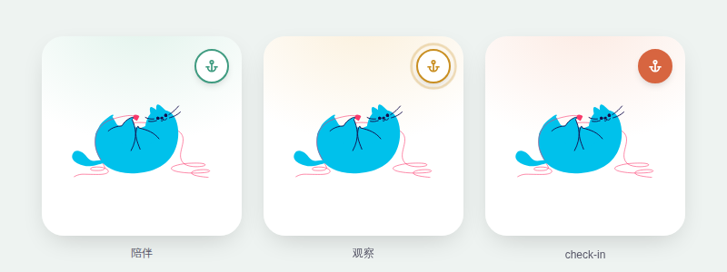
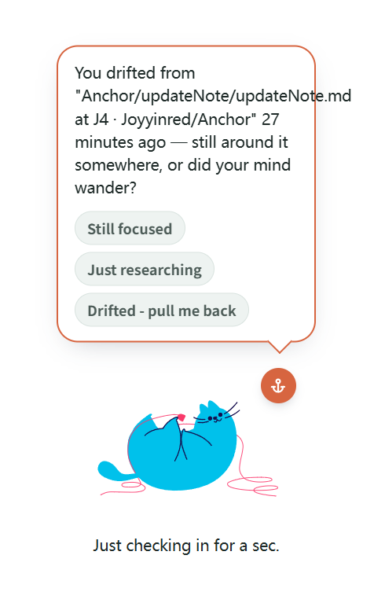
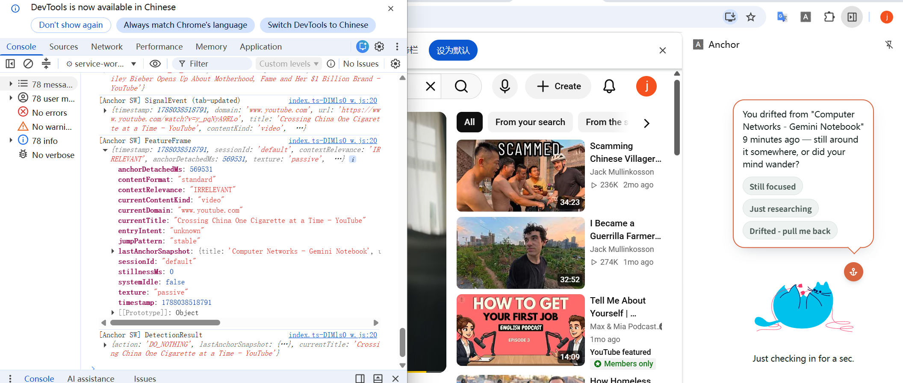

## 0824 
### joy
1. understand all docs and codes
2. based on docs and events add frames.json
3. update file structure
4. add schema interface to engine/types
5. todo-detector.ts and test, will do it later today or tmr

### jay
0. 工作流程表单：方便检查进度，会在我这边每日更新。
1. update `events.json` based on "契约v4: 4.场景"
2. Set up test environment:
    - `package.json`: devDependencies：
        - TypeScript 5.9、Vitest 3.2
        - cripts.test / scripts.test:watch：npm test
    - `tsconfig.json`: TypeScript compilation config. 开了 strict（严格类型检查）、noUnusedLocals/noUnusedParameters（防止死代码堆积）、resolveJsonModule（允许直接 import .json 文件，这样测试代码才能把 events.json/frames.json 当模块导入）。
    - `package-lock.json`（npm install 自动生成）: 锁定依赖的精确版本号，保证以后的 CI 装出来的包版本完全一致。
3. complete task A5, A6: 
    - `src/engine/perceiver.ts`: signal1 - `resolveContextRelevance`, signal2 - `computeAnchorSignal`, signal3 - `computeTexture`, signal4 - `computeJumpPattern`, `computeFeatureFrame` - combine signals and feed data to decision parts.
4. create test files and check J3:
    - `src/engine/perceiver.test.ts`: test perceiver.ts
    - `src/engine/integration.test.ts`: 把perceiver.ts & detector.ts真正接起来跑的端到端测试, "两半合流"。核心是一个"细粒度步进重放"模拟器：把 events.json 的 25 个场景，按真实时间轴一步步推进（不是只看最后一刻），因为 B 的判定逻辑需要证据"持续满 30 秒"才会真的触发提醒，必须真正把时间推进过去才能测出来。23 个可测场景（另外2个是独立函数验收，不适用这条主线）全部验证通过。
5. `detector.ts` debug and update: find one bug in integration test. 
    - DEMO_MODE（演示模式，时间压缩120倍）下，anchorDetachedThresholdMs（锚点阈值）和 stuckThresholdMs（卡住阈值）这两个策略常量一直没有被压缩函数 scaled() 包裹，导致"演示模式下 8 分钟阈值应该变成 4 秒"这条契约规定的行为实际没生效。
6. 跑项目目前需要的 commands：
    - `npm install`：装依赖（第一次拉仓库、或 package.json 有更新时跑一次，生成/更新 node_modules）
    - `npm test`：跑全部单测（perceiver.test.ts + integration.test.ts + detector.smoke.test.ts），一次性跑完就退出
    - `npm run test:watch`：跑测试并监听文件变化，改代码时自动重跑，开发时常驻用这个
    - `npx tsc --noEmit`：只做类型检查、不产出编译文件，提交前建议跑一下确保没有类型错误
    - `npx vitest run <文件路径>`：只跑某一个测试文件，比如 `npx vitest run src/engine/perceiver.test.ts`
    - `npx vitest run -t "关键词"`：只跑名字里含某关键词的用例，调试单个场景时好用（比如 `-t "场景 24"`）

## 0825
### Jay

complete A1234（A1 平台预研 + A2 分类黑白名单 + A3 扩展骨架 + A4 真实信号采集）, refined A2 BUILTIN_ENTERTSINMENT_BLACKLIST.

1. **A1 产出：`docs/MV3平台预研.md`**——写代码前先把 Chrome 扩展这个平台的"规矩"摸清楚。
    - 要申请哪些浏览器权限（tabs/idle/storage/alarms/webNavigation/sidePanel + host_permissions），以及各自为什么必须要。
    - 后台脚本会被浏览器随时"杀掉、清空内存"，怎么保证用户状态不丢。
    - 怎么在网页里监听用户的键盘/滚动/播放行为（content script 注入策略）。
    - 扩展各部件（网页脚本/后台/侧边栏）之间怎么互相传消息（消息链路设计）。
    - "判断用户是怎么进到这个页面的"这件事在哪些场景下拿不到准确信息、只能靠猜（entryIntent 可行性结论，SPA 内部跳转保守判 unknown）。
    - 用什么工具打包扩展（构建工具选型：CRXJS+Vite+TS）。
    - demo 演示模式的开关怎么存、怎么读（DEMO_MODE flag 存储方案）。

2. **A2 产出：`docs/分类prompt-v0.md`**——"AI 怎么判断一个网站跟当前任务相不相关"的说明书。
    - §1-2：判相关性用的 AI 提示词（按网页内容判断，不是按域名一刀切）+ 给 AI 输出结果定的规矩（AI 拿不准时强制标"未知"、结果要缓存、优先走更快的判断路径）。
    - §3：黑白名单兜底表——不用等 AI 判断，命中就直接放行/拦截，对应 `perceiver.ts` 里已经写好的 `DEMO_PRESET_CACHE`/`BUILTIN_ENTERTAINMENT_BLACKLIST`。
    - §4-5：给桌宠"开场白"（起步教练 B6）、"提醒话术"（check-in B7）用的提示词，顺带记一下避免以后重复写。

3. **A3：MV3 扩展骨架，从零搭建**——把扩展从"一堆空文件夹"变成"能装进 Chrome、真的会跑"的东西（新增文件）：
    - `manifest.json`：扩展的"说明书"，声明权限 + 后台 service worker + 侧边栏 + 网页采集脚本。
    - `vite.config.ts`：接入 `@crxjs/vite-plugin` 打包工具，把 `manifest.json` 处理成 Chrome 能直接读的 `dist/` 文件夹。
    - `tsconfig.engine.json` / `tsconfig.platform.json`：把原来一份 `tsconfig.json` 拆成两份——engine 版专门管 `src/engine`（不认识浏览器 API，保证这块纯逻辑代码能脱离浏览器单独测试），platform 版管 `src/platform`/`src/sidepanel`（认识浏览器 API）。根 `tsconfig.json` 改成继承 engine 版，编辑器默认按更严格的那份标准检查。
    - `src/platform/background/index.ts`：后台 Service Worker 的入口文件。注册了 1 分钟一次的心跳闹钟（`chrome.alarms`，专门防后台被浏览器闲置回收、记录后台启动/唤醒的日志、把网页脚本发来的消息转给对应逻辑处理。
    - `src/platform/background/state.ts`：负责往本地存储读写数据——存 demo 模式的开关、存状态持久化用的 key（对应契约里的 `BStatePersistable`）。
    - `src/platform/background/session.ts`：今天先给一个"默认设定"（因为真正的起步引导流程 B6/A13 还没做）——自动把当前打开的网页当作锚点、给个默认档位、给 2 分钟宽限期，存进本地供后面复用。
    - `src/platform/content/content-script.ts`：注入到所有网页里的采集脚本骨架，真正的采集逻辑见下方 A4 ）。
    - `src/platform/messages.ts`：定义网页脚本和后台之间传递消息的格式。
    - `src/sidepanel/index.html` + `main.ts`：侧边栏的占位页面（先显示"Anchor is running"），**后续由B负责，可以在这里建立真正的桌宠界面**。
    - `package.json`：新增了打包需要的几个依赖包，新增了 `build`（打包）、`dev`（开发模式）、`typecheck:engine`/`typecheck:platform`（分别检查两块代码的类型对不对）这几个命令。
    - 验证：`npm run build` 能正常产出 `dist/` 文件夹；用自动化脚本连了一次本地 Chrome，确认装上扩展后后台能成功注册、没有报错。

4. **A4：真实信号采集实现**——把"知道用户在干嘛"这件事真正接到浏览器 API 上（新增文件，用到 chrome.tabs/idle/webNavigation）：
    - `src/platform/background/heuristics.ts`：两个小工具函数。一个用简单的域名表猜"这个网页是代码/文档/视频/PDF/AI聊天中的哪一种"（比如 github→代码，youtube→视频）；另一个把浏览器给的"用户是怎么跳转过来的"原始信息，翻译成我们自己定义的分类，遇到单页应用内部跳转（比如 YouTube 自动换下一个视频）就统一标"未知"，因为这种情况本来就猜不准。
    - `src/platform/background/signals.ts`：今天 A4 的核心文件。监听"用户切了哪个 tab / 同一个 tab 里网址标题变了""用户是不是空闲了""用户是整页跳转还是单页应用内部跳转"这几类浏览器事件，把它们拼成一份完整的"当前信号快照"，再判断一下"这是不是用户设定的锚点页面"，最后打印到控制台方便检查数据对不对（今天还没做存储持久化，留给后面真正接入判断逻辑时再做）。
    - `content-script.ts` ：监听键盘、滚动（这两种事件很频繁，每 2 秒才发一次，避免刷屏）、页面是否被切到后台（不限流，立刻发）、以及视频的播放/暂停/跳转（用 `MutationObserver` 应对单页应用换视频时播放器被整个替换掉的情况，这是 A1 预研里提前标出来的风险点）。这些信息通过消息发回后台，后台只信任当前锚点页面发来的消息，避免被其他网页乱发消息干扰。
    - 验证方式（等我们后续手动测）：切 tab / 触发空闲 / 切走页面 / 播放视频，看后台控制台打出来的信号内容是否合理；心跳闹钟是否按时打日志。

5. 今日新增/常用 commands：
    - `npm run build`：`vite build`，产出 `dist/` 供 Chrome load-unpacked。
    - `npm run dev`：`vite`，CRXJS 开发模式（带 HMR）。
    - `npm run typecheck:engine`：`tsc -p tsconfig.engine.json --noEmit`，验证 `src/engine` 零 chrome 依赖。
    - `npm run typecheck:platform`：`tsc -p tsconfig.platform.json --noEmit`，验证平台层类型正确。
6. New Branch 'J4' is for integrating A,B's jobs when A7, B4 are completed. A will work on personal brance 'A7' before merging to J4. B is suggested to create own branch 'B4' and work on B1-B4 before merging to J4.


### Joy

complete B1、B2（引擎侧逻辑），B4 桌宠组件定稿并接入 Lottie 动画，8.26完成本地测试环境的踩坑排查。

1. **B1 产出：`src/engine/types.ts` + `src/engine/detector.ts`**
    - `defaultSessionContext()`：给一次新会话生成默认的 `SessionContext`（默认档位 CREATOR、2 分钟宽限期 `DEFAULT_GRACE_MS`、默认任务声明）。
    - `restReminderDue()` + `createRestState()`：休息提醒的节流逻辑（首次提醒延迟 + 之后按固定间隔重复提醒）。
    - 新增 `src/engine/metaScenarios.test.ts`（15 条用例，对着 `frames.json` 的 metaScenarios 规格验证），已直接改进项目、跑通。

2. **B2 产出：`src/engine/types.ts` + `src/engine/detector.ts`**
    - 新增 `CheckInChannel`/`CheckInAnswer`/`CheckInFeedback` 类型。
    - `applyCheckInFeedback()`：处理用户在气泡里点的三种回答——STUCK 通道下"在专注"会让阈值梯子往上爬一级（更难触发下次提醒）、"飘了"会把梯子重置到底；DRIFT 通道下清空对应的持续计时器。
    - 新增 `src/engine/b2.test.ts`（6 条用例，对着 `integration.test.ts` 里 `SCENARIO_OVERRIDES[7]` 的 fixture 验证），已跑通。

3. **B4 桌宠组件：`src/pet/CuteAnchorPet.tsx` + `.css` + `assets/cat.json`**
    - 经历了几轮设计迭代（软糖水滴 → CSS/SVG 猫耳猫尾 → 像素画风 → 最终定稿：从Lottie网站找到的矢量动画猫，可以免费试用，版权问题8.26会再次确认）。
    - 猫本体是一份 Lottie JSON，三态（陪伴/观察/check-in）不靠猫变色区分，改成猫耳朵旁边的小锚徽章（描边/描边+波纹脉冲/实心）+ check-in 气泡颜色。
    - 组件用 `lottie-web`（不是 `lottie-react`）手动挂载动画，并在加载完成后裁剪 SVG 的 `viewBox`，让猫撑满容器、徽章能贴着耳朵而不是飘在空中；`state` 切换不会重新加载动画，只影响徽章样式和气泡。
    - 新依赖：`lottie-web`（还需要 `react`/`react-dom`/`@vitejs/plugin-react` 等 React 相关依赖，项目里原来没有）。
    - 附带交付了一个临时的本地预览工具（`devpreview.vite.config.ts` + `devpreview/`），不影响扩展本身构建，纯粹用来肉眼确认三态长什么样。
    - 
    - 
    - 我觉得无背景气泡的更符合桌宠的感觉？but feel free to give advice for this.

4. **今日本地测试环境排查**（还在进行中，未完全解决）：
    - 发现 `tsconfig.platform.json` 的 `include` 里漏了 `src/pet`，导致编辑器对 `CuteAnchorPet.tsx` 按默认严格规则检查、给 `.css` 引入标红线（命令行 `tsc` 实际不受影响，因为 `moduleResolution: bundler` 本身就允许非 JS 后缀的引入）——这是个真实遗漏，修法是把 `src/pet` 加进 `tsconfig.platform.json` 的 `include` 数组，已修复
    - `devpreview` 本地预览服务器起得来（`vite` 终端显示 `ready`），但浏览器和 `curl` 都连不上 `127.0.0.1`，且失败前有 ~2 秒延迟（不是瞬间拒绝）——判断是本机防火墙/安全软件在拦截 Node 监听的端口，还没确认具体是哪个软件，待我8.26本机排查后回填结论。

5. **0826todo**
   - debug pet preview failure problem
   - 版权问题
   - 根据意见修改b4 pet ui, 对话会改成英文
   - finish b5,b6

## 0826
### Jay

昨天 `/code-review` 挑出来的6条问题，先修了2条真 bug（域名匹配漏了 www. 前缀、SW 被回收后信号会哑掉），今天把剩下4条也一并修完：

1. **`onActivated` 切 tab 时的竞态问题**：监听器里有个 `await` 查 tab 信息，如果用户手速很快连续切了好几个 tab，理论上后发的请求可能反而先返回，把新数据被旧数据覆盖掉。修法是给每次触发编个递增的号，`await` 结束后先看看自己是不是最新那次，不是就不写。查代码时顺便发现 `ensureCurrentTab()`（昨天加的、SW 醒来后补状态用的那个函数）也有一模一样的问题，一起修了。

2. **`prefix` 锚点匹配模式没做边界检查**：判断"当前网页算不算命中锚点"时，`prefix` 模式原来直接用字符串 `endsWith`，会把 `notexample.com` 误判成命中锚点 `example.com`（只是字符串结尾一样，其实完全不相关的两个网站）。这个问题昨天修黑名单匹配 bug 时其实已经顺手在 `perceiver.ts` 里写对了一份（`domainMatches`，判断"同一个域名，或者是它的子域名"），今天把这个函数导出，`signals.ts` 和 `heuristics.ts` 都改成调用它，不再各自维护一份容易漏改的判断逻辑。

3. **两份 tsconfig 拆开后没有一个命令能一次测两边**：加了 `npm run typecheck`，一条命令顺序跑 `typecheck:engine` 和 `typecheck:platform`。另外在 `src/platform/`、`src/sidepanel/` 文件夹里各放了一个只有一行"继承平台版配置"的 `tsconfig.json`，这样编辑器打开这两个文件夹下的文件时能自动找到正确的配置（认识 chrome API），不会再显示一堆假的类型错误。

4. **`domainOf()`（从网址里提取域名的小函数）写了两份一模一样的**：新建了 `src/platform/background/domain.ts` 专门放这一个函数，`session.ts` 和 `signals.ts` 都改成从这里引用，删掉各自的重复代码，这样改动这个函数时不用改两个文件，避免因忘记改其中一个而出bug。

验证：`npm run typecheck`（新命令）、`npm test`（57/57 全绿）、`npm run build` 都过了。今天这几条属于代码内部逻辑修正，没有加新的自动化测试——`domainMatches` 的边界判断已经在 `perceiver.test.ts` 里测过了，`signals.ts` 这边涉及真实 chrome API，项目目前还没有 mock chrome API 的测试基建。

5. **完成 A7：真实信号正式接进感知半**——之前 A4 只是把采集到的 `SignalEvent` 打印出来看看形状对不对，今天把它真正接进 `perceiver.ts` 的 `computeFeatureFrame`，算出真实的 `FeatureFrame`（相关性/锚点脱离时长/交互纹理/跳转形态四个信号），相当于把"喂给感知半的数据源"从假的 `events.json` 换成了真实浏览器信号——契约里约定好的 `FeatureFrame` 接口没变，所以 B 那边的决策代码完全不用动。
    - 新增 `src/platform/background/frame-pipeline.ts`：维护一份事件历史，每来一条新事件就存进去（内存 + 存到 `chrome.storage.local`，这样后台被浏览器回收重启后历史不会丢），再拿完整历史跑一次感知半算出当前这一帧。历史只留最近 4 小时/500 条，防止长时间挂着不关内存一直涨。
    - `signals.ts` 现在每收到一个事件，除了打印原始信号，还会打印算出来的 `FeatureFrame`，方便手动检查真实场景下算出来的数值合不合理。
    - 域名相关性判断还是用现成的黑白名单兜底表，真正的 LLM 判断（A8）还没接，判不出的先按"未知"处理，不会卡住整个流程。
    - 验证：`npm run typecheck`、`npm test`（57/57，没碰引擎代码所以数量没变）、`npm run build`（新文件正常被打包进去）都过了。这块也是真实 chrome API 代码，跟 signals.ts 一样，暂时没有自动化测试覆盖。

6. **合并 `B4` → `J4`**：把 Joy 的 B1/B2/B4 分支合并进当前分支，`ort` 策略自动合并成功，两边都改过的 `detector.ts`/`types.ts`/`perceiver.ts` 没有冲突标记。合并后跑了一遍全套验证：`npm run typecheck` 两边干净、`npm test` **78/78 全绿**（多了 Joy 的 `b2.test.ts` 6 条 + `metascenario.test.ts` 15 条）、`npm run build` 正常出包。

7. **自动代码审查发现 10 个问题**：
    - **①休息功能没真正接上**（`detector.ts` 的 `createRestState()`）：点"休息"后应该让走神/卡住提醒暂停，但这个函数算出的结果从没被存回真正生效的状态里，休息期间提醒照样弹。
    - **②提醒冷却没生效**（`detector.ts` 的 `state.lastCheckInTs`）：弹过一次提醒后本该等 5 分钟才能再弹，但"上次弹了没"这个记录从来没人写过，等于没做冷却，可能连续弹好几次。
    - **③休息提醒的触发算法不现实**（`detector.ts` 的 `restReminderDue()`）：算法要求时间点"精确对上"才触发，但真实的定时检查节奏和用户点休息的时刻基本对不齐，实际几乎永远不会触发。
    - **④隐藏按钮仍可被键盘触发**（`src/pet/cat.tsx` 的 check-in 按钮）：按钮不该出现时只是用样式藏起来，没真正从页面里去掉，键盘用户 Tab 过去按回车依然能触发，等于用户没看到提示就被"代答"了。
    - **⑤ VIEWER 模式下重置会失效**（`detector.ts` 的 `applyCheckInFeedback()`）：用户答"飘了"应该无条件把进度清零，但代码加了个条件，导致 VIEWER 这种没有进度阶梯的画像下，这个重置悄悄不执行。
    - **⑥默认配置数组是共用引用，不是真拷贝**（`types.ts` 的 `defaultSessionContext()`）：看起来在复制一份默认设置，数组部分其实还指向同一份数据，以后谁改了自己那份会连带改坏全局默认值。
    - **⑦本地预览工具路径写错，打不开**（`src/devpreview/main.tsx` + `Devpreview.vite.config.ts`）：文件目录写错了。`main.tsx` 的 `'../src/pet/cat'` 多写了一层 `src/`（应为 `'../pet/cat'`），`Devpreview.vite.config.ts` 的 `root` 也应为 `'src/devpreview'` 而非 `'devpreview'`。
    - **⑧默认会话逻辑写了两份**（`types.ts` 的 `defaultSessionContext()` 和 `session.ts` 的 `getOrInitSessionContext()`）：两个文件各自维护一套一样的"新会话默认值"，以后改一处容易忘了改另一处。
    - **⑨同一个类型定义分开写了两份**（`src/pet/types.ts` 和 `src/engine/types.ts` 的 `CheckInAnswer`）：两边各写了一份一样的类型没有互相引用，容易改一边忘另一边；桌宠组件回传答案时也少传了一个关键信息（是哪个通道触发的）。
    - **⑩重复代码可以合并**（`detector.ts` 的 `applyCheckInFeedback()`）：同一行判断逻辑在两个分支里各写了一遍，跟具体是哪个分支无关，可以提出来共用一次。

8. fix all 10 bugs. See details in 工作流程表单.

### Joy

昨天 todo 里的"改 b4 pet ui + 英文化 + 完成 b5/b6"今天都做完了，另外顺手把 b7 也提前做了（依赖只有 B1，不卡 Jay 那边）。

1. **B4 桌宠 UI 按反馈调整**（`src/pet/cat.tsx` + `.css`）：
    - 发现 check-in 气泡一开始会被浏览器顶部截断——气泡实际高度比预留的空间大，往上量了一下实际尺寸后把预留空间从 60px 一路调到 236px，气泡的 `top` 偏移也从 -6px 调到 -30px，跟锚徽章之间留出干净的间距，不再互相遮挡。
    - 气泡改成从锚徽章那个位置"弹出来"的动画：用 `transform-origin` 钉在徽章的坐标上，缩放起点从 0.9 改成 0.2，看起来更像是从徽章里长出来的，配合徽章自己也加了一下小弹跳动画（`ap-badge-pop`），两个动作像是同一个手势。
    - "专注 12 分钟"这个标签原来常驻在右上角，改成悬停在锚徽章上才弹出来的小提示（纯 CSS `:hover` + 相邻兄弟选择器，不用 JS），常态不占地方，符合它"配角，别喧宾夺主"的定位。
    - 全部对话文案（三态说明文字、check-in 按钮、气泡默认消息、专注时长标签）统一改成英文——这是个英文项目，之前是中文占位。

2. **B5 产出：`src/engine/frames.test.ts`**——单元测试：`frames.json` 25 场景里可测的 22 条，直接喂给 `evaluateFrame()`，断言算出来的动作和 `frames.json` 里写的 `expectedAction` 一致（不经过感知半，用 `frames.json` 自带的 `initialState.*SinceOffset` 抄近道直接摆好证据持续器的起始状态，省得逐帧重放）。
    - 过程中揪出 `frames.json` 场景14 一个真的数据 bug：两步之间少了一个"刚越过阈值"的中间帧，导致持续器从来没被正确播种，永远判不出该有的 `CHECK_IN_STUCK`。照着场景6的两步节奏，补了 `900001ms`/`931001ms` 这组边界值（阈值严格大于才算数，卡在整数边界上不算越过）修好，22/22 全绿。

3. **B6 产出：`src/engine/coach.ts` + `coach.test.ts` + `docs/起步教练prompt-v0.md`**——起步教练最小版。
    - `runStarterCoach()` 落实契约v4 §5.5 的追问义务：任务声明不够 8 个字符就追问，最多追问 2 轮，不占用"单次 LLM 调用"这个额度；够格之后才真正调用一次注入进来的 LLM 函数，产出"第一步物理动作"这句话。
    - 真正的 LLM 调用没有写死在代码里，是通过一个参数注入进去的——跟 `perceiver.ts` 判断网页相关性时用的 `ClassificationCache` 是同一个思路，换供应商不用改这个文件，单测也不用真的打网络请求。
    - `SessionContext` 复用已经写好并测过的 `defaultSessionContext()`，只把里面的任务声明换成校验通过的用户输入，没有重新发明一遍。
    - LLM 调用失败（网络问题/超时）有兜底文案，不会让刚打开插件的第一步就卡死。11/11 测试绿。

4. **B7 产出：`src/engine/wording.ts` + `wording.test.ts`**——check-in / 微重启措辞 v1。
    - 关键点：DRIFT 和 STUCK 两种提醒问的不是同一件事，不能共用一套文案逻辑——DRIFT 是"你已经离开了"，问的是离开前那件事（数据来源 `lastAnchorSnapshot`，这是契约里特别强调的一条★）；STUCK 是"你还在这，但很久没动"，问的是当前停留的这件事（数据来源当前页标题），两者搞反了措辞会文不对题。
    - 用户点按钮之后紧跟的那一句短反馈（"在专注"/"查资料呢"/"飘了"三种回答对应三句不同的话）也在这里，一句话说完不追问、不说教。
    - "像朋友不像监工"这条要求不只是嘴上说说，测试里专门用正则挡掉了"should/stop/again/why"这类说教味的词，防止以后改措辞的时候不小心改回监工语气。13/13 测试绿。

5. **英文化扫尾**：`types.ts` 的 `DEFAULT_TASK_DECLARATION`（用户跳过起步教练时会看到的默认任务文案）原来是中文，一并改成英文，跟今天新加的其他用户可见文案保持一致。内部代码注释还是保持中文，跟仓库现有习惯一致，只统一了真正会展示给用户看的字符串。

6. 验证：`npm run typecheck`（engine+platform 两边都干净）、`npm test` **128/128 全绿**（今天新增 `frames.test.ts` 22 条 + `coach.test.ts` 11 条 + `wording.test.ts` 13 条）、`npm run build` 正常出包。

7. **0827todo**
    - B9：状态机建模（陪伴/观察/check-in 三态转换）——依赖只有 B1，是真正会调用今天写的 `buildCheckInMessage`/`buildMicroRestartMessage`、把结果接进 `cat.tsx` 的 `message` prop 那一层，不卡 Jay。
    - B8（协助桌宠接入 side panel）和整条 J4/J5/J6 线，要等 Jay 的 A11（chrome 消息链路）落地才能真正推进，暂时排不上。
    - 版权问题（B4 那只 Lottie 猫的授权条款）昨天的 todo 里提过，今天没顾上，还是待确认。

## 0827
### Jay

今天先把 A7 分支（落后于 J4，缺 B6/B7/桌宠组件）合并 J4 对齐，再完成 A11（桌宠接入 side panel）+ A8（真实 LLM 分类）+ A9（随 A8 一并满足），过程中靠 Jay 手动真机测试暴露出两个真 bug 顺手修了，最后跑了一轮 `/code-review` 把今天新代码的 5 条发现也修完。128/128 测试全程保持绿，`npm run build` 正常出包。

1. **A11 产出：桌宠组件真正接入 side panel（感知半→UI 消息链路）**
    - `vite.config.ts` 接入 React 插件（`@vitejs/plugin-react` 之前装了没注册，`cat.tsx` 这样的 JSX 文件构建不进 side panel 产物）。
    - 新增 `src/platform/panel-state.ts`（background 和 side panel 共享的 `PanelState` 形状）+ `src/platform/background/panel.ts`（把 `DetectionResult` 翻译成 `PanelState`：`CHECK_IN_DRIFT`/`CHECK_IN_STUCK` 调 B7 的 `buildCheckInMessage()` 生成真实文案，`DO_NOTHING` 先占位成 `companion`）。
    - `src/sidepanel/main.tsx`（新，替换占位 `main.ts`）：真正的 React 入口，`chrome.storage.onChanged` 订阅 `PanelState`，渲染 `CuteAnchorPet`，`onAnswer` 把用户回答通过 `chrome.runtime.sendMessage` 发回 SW。
    - `src/platform/messages.ts` 新增 `CheckInAnswerMessage`；`background/index.ts` 收到后调 `frame-pipeline.ts` 新增的 `applyCheckInAnswer()`（内部调 B2 的 `applyCheckInFeedback()`）。
    - 真机装上验证：侧边栏能打开、桌宠能渲染、真实浏览（YouTube/Gemini Notebook）触发的 `SignalEvent`→`FeatureFrame`→`DetectionResult` 全链路日志正常。

2. **真机测试顺手揪出的两个真 bug**：
    - Lottie 猫渲不出来，Inspect 报 CSP 拦 `eval`——`lottie-web` 默认打包（AE expressions 功能）内部用 `eval()`，MV3 扩展页面 CSP 硬性禁 `unsafe-eval`。换成不含 expressions 的 `lottie-web/build/player/lottie_light` 构建，一行 import 改掉，构建产物还小了 138KB。
    - 真实播放 YouTube 视频 8 分钟，`DetectionResult.action` 一直 `DO_NOTHING`——查出心跳 alarm 从来没有真正重新跑过 `computeFeatureFrame`/`evaluateFrame`，只靠离散 DOM 事件触发评估，安静看视频不产生新事件就永远不会被重新检查。这正是契约v4 §3.1"事件静默 >60s 补帧"要求的行为，之前规划过没真正做。`frame-pipeline.ts` 新增 `recomputeOnHeartbeat()`，心跳周期性用当前时刻重新评估（不需要新事件）。

3. **A8 产出：`classifyDomainRelevance` 真实实现**（`src/platform/background/classifier.ts` + `groq.ts`）
    - API： `classifyDomainRelevance()` 正常走 Groq `gpt-oss-20b` → 降级为`UNKNOWN` 。
    - `frame-pipeline.ts` 新增 `triggerLazyClassification()`：只在感知半已经把当前页判成 `UNKNOWN` 时才异步触发（意味着黑名单/白名单/预置缓存全没命中），fire-and-forget，不阻塞当前帧，结果写回 `classificationCache` 供下一次重新计算帧用。
    - 顺带把 Groq `gpt-oss-120b` 接进 B6 起步教练已有的 `StarterCoachLLMCall` 注入口（新增 `src/platform/background/starter-coach.ts`），还没接线——起步教练 UI 本身还没建。

4. **A9（本地黑白名单降级路径）随 A8 一并满足**：`classifyDomainRelevance` 任何失败（没配 key/网络/超时/解析失败/低置信度）都安全落回 `UNKNOWN`，不影响 A2 已有的 `DEMO_PRESET_CACHE`/`sessionWhitelist`/黑名单短路优先级——断网/API 挂了，表现跟"还没接 LLM 之前"完全一样。

5. **`/code-review` 全部修完**：
    - check-in 答完 side panel 不刷新（按钮留在 UI 上能再点一次，会把 `applyCheckInFeedback` 重复触发）→ 新增 `pushCompanionState()`，答完立刻推。
    - `BState` 持久化了 `types.ts` 明确标注"不持久化"的持续器字段（`driftSustainer`/`stuckSustainer`/`passiveSince`），SW 回收重启后可能拿旧证据误判 → 新增 `toPersistable()` 只存该存的一半，顺带把本来重复造的本地 storage key 逻辑改成 `state.ts` 里早就有但没人调用的 `getBState`/`setBState`。
    - 心跳里两次 `Date.now()` → 改成只取一次复用。
    - `classifier.ts`/`starter-coach.ts` 各写一份 JSON 提取逻辑 → 提到 `groq.ts` 的 `extractJsonObject()` 共用。

6. **今日遗留问题**（记录，暂未处理）：
    - **A8 和 B6 完全没接上**：`session.ts` 的 `getOrInitSessionContext()`（`taskDeclaration` 唯一写入点）只调 `defaultSessionContext()`，从不知道 `runStarterCoach()` 的存在；`runStarterCoach()`/`groqStarterCoachCall` 目前只有测试文件在调用，没有任何 UI/消息通道能让用户真正声明任务。后果：`ctx.taskDeclaration` 永远是占位文案，这正是这几天测试时 A8 分类经常判 `UNKNOWN` 的根因——模型被问"这页面跟'没有任务'相关吗"答不出来是它的正确保守回答，不是分类链路本身的锅。这个缺口卡在 B6 和 A13 之间，两边现有任务描述都没直接点出来。
    - ~~**DRIFT 通道有一个契约本身的设计边界，真机测试才浮出来**：`texture: 'idle'`...~~ **已修复，见下方第 9 条**——跟 Jay 确认过这是设计漏洞不是边界，改掉了。
    - **check-in 答 FALSE_POSITIVE 不会真正写回 `sessionWhitelist`**：`detector.ts` 注释里写明这是调用方的责任，`applyCheckInAnswer()` 目前只清空 `driftSustainer`，没有真正把当前域名加进白名单。
    - `panel.ts`/`classifier.ts`/`groq.ts`/`starter-coach.ts` 这批新代码依赖真实 `chrome.storage`/`fetch`，仓库目前没有 chrome API mock 的测试基建，都还没有自动化测试覆盖（跟之前 `signals.ts`/`session.ts` 是同一类已记录过的遗留缺口）。

7. **DRIFT 通道 `texture: 'idle'` 缺口修复**（`src/engine/detector.ts`，B1/B3 的内容，改了 `detector.ts`）：`texture: 'idle'`（120s 窗口内连 `PASSIVE_SCROLL` 都没有）语义上比 `'passive'`（至少还在被动滚动/僵尸连播）更强的走神证据，之前却被排除在 DRIFT 的纹理证据之外。
    - `isContinuouslyPassive()` 改名 `isContinuouslyDisengaged()`：原来 `f.texture !== 'passive'` 就重置计时器（等于只认 `'passive'`，`'idle'` 会被当成"没证据"处理）；改成只有 `f.texture === 'purposeful'` 才重置——`'passive'`/`'idle'` 现在都算连续非主动纹理证据，两者共用同一个 60s 累计窗口。`isDrifting()` 里的调用处同步改名，STUCK 通道（`isStuck`）没有改动。
    - 补了 `src/mock/frames.json` 场景25 作为回归测试——照抄场景3（`passive` 纹理的三步触发过程）复制一份，只把 `texture` 换成 `'idle'`，其余时间轴/期望动作完全一致（证明这两种纹理现在走同一套逻辑）。
    - `src/engine/frames.test.ts` 22→23 条（新增场景25），全套 `npm test` 129/129 全绿，`npm run typecheck`/`npm run build` 都过。

## 0827
### Joy

今天把 B8/B9 做完，并把昨天写好却一直没人调用的 B6 起步教练真正接上了 UI——`runStarterCoach()`/`groqStarterCoachCall` 从此有了调用方，这是 0827 遗留问题里"A8 和 B6 完全没接上"那一条的正面解决。之后第一次做完整真机测试，暴露出 6 个 bug，修掉 2 个（都在我自己的代码里），另外 4 个在感知半（Jay 的 `signals.ts`/`perceiver.ts`）和 `types.ts` 里，记录在下方第 5 条。`npm test` 147/147 全绿，`npm run typecheck` 两边干净，`npm run build` 正常出包。

1. **B6 起步教练 UI 落地**（补上 0827 记录的那个缺口）
    - 新增 `src/platform/onboarding-state.ts`：background ↔ side panel 共享的 `OnboardingState` 形状（`PENDING`/`NEEDS_FOLLOWUP`/`READY`/`DONE` 四态），跟 `panel-state.ts` 同一个模式，属于传输层不进引擎契约。
    - 新增 `src/platform/background/onboarding.ts`：SW 侧逻辑。`handleOnboardingSubmit()` 真正调用 `runStarterCoach()` + `groqStarterCoachCall`，结果推回 `ONBOARDING_STATE_KEY`；`pushOnboardingStatus()` 判断该显示输入框还是直接显示桌宠——判据是 `SessionContext.taskDeclaration` 是否还是那句默认占位文案，**不额外维护一个"onboarding 做过没"的独立标记**，省得两处状态哪天不同步。
    - 新增 `src/sidepanel/OnboardingPanel.tsx` + `onboarding.css`：起步输入框 UI，纯展示层（跟 `cat.tsx` 同一个原则），契约v4 §5.5 的追问闸门逻辑全在 SW 侧的 `runStarterCoach()` 里，这里只转发输入、显示 SW 推回来的状态。
    - `messages.ts` 新增 `ONBOARDING_STATUS_REQUEST`/`ONBOARDING_SUBMIT` 两条消息；`session.ts` 新增 `saveSessionContext()`（起步教练产出的真实 `SessionContext` 写回 `getOrInitSessionContext()` 读的那同一个 key）；`background/index.ts` 接住这两条消息。
    - **意义**：`ctx.taskDeclaration` 现在第一次会是用户真实声明的任务，不再永远是占位文案。0827 记录的"A8 分类经常判 UNKNOWN"的根因（模型被问"这页面跟'没有任务'相关吗"）从这里被解掉。
    - 起步教练LLM调用测试通过，可以正常对话并分解任务

2. **B7 的微重启文案终于被调用**（`panel.ts` 新增 `pushMicroRestartToast()`）
    - `buildMicroRestartMessage()` 0826 就写好也测过，但一直没有调用方——用户答完 check-in 是直接变空白陪伴态，点了按钮没有任何回应。
    - 现在答完先显示那句反馈（"Good, carry on." / "No worries, let's head back."），2.5 秒后自己摘回空白 companion。
    - 为此改了 `cat.tsx`/`cat.css`：气泡显隐从"是不是 checkin 态"改成"这一刻有没有话要说"（新增 `data-bubble-visible` 属性驱动），**没有引入第四个 PetState**（组件注释明确禁止）。气泡边框色改成跟着 `--ap-state` 走，否则一句"没关系，回去吧"套着橙色警示框，看着像在质问用户。
    - 测试通过，checkin消息弹出后有互动

3. **B9 状态机**（`src/engine/pet-state.ts` + `pet-state.test.ts`，16 条单测）
    - 解决的问题：桌宠画了三态，但 `observing` 从头到尾没有任何代码会产出——`panel.ts` 之前把 `DO_NOTHING` 一律映射成 `companion`，实际只演得出两态。
    - **`observing` 的信号来源**（`panel.ts` 顶部注释留的那个问题）：`DetectionResult` 确实不带"证据接近阈值"，但 `BState` 的两个证据持续器带——`driftSustainer.since`/`stuckSustainer.since` 一旦不是 null，就意味着"证据已开始累积、还没满持续窗口"，正好就是"有点飘的迹象，先悄悄多看两眼"那一刻。**不需要给 `DetectionResult` 加字段，也不需要动 `detector.ts` 的判定逻辑。**
    - 优先级：`checkin` > 休息期强制 `companion` > 证据累积 `observing` > `companion`。
    - 两个额外设计决定：①**迟滞防抖 `MIN_OBSERVING_MS = 15s`**，证据消失后 observing 至少再保持 15 秒——不加的话真实浏览里 `texture` 每几秒翻一次，桌宠会在两态之间明显闪烁；②**休息期强制 companion**，因为休息期 `isDrifting`/`isStuck` 是在闸口直接 return false 的、持续器不会被清空，不显式挡一道的话用户点了"休息"反而会看到桌宠一直在"盯着你"。
    - `detector.ts` 把 `scaled()` 加了 `export`（原来私有）——迟滞窗口在 demo 模式也得压缩，按红线5「DEMO_MODE 时间压缩常量只在一个地方改」必须复用同一个函数，不能自己再写一份 `1/120`。

4. **B8 接线**（`frame-pipeline.ts` / `panel.ts` / `signals.ts` / `index.ts`）
    - `frame-pipeline.ts` 是全项目唯一同时拿得到 `action` 和 `BState` 的地方，所以状态机实例放在那里推进（模块级内存变量，跟 `previousTexture` 同一个理由：纯 UI 表现状态，SW 回收后从 companion 重来无害，不值得多一次 storage 往返），算出的 `PetState` 跟 `DetectionResult` 一起返回。
    - `panel.ts` 退化成纯翻译层，不再自己判断 PetState；`signals.ts`/`index.ts` 各一行透传。

5. **真机测试暴露的 6 个 bug**

    **已修（2 个，都在我自己的代码里）：**
    - **① 起步教练把锚点弄丢了**（`onboarding.ts`，我写这个文件时漏传参数）：`runStarterCoach()` 没传 `inferredAnchor`/`sessionId`，导致起步一完成 `anchor` 就被覆盖成 `{ domain: '', url: '' }`。空锚点匹配不上任何页面 → 没有任何事件被判成"在锚点上" → `lastAnchorTs` 恒为 0 → **`anchorDetachedMs` 直接等于当前 epoch 时间戳**（真机日志里是 `1787883284236`，而不是"脱离了多久"），`lastAnchorSnapshot` 也拿不到真实标题。修法：查一次当前活动 tab 当锚点（跟 `session.ts` 取的是同一个东西、复用它的 `domainOf`），`sessionId` 固定成 `'default'`——BState/事件历史都按 sessionId 分 storage key，每次起步生成新 id 的话旧 key 会永远堆在 `chrome.storage.local` 里没人清。
    - **② check-in 文案报出天文数字**（`wording.ts`）：上面那个 bug 的连带表现，真机上弹出的是 `You drifted from "what you were working on" 29798077 minutes ago`（≈56 年，即 `now - 0`）。根因修了，但退化情况本身也该防住——快照仍是初始值（`ts <= 0` 或标题为空）时改成**完全不说"多久以前"**：宁可少一条信息，也不能报一个一眼假的数字，那比没有信息更伤可信度。补了 2 条回归测试，其中一条用正则挡掉 4 位以上数字。

    **未修（4 个，需要 Jay 确认后再动，因为都在她的文件或会影响既有测试断言，供你参考，只是我这边今天跑了测试的结果）：**
    - **③ `signals.ts`：切 tab 会永久卡死**（我测试时开着工作网页和油管不相关视频切了很多次，会停留在之前的tab上很久，必须重新关掉油管重新进入才能检测到，不知道你那边明天测试会如何，所以暂时先写进来，我没有切双屏）。`onActivated` 里 `if (!tab.url) return;` —— 新开的标签页（`chrome://newtab/`）`tab.url` 是空字符串，于是**早退且没更新 `currentTab.tabId`**，`currentTab` 继续指向上一个标签。而 `onUpdated`/`onCommitted`/`onHistoryStateUpdated` 三个监听器全都有 `currentTab.tabId !== tabId` 的门禁，那个新标签页后来导航到 YouTube 时带的是新 tabId，**全部被丢弃**。`ensureCurrentTab()` 也救不了（第一行 `if (currentTab) return;`，非空只是过期）。真机日志表现：SW 心跳持续报 `currentTitle: '扩展程序'`，人已经在 YouTube 上好几分钟了完全检测不到。**临时绕过**：切到任意别的普通网页再切回来（这次 `tab.url` 非空，能正常更新）。建议改法：不管 url 是否为空都先把 `tabId` 切过去，url 留空等 `onUpdated` 补，只是暂时不发事件。
    - **④ `signals.ts`：没有监听 `chrome.windows.onFocusChanged`**（grep 全文 0 处）。`tabs.onActivated` 只在同一窗口内切标签时触发，**跨窗口切换完全静默**。测试时 SW 控制台是独立窗口很容易踩到，真实用户双屏工作也会。
    - **⑤ `perceiver.ts`：`texture` 在没有新事件时会"冻住"**——这是挡住 DRIFT 的直接原因。`computeTexture` 里 `if (windowEvents.length < 1) return previousTexture;`（冷启动沿用上次判定）。**安静看视频压根不产生事件**（content script 只在键盘/滚动/播放暂停时才发），所以纹理窗口空空如也 → 每帧都走冷启动 → `previousTexture` 是什么就永远是什么。真机日志里连续多次心跳 `texture: 'purposeful'` 纹丝不动。DEMO 模式下更糟：`TEXTURE_WINDOW_MS` 120s 被压成 **1 秒**，几乎必然落进冷启动分支。后果：`isDrifting` 的 `textureEvidence` 要求 passive/idle，CREATOR 档 `muteJumpPattern: true` 让 `jumpEvidence` 恒 false，于是 `evidence` 恒 false，**"安静刷视频"这个最典型的走神场景反而永远抓不到**。手动滚动几下页面能绕过（`PASSIVE_SCROLL` 进窗口），今天就是靠这个才验证通链路的。建议改法：超过一个窗口长度没有任何事件应判 `idle`，而不是无限期回显上一次——但会影响 `perceiver.test.ts`/`integration.test.ts` 的既有断言，需要 Jay 确认。（我在工作台手动改为passive后就正常了）
    - **⑥ `types.ts`：`graceUntil` 没有做 DEMO_MODE 压缩**。`defaultSessionContext()` 里 `graceUntil: now + DEFAULT_GRACE_MS`（2 分钟），**没有 `isDemoMode` 参数**，算出来是绝对时间戳，demo 压不到它。而 `runStarterCoach()` 内部正是调它造新 context——**用户做完起步教练那一刻，宽限期重新开始算 2 个真实分钟**，紧接着切走会被公共闸口 `if (now < ctx.graceUntil) return false;` 全部静默。违反红线5「时间压缩常量只在一个地方改」的精神，`scaled()` 漏了这一处。临时绕过是控制台手动把 `graceUntil` 改成 0，但 J10 走查/J11 录 demo 时很容易翻车。

6. **manifest 缺 `action` 字段**（`manifest.json`，不算 bug 但影响 demo 观感）：没有声明 `action`，**工具栏上没有可点的 Anchor 图标**，只能从 Chrome 自带的侧边栏下拉菜单里翻出来。录 demo 时让评委看这个过程观感会差很多。改法：manifest 加一个空的 `"action": { "default_title": "Anchor" }`，`background/index.ts` 加 `chrome.sidePanel.setPanelBehavior({ openPanelOnActionClick: true })`，就能"点图标直接弹出桌宠"。

7. **真机测试正确姿势**（踩坑记录，下次测试/demo 前照着来）
    - 每次重测起步教练都要 `chrome.storage.local.clear()` + `chrome://extensions` 刷新扩展——onboarding 靠 `taskDeclaration` 是否为占位文案判断该不该显示。
    - Groq key 手动配：`chrome.storage.local.set({ anchor_groq_api_key: 'gsk_...' })`，配在 **Anchor 自己的 Service Worker 控制台**里（不是网页控制台，storage 是分开的）。
    - **声明完任务后必须先在锚点页面上滚动/敲字几下再切走**——`computeAnchorSignal` 要求 `isAnchor` + `ACTIVE_INPUT`/`PASSIVE_SCROLL`/`MEDIA_PAUSE`/`MEDIA_SEEK` 才写快照，光把锚点设对了不够。否则 check-in 文案只能说兜底的 "what you were working on"。**这条要编进 demo 脚本**，评委看的路径很容易踩到。
    - demo 模式：`chrome.storage.local.set({ anchor_demo_mode: true })`，120x 压缩（不开的话触发一次 DRIFT 要 8 分钟锚点脱离 + 60s 被动 + 30s 持续 ≈ 10 分钟起）。注意心跳 alarm 最短 1 分钟是 Chrome 硬性下限，demo 模式也压不了。★ 09-11 更新：压缩倍数已经从 120x 调到 30x，这条记录按当天原始数字保留，最新倍数见 09-11 当天的条目。


## 0828
### Jay

核对了 Joy 昨天 B4 分支的记录（B6/B7/B8/B9 + 6 个真机测试 bug），跟代码逐条核实无误，合并进 J4（`715032e`）。然后按顺序把你留的 ③④⑤⑥ 四条都修了。`npm test` 147→150（`perceiver.test.ts` +2、`metascenario.test.ts` +1），`npm run typecheck` 两边干净，`npm run build` 正常出包。

1. **③ `signals.ts`：新标签页会让 `currentTab` 永久卡死**
    - `chrome.tabs.onActivated` 里 `if (!tab.url) return;` 会在切到 `chrome://newtab/` 这类内部页面时早退且不更新 `currentTab.tabId`——之后不管这个 tab 导航到哪，`onUpdated`/`onCommitted`/`onHistoryStateUpdated` 三个监听器全靠 `currentTab.tabId` 门禁，全部会被判成"不是当前 tab"丢弃，表现正是 Joy 描述的"必须重新关掉再进入才能检测到"。
    - 修法：`tabId` 无论如何先切过去（`url`/`domain`/`title` 留空），只有 `tab.url` 非空才真正 `emitSignalEvent`——等 `onUpdated` 把真实 url 补上后自然会走信号发送路径，不用等用户手动切到别的 tab 再切回来。

2. **④ `signals.ts`：没有监听 `chrome.windows.onFocusChanged`**
    - grep 全文确认 0 处。`tabs.onActivated` 只在同一窗口内切标签时触发，跨窗口切换（真实用户双屏工作很常见，Joy 测试时 SW 控制台是独立窗口也踩到了同一类问题）完全静默。
    - 新增该监听器：`windowId === chrome.windows.WINDOW_ID_NONE`（焦点离开 Chrome 本身，切到别的应用）时忽略；否则查一次新窗口里当前激活的 tab，按跟 `onActivated` 一样的逻辑处理，复用同一个 `activationSeq` 过期保护（两者会互相竞态，必须共享同一套"只认最新一次"）。

3. **⑤ `perceiver.ts`：`computeTexture` 冷启动会无限期冻结**（Joy 认为的 DRIFT 根因）
    - `windowEvents.length < 1` 时原来无条件 `return previousTexture`。安静看视频完全不产生新事件（content script 只在键盘/滚动/播放暂停时才发），纹理窗口永远空，于是每一帧都走冷启动分支，`previousTexture` 是什么就永远是什么——真机日志里连续多次心跳 `texture: 'purposeful'` 纹丝不动，`isDrifting` 要求的 passive/idle 纹理证据永远等不到。
    - 关键发现：`current`（`events` 数组里时间戳最大的那条）必然满足自己的 domain 过滤条件，所以 `windowEvents` 为空当且仅当①压根没有任何事件，或②最近一条事件已经比一整个纹理窗口（120s）还旧——不存在"刚切换域名、证据不够"这种中间态需要额外处理，两种情况天然就是所有可能性的全部。
    - 修法：`current` 不存在（真正的会话起点）才沿用 `previousTexture`——没有信息，不该编造判定；只要曾经有过事件，windowEvents 为空就意味着一整个窗口的彻底沉默，直接判 `'idle'`——这本身就是最有力的证据。补了 `perceiver.test.ts` 2 条回归测试（真沉默判 idle / 真起点仍沿用 previousTexture）。
    - **连带发现并更新设计漏洞**：这个修复会让场景15（READER 精读课件，滚动间隔原本是 5/15/30 分钟）误报 STUCK——之前它能过纯粹是靠这个 bug 意外挡住的（`texture` 冻结在 `'purposeful'`，STUCK 的 `f.texture !== 'idle'` 硬闸门直接拦下）。这不是逻辑错误，是 fixture 的滚动密度不真实——真实精读远比 5-15 分钟一次滚动频繁。现把场景15的滚动间隔改成 100s 一次（小于 120s 纹理窗口，texture 全程不冷启动），场景意图（精读不算走神）不变。

4. **⑥ `types.ts`：`graceUntil` 没有做 DEMO_MODE 压缩**
    - `defaultSessionContext()` 里 `graceUntil: now + DEFAULT_GRACE_MS` 原来是绝对时间戳，没有 `isDemoMode` 参数——起步教练一做完宽限期就会重新算 2 个**真实**分钟，demo 模式压不到它，紧接着切走会被 `detector.ts` 的公共闸口 `now < ctx.graceUntil` 全部静默。
    - 修的时候发现根因不只是"漏了一处 `scaled()`"：`detector.ts` 和 `perceiver.ts` 各自维护了一份几乎一样的 `scaled()`/`DEMO_TIME_SCALE` 实现（互相看不到对方），`types.ts` 里的 `defaultSessionContext()` 想用哪一份都会造成循环依赖（两个文件都 import `types.ts`）——这正是"没有一个大家都能安全 import 的公共位置"，跟分工v2.md §5 红线5「时间压缩常量只在一个地方改」的精神直接冲突。
    - 修法：把 `scaled()` 的规范实现搬到 `types.ts`（engine 内两个文件共同依赖的叶子模块，天然不会产生循环依赖）；`detector.ts` 改成从 `types.ts` import 后原样重新导出（`export { scaled }`），`pet-state.ts` 现有的 `import { scaled } from './detector'` 完全不用改；`perceiver.ts` 删掉自己那份本地实现，改成从 `types.ts` import。`defaultSessionContext()` 新增 `isDemoMode?: boolean` 参数，`graceUntil` 改用 `scaled(DEFAULT_GRACE_MS, isDemoMode)`。两个调用方跟着改：`session.ts` 的兜底路径读一次 `getDemoMode()` 传进去；`coach.ts` 的 `runStarterCoach()` 新增 `isDemoMode` 参数透传给 `defaultSessionContext()`，`onboarding.ts` 的 `handleOnboardingSubmit()`/`index.ts` 的 `ONBOARDING_SUBMIT` 处理器跟着接上 `getDemoMode()`。补了 `metascenario.test.ts` 一条 DEMO_MODE 回归测试。

5. **J5 启动：修真机测试暴露的问题**
    - `manifest.json` 加 `"action": { "default_title": "Anchor" }` + `background/index.ts` 加 `chrome.sidePanel.setPanelBehavior({ openPanelOnActionClick: true })`——点工具栏图标直接弹侧边栏，不用再从 Chrome 下拉菜单翻（Joy 08-27 记录的第6条，非 bug 但影响 demo 观感，顺手做掉，但不确定是否符合你的想法）。
    - **check-in 气泡一闪而过（真 bug）**：根因是 `evaluateFrame()` 触发 check-in 那一刻会把 `state.lastCheckInTs` 设成 `now`（它自己 5 分钟冷却闸门要用），于是紧接着**任意一次**新事件（键盘/滚动/切 tab，不用是在回答）触发的下一次 `evaluateFrame()` 都会被冷却闸门拦成 `DO_NOTHING`，而 `panel.ts` 原来每帧无条件覆盖 storage——气泡因此在用户读完/回答之前就被顶掉，跟按不按回车没关系，是任何后续事件都会触发。修法：`panel.ts` 的 `pushPanelState()` 先看当前是不是已经在显示未回答的 check-in，是的话跳过覆盖，只有用户真正点按钮（`pushCompanionState`/`pushMicroRestartToast`）才会让它消失。
    - **`cat.tsx` 的状态文案读起来像内部判定说明**：原文案"Enough signs now — asking like a friend, not a supervisor."把"像朋友不像监工"这条设计原则直接说给用户听了，改成第一人称口语化："Might be drifting a little — I'm keeping half an eye on things."（observing）/ "Just checking in for a sec."（checkin）。
    - **气泡顶部被 Chrome 原生 side panel 标题栏遮挡**：真实页面标题（YouTube 标题常见 60-80 字符）会把气泡撑得比预留高度还高，`wording.ts` 新增 `truncateTitle()`（60 字符截断+省略号），DRIFT/STUCK 两条措辞里嵌入的页面标题都过一遍，补了 2 条 `wording.test.ts` 回归测试；气泡顶部紧贴标题栏，`cat.css` 的 `.anchor-pet-stage` 顶部内边距从 236px 再加到 320px。

**J5 完成**：重新配好 Groq key 后完整复测"疯狂切 tab 不打扰"+"飘走触发 check-in"两个反差瞬间，均确认通过——★关键检查点二达成。

6. **给 Joy 的建议：完成休息模式 UI**——grep 了一遍 `startRest()`/`restReminderDue()`（`detector.ts`，B1 早就写好并测过）的调用方，`src/pet/`、`src/sidepanel/`、`src/platform/background/{panel,index}.ts`、`messages.ts` 里没有任何一处引用它们——整条休息模式功能目前有引擎逻辑、零 UI、零入口，用户根本点不到"休息"。
    - **契约v4 §3.8 功能简述**：
      - 用户主动点"休息" → `restUntil = now + 20min`，期间 DRIFT/STUCK 双通道全静默（`state.restUntil > now` 这条闸门 B1 已经实现），A 侧感知半照常上报不受影响。
      - 休息满 15 分钟且用户还没回来 → 第一次轻声提醒"休息够啦，要继续吗？"；之后每 5 分钟重复提醒，直到用户回来（`restReminderDue()` 已经实现，帯 60s 心跳节拍容差）。
      - 提醒期间用户可以随时"继续专注"或"结束专注"两个选项。
    - **需要 B 做的**：①桌宠/side panel 上要有个"休息"入口（按钮或类似交互）；②15/20/25min 提醒触发时的 UI 表现；③"继续专注"/"结束专注"两个按钮的交互和对应的消息类型。
    - **A 侧需要配合的部分（我这边待做）**：新增一个类似 `CHECK_IN_ANSWER` 的消息类型（比如 `REST_START`/`REST_END`），`background/index.ts` 接住后调 `startRest()`/清空 `restUntil` 并持久化 `BState`——这条链路目前完全不存在，等 B 把 UI 设计定下来之后我可以照着 A11/B8 已有的模式（`messages.ts` 加类型 + `index.ts` 加 handler + 结果推回 `PanelState`）接上。

7. **J6：逐字段核对 `SessionContext` 是否正确喂给 A 感知半，补上一个真缺口**
    - 核对结果：`taskDeclaration`（`classifier.ts` 消费）、`profile.archetype`/`policy`（`evaluateFrame` 消费）、`anchor.domain`/`url`/`matchMode`（`signals.ts` 的 `isAnchorMatch`，exact/prefix 都已实现）、`graceUntil`（`detector.ts` 公共闸门，已按 DEMO_MODE 压缩）都没问题。
    - 发现真缺口：`sessionWhitelist` 只有读（`perceiver.ts` 的 `resolveContextRelevance`）没有写——`detector.ts` 的 `applyCheckInFeedback` 注释早就写明"FALSE_POSITIVE 要不要把当前域加入 sessionWhitelist 是调用方（SessionContext）的事"，但一直没人接这一步，答"查资料呢"之前只会清空 `driftSustainer`，下一次同一个域名照样会被判 DRIFT 重新问一遍。
    - 修法：`panel-state.ts` 的 `PanelState` 新增 `domain` 字段——`panel.ts` 的 `toPanelState()` 在 DRIFT 触发那一刻把 `frame.currentDomain` 记进去（不是用户点按钮那一刻在哪个域名，因为 08-28 修的"气泡 sticky"允许用户在气泡还没消失前已经切走）；`messages.ts` 的 `CheckInAnswerMessage` 新增 `domain?: string`，`main.tsx` 的 `handleAnswer` 把 `panelState.domain` 原样带回；`frame-pipeline.ts` 的 `applyCheckInAnswer()` 新增 `domain` 参数，DRIFT+FALSE_POSITIVE 时把它 push 进 `ctx.sessionWhitelist`（去重）并调 `saveSessionContext()` 持久化。
    - 验证：`npm run typecheck` 两边干净，`npm test` 152/152（改动没碰 engine），`npm run build` 正常出包。真实 chrome API 代码没有自动化测试覆盖（沿用已知缺口）——建议下次真机测试顺手验证：同一个域名答两次 FALSE_POSITIVE，第二次不该再触发 DRIFT。

8. **A12：真实数据噪音处理（idle 抖动/tab 快切去抖节流）**
    - `signals.ts` 新增 `emitSignalEventDebounced()`（300ms 尾部去抖），套用在 `onActivated`/`onFocusChanged`/`onUpdated` 三个"tab 快切"触发源——`currentTab` 的赋值仍然同步，只延迟"要不要真的产出一条 SignalEvent"这个决定，debounce 期间用户再切一次会看到最新的 currentTab，只有停留超过 300ms 才真正记一条事件。300ms 选得足够短：人不可能在这么短时间内真正"看"一眼某个标签页再决定继续切，`jumpPattern` 关心的是秒级的往返跳转模式，不会因为吞掉亚秒级抖动丢失有意义的证据。`onCommitted`/`onHistoryStateUpdated`（真实导航提交）和 content-script 交互（已在内容脚本层 2s 节流）不受影响，仍然逐条记录。
    - `idle.onStateChanged` 加防御性去重：新状态跟当前追踪的 `systemIdle` 一样就直接跳过，不重复跑一遍完整评估链路。
    - 验证：`npm run typecheck` 两边干净，`npm test` 152/152，`npm run build` 正常出包。同样是真实 chrome API 代码，没有自动化测试覆盖。

### Joy

接着 Jay 上午给的建议做了休息模式 B 侧，然后做完 B11（措辞打磨），再把「最小版收尾反思」补掉（那块不在任何编号里，但同时堵三个洞：给 `SESSION_END` 一个归宿、解开 J7 ↔ B15 互相依赖转不动的死结、补齐 J7「起步 → 陪伴 → 拉回 → 收尾反思」的最后一环），最后发现并修了「拉我回去」这个**说了不算**的大漏洞。`npm test` **180/180** 全绿，`npm run typecheck` 两边干净，`npm run build` 正常出包。

1. **休息模式 B 侧**（契约v4 §3.8，对应 Jay 上午第 6 条的建议）
    - 新增 `src/platform/rest-state.ts`：`RestState` 形状 + 独立 storage key。**不塞进 `PanelState`**——休息跟三态是正交的两件事，而且分开一个 key 之后，用户点"休息"那一刻不会被下一次心跳的 `pushPanelState` 冲掉。
    - 新增 `src/platform/background/rest.ts`：`beginRest`/`endRest`/`refreshRestReminder` 三个函数，只负责读写 `BState` + 推面板状态，判定全部复用 B1 早就测过的 `startRest()`/`restReminderDue()`。**这是给 Jay 的参考接线**，她要重写或挪进 `frame-pipeline.ts` 都行。
    - `wording.ts` 补三句休息措辞；`pet/types.ts` 加 5 个 props；`cat.tsx`/`cat.css` 加休息入口按钮、提醒气泡的两个选项、`data-resting` 视觉；`messages.ts` 加 `REST_START`/`REST_END`/`SESSION_END`；`main.tsx` 订阅 `REST_STATE_KEY`。
    - **★ 关键设计决定：休息不是第四个 PetState。** `cat.tsx` 顶部明确写了"三态之外没有第四态"，所以休息做成正交标记——休息期间 `state` 仍是 `companion`，只是徽章降饱和度+去脉冲、猫本体淡到 0.7、说明文案换掉。语义上正好："我还在，只是不看着你了"。
    - **踩过的坑写在注释里了**：结束休息必须**同时**清 `restUntil` 和 `restStartTs`。只清前者的话 `restReminderDue()` 会继续按老的休息起点判定，提醒停不下来（它只读 `restStartTs`）。
    - UI 微调：`Take a break` 一开始做成了无边框纯灰文字，预览里看着像说明文案不像控件（affordance 不足，**一个点不出来的入口等于没有这个功能**）。改回描边 pill，靠"背景透明 + 更浅文字色"跟 check-in chip 拉开层级，而不是靠去掉按钮特征本身。

2. **B11：check-in / 微重启措辞打磨**（`wording.ts` + `wording.test.ts` + `panel.ts`）
    - **要解决的是重复。** 每种情况只有一句固定文案，而冷却是 5 分钟——一次 demo 很容易触发两三次 check-in，评委会看到一模一样的句子重复出现，那一瞬间"像朋友"的错觉就破了，变成很明显的模板机器人。
    - 做法：DRIFT 3 个变体、STUCK 3 个、无快照兜底 2 个、微重启每种回答 3 个，用 `pickVariant()` 按 `Math.floor(now / 60_000) % 池长度` 轮换。
    - **★ 刻意不用 `Math.random()`**，三个理由：①测试可断言不 flaky；②**demo 可预演**——走查时看到的就是现场会出的那句，不会临场抽到没排练过的文案；③两次 check-in 至少隔 5 分钟冷却，分钟数必然不同，实际观感就是"每次都不一样"。
    - `panel.ts` 的 `pushMicroRestartToast()` 补传 `Date.now()`——不传的话永远只出每个池的第一句，变体等于白做。第二参数可选，所以是向后兼容的改动。
    - **测试才是这次的重点**（23→32 条）：不是只测选中的那一句，而是**对每一个变体逐条断言语气规则**——必须引用标题、必须带时间线索、必须问号收尾、不能出现 `should/stop/again/why`；微重启的 `FALSE_POSITIVE` 不能出现 `sorry/wrong/mistake`、`DRIFTED` 不能出现 `again/why`。B11 标着"demo 成败点"，值得用测试把标准焊死，而不是靠每次 review 凭感觉。

3. **最小版收尾反思**（J7 最后一环 / B15 的最小版）
    - 新增 `src/platform/session-summary-state.ts`（`SessionStats`/`SessionSummary` + 两个 key）、`src/platform/background/session-summary.ts`（累计统计/结算/重启会话）、`src/sidepanel/SummaryPanel.tsx` + `summary.css`；`wording.ts` 补 4 个函数；`messages.ts` 加 `SESSION_RESTART`。
    - **★ 统计不进 `BStatePersistable`**：那是契约v4 §3.1 定义的"判定状态"（阈值/冷却/休息），塞 UI 统计会污染语义；而且 `frame-pipeline` 的 `toPersistable()` 用的是解构剩余，往 `BState` 加字段会被自动当判定状态一起持久化。改用独立 storage key，跟 `panel-state`/`rest-state`/`onboarding-state` 一个模式。
    - **★ 只统计"用户真正回答过的" check-in**：没回答就被下一帧顶掉的不算——那不是一次有效对话，算进去会虚高。这个口径正好等于契约v4 §5.4 误报率的分母。
    - **★ 零次的统计行整块不渲染**（`buildCheckInTally()` 返回 `null`）：说"我一次都没打扰你"像邀功，说"未检测到走神"像系统状态报告——这一行的定位是"顺带一提"，零次就该沉默。
    - 语气用正则焊死了**不打分**：`great|well done|proud|could have|should have|only` 一律禁，感叹号也禁。**表扬和批评是同一类问题，都是在评价用户，而不是陈述发生了什么。** 用户刚结束一场专注，此刻最不想看到的是一张成绩单。
    - 结算流程：`SESSION_END` → 存 summary（`taskDeclaration` 要**先**快照再清 context，顺序不能反）→ 把 `taskDeclaration` 打回默认值（复用 onboarding 的同一个判据，两处不会不同步）→ 面板显示收尾视图 → 点"Start something new" → `SESSION_RESTART` → 清 summary → 回到起步教练。

4. **★ 修了「拉我回去」这个说了不算的大漏洞**（新增 `src/platform/background/pull-back.ts`）
    - **问题**：用户点「Drifted - pull me back」之后，代码只做了三件事——清空证据持续器、记 `lastAnswerTs`、弹一句 "No worries, let's head back."。**然后就没有然后了。** grep 全项目没有任何 `tabs.update`/`tabs.remove`，用户还留在无关页面上。按钮字面写着 pull me back、文案说"我们回去吧"，**但没有任何人真的回去**。这比少了个功能更糟：**文案承诺了一个不存在的动作，"说了不算"比一开始就不说更伤信任。**
    - **做法**：`pullBackToAnchor(ctx)` 找到锚点 tab → `chrome.tabs.update({active:true})` → 锚点可能在另一个窗口，再 `chrome.windows.update({focused:true})`（只 active 不 focus 的话用户屏幕上什么都不会变，"拉回去了"这件事他根本看不见）。匹配复用 `signals.ts` 的 `isAnchorMatch`（把它从私有改成导出），**不写第四份锚点匹配逻辑**——否则会出现"感知半认为你在锚点上、但拉回功能找不到那个 tab"这种自相矛盾。
    - **★ 三条边界，这是「朋友」和「监工」的分界线**：
      - **只切换、绝不关闭。** 一度考虑过强制关掉当前 tab，但那是越权：用户授权的是"带我回去"，不是"把这个弄没"。关 tab 会毁掉视频进度/写了一半的评论，而且**不可逆**——**在"我们可能判错"的前提下，只做可逆的动作**。
      - **只在答 `DRIFTED` 时做。** `FOCUSED`（我在专注）和 `FALSE_POSITIVE`（你判错了）这两个回答的意思恰恰是"别管我"，这时候切 tab 才真是监工。测试专门锁了这条。
      - **找不到锚点 tab 就什么都不做，不新开一个。** 用户可能是故意关掉的，硬开回来又越权了。
    - **顺带解决了"说了不算"的另一半**：切不回去时不能还说"我们回去吧"，那又是空头支票。新增 `DRIFTED_NO_ANCHOR_TEMPLATES`（"Got it — pick it up whenever." 这类），`buildMicroRestartMessage()` 加可选 `context.pulledBack` 决定用哪个池。测试用正则挡死：`pulledBack: false` 时**绝不能出现** `let's head back`/`back to it`/`pick that back up`。

5. **修的 bug：结算时没清空 `sessionWhitelist`**（`session-summary.ts`，我自己刚写的代码里的）
    - `endSession()` 原本只把 `taskDeclaration` 打回默认值，`sessionWhitelist` 原样留着。但它名字里就写着 session——白名单是"针对**这个任务**，这个域名算相关"的判断，换了任务就不成立：为了"准备数据结构考试"把 YouTube 标成查资料，不代表下一场"写周报"时 YouTube 也该免打扰。
    - 不清的话它会一直躺在 storage 里，**用户做几场之后常去的域名全进白名单，检测等于被自己悄悄关掉了。**

6. **一个产品设计结论：不对"用户谎称在查资料"做 double check**
    - 起因：用户在看无关 YouTube 时也可以点"Just researching"把域名洗白。这个洞是真的，但**解法不在当场质疑**。
    - **不做的四个理由**：①桌宠弹一句"你确定吗？"，那一秒它就从朋友变成监工，直接摧毁 demo 的核心差异点；②用户不是对手——扩展是他自己装的，谎报只坑自己，不存在被欺骗的第三方，跟公司监控软件有本质区别；③为撒谎的用户做设计会**惩罚诚实的用户**（真在查资料的人每次都要多被怀疑一次），为堵一个自愿的漏洞让主路径变差不划算；④跟自欺辩论没用，弹窗反驳不会改变行为，只会让人卸载。
    - **改在别处**：①白名单作用域收紧（上面第 5 条，换任务就清空）；②**放到收尾反思里说，不在当下说**——统计里已经有 `answers.FALSE_POSITIVE`，收尾时平铺直叙"这一场你标了 N 次'在查资料'"，不评判不追问。这才是朋友的做法：当下不争，事后提一嘴，然后翻篇。用户自己看到那个数字比任何弹窗都有效。
    - 契约 §5.4 的误报率本来就是这个信号，但**正确的反应是调检测器（B10），不是质问用户**。

7. **预览工具扩充**（`src/devpreview/`，纯本地工具不进扩展构建）
    - 从 3 格扩到：5 个桌宠状态（含 resting / rest reminder）+ 收尾反思 2 格（有统计 / 全程零打扰）+ **B11 措辞变体一览**（7 组）。
    - 变体一览**调的是真函数不是写死的假文案**，看到的就是真机上会出的那几句。改 `wording.ts` 任何一句 Vite 热更新即时刷新——这正是"措辞反复调"需要的循环。
    - 跑法：`npx vite --config Devpreview.vite.config.ts`

8. **等 Jay 接线的 7 处**（全在 `background/index.ts`，一次接完）
    - `CHECK_IN_ANSWER` 分支 → `recordCheckInAnswer(feedback, now)`
    - `CHECK_IN_ANSWER` 分支 → 答 DRIFTED 时先 `const pulledBack = await pullBackToAnchor(ctx)`，再 `pushMicroRestartToast(feedback, pulledBack)`（非 DRIFTED 传 true）
    - `REST_START` 分支 → `beginRest(state, now)` + `recordRestStart(now)`
    - `REST_END` 分支 → `endRest(state)`
    - `SESSION_END` 分支（新）→ `endSession(ctx, now)`
    - `SESSION_RESTART` 分支（新）→ `restartSession()`
    - 心跳里 → `refreshRestReminder(state, now)`

9. **B12 范围新增：LLM 预生成 check-in 变体**（想到了先记下，不现在做）
    - 现在的措辞是模板，只能说页面标题（`"login.tsx"`）；LLM 版能说**"你本来在准备数据结构考试"**——这个差别在 demo 上评委能感受到。
    - **但绝不能在 check-in 触发那一刻现调 LLM**：①延迟正好卡在最要命的位置，"及时性"恰恰是这个产品说服力的来源，慢一秒就从"它注意到了"变成"它反应了一下"；②违反红线1（LLM 不阻塞引擎）——文案没有"看不见的兜底"，要么先显示模板再替换（跳变难看）要么就是在等；③违反红线2/3 的精神，断网/限流时坏掉的**恰好是全场 demo 最关键的那一瞬间**；④没法排练，走查看到的和现场出的不是同一句。
    - **正确做法**：起步教练那次 LLM 调用**顺带**生成 3-4 句任务相关的 check-in 变体缓存起来 → check-in 时同步取用零延迟 → 缓存为空（断网/失败）自动落回现有模板。零延迟、可降级、可排练、真正任务感知。

10. **★ 待跟 Jay 讨论：真机测出 STUCK 对娱乐视频误报 + DRIFT 完全不触发（契约层 + 分类质量，今天先不改）**

    真机复现：起步教练把 GitHub 设为锚点 → 切到 YouTube 看娱乐视频（`Crossing China One Cigarette at a Time`）→ 期望 `CHECK_IN_DRIFT`，**实际反复出 `CHECK_IN_STUCK`**。桌宠问的是 "You've been sitting still on 'Crossing China One Cigarette at a Time' — stuck on something, or just deep in thought?"——**对着一个娱乐视频问"你是不是卡住了"**，这句话本身就会让用户觉得这东西根本不懂他在干嘛。我切到购物网站则能正常触发drift，你也可以在你那边跑一遍看是不是同样的情况。

    **★ 这其实是三个独立问题，别当成一个修**（这一点很重要，不然明天改完一个发现还是不触发，会白 debug 一轮）：

    | # | 问题 | 性质 | 归属 |
    |---|---|---|---|
    | 1 | STUCK 对 `UNKNOWN` 放行，误判成"卡住" | 契约自相矛盾 | 契约 §3.5 / `detector.ts` |
    | 2 | **YouTube 娱乐视频被判 `UNKNOWN` 而非 `IRRELEVANT`** | **分类质量——这才是 DRIFT 不触发的真原因** | A2/A8 |
    | 3 | 安静看视频 = `texture: 'idle'` | 信号盲区 | `perceiver.ts` |

    ---

    **先排除两个不是原因的**：①锚点认对了（`lastAnchorSnapshot` 是 GitHub 那个 md 文件，切回去时 `anchorDetachedMs: 0`）；②`detector.ts` 的实现跟契约 §3.5 **逐行一致，我们的代码没写错**。

    ### 问题 1：两条通道对 `UNKNOWN` 的处理不一致

    根因日志：
    ```
    [Anchor SW] Groq classify: below confidence threshold {verdict: 'UNKNOWN', confidence: 0.6}
    [Anchor SW] classified www.youtube.com/watch?v=y_pqNyA9RLo -> UNKNOWN
    ```

    | 通道 | 契约 §3.4/§3.5 的闸口 | `UNKNOWN` 时 |
    |---|---|---|
    | DRIFT | `if (contextRelevance !== 'IRRELEVANT') → false` | **挡住** ✅ 保守 |
    | STUCK | `if (contextRelevance === 'IRRELEVANT') → false` | **放行** ❌ |

    DRIFT 要求"必须是 IRRELEVANT"，STUCK 只排除"是 IRRELEVANT"——**`UNKNOWN` 从 STUCK 的缝里漏过去了**。这是契约自相矛盾：红线1 白纸黑字写着"判出前一律保守（不触发 check-in）"，**DRIFT 遵守了，STUCK 没有**。

    候选方案（等一起定，我没动代码）：
    - **方案 A（改一行，我倾向这个）**：`if (f.contextRelevance === 'IRRELEVANT') return false;` → `if (f.contextRelevance !== 'RELEVANT') return false;`。语义变成"**只有确认在做正事、却停住不动了，才问是不是卡住了**"——这才是 STUCK 的本意，也让两条通道对 `UNKNOWN` 的态度一致。
    - **方案 B（可叠加）**：`contentKind === 'video'` 时排除 STUCK——看视频本来就不该被问"卡住了吗"。

    **⚠️ 但必须清楚：方案 A 只让 STUCK 闭嘴，不会让它变成 DRIFT。** DRIFT 的闸口要求 `=== 'IRRELEVANT'`，`UNKNOWN` 照样被挡 → **改完之后两条通道都不响，桌宠一句话都不说**。比误报好，但这是**漏报**——恰恰是产品最该抓的场景（契约场景3：飘到 youtube 娱乐 → `CHECK_IN_DRIFT`）。**方案 A 是"不说错话"，不是"能说对话"。**

    ### 问题 2：分类质量（DRIFT 不触发的真原因，我也觉得这是根本原因，groq的问题把youtube识别为unknown）

    当前配置：分类 `openai/gpt-oss-20b`，置信度阈值 `0.7`，prompt 只喂 `taskDeclaration + url + title`。四个可能原因：

    - **① 模型太小**：分类用 20b，起步教练用 **120b**——分类是判断题、更吃语义理解，反而用了小六倍的模型。当初选小模型的理由是"高频、追求速度"，但实际有缓存（每页每会话最多一次），频率没那么高。**换 120b 可能是最省事的一刀。**
    - **② 阈值 0.7 偏高**：`confidence 0.6` 被强制降级。但这是红线1 定的保守值，降它会让所有分类都变激进。**我倾向不动**——0.6 的把握本来就该保守，问题是模型对这个页面不该只有 0.6。
    - **③ prompt 上下文太薄**：`Crossing China One Cigarette at a Time` + 一句任务声明，模型犹豫情有可原（旅行纪录片理论上可能是 research）。可以补判断准则，比如"娱乐向 vlog/纪录片除非任务明确涉及该主题否则判 IRRELEVANT"。属 A2 prompt 打磨范围。
    - **④ 任务声明太模糊**：任务越具体分类越准——这正是契约 §5.5 要求 ≥8 字符追问的原因。

    **验证方法（5 分钟出答案，别猜）**：同样的 prompt 分别用 20b 和 120b 手动跑一次那个 YouTube 页面，看置信度差多少。120b 明显更准 → 换模型；都不准 → 改 prompt。

    ### 问题 3：看视频 = `texture: 'idle'`

    日志里心跳帧 `texture: 'idle'` 但视频正在播放。content script 只在键盘/滚动/播放暂停时发事件，**安静看视频不产生任何事件** → 120s 纹理窗口空了 → 判 `idle`。结果"专注看视频"和"盯着静止页面发呆"信号上完全一样，正好喂给 STUCK 的 `texture !== 'idle'` 闸口，让问题 1 雪上加霜。

    ### demo 的现成后门（无论上面怎么改都该做）

    契约 §5.2 明确写了：*"若需断网仍演场景 3，可在 DEMO_MODE 下额外注入 `youtube.com/watch?v=fun*` → IRRELEVANT"*。**A10（demo 域名预热进缓存）本来就是干这个的，现在还是 ⬜。** 录 demo 不能赌 LLM 当场判得准——这本来就是红线2/3 的既定策略。

    ### 为什么今天不改

    问题 1 动的是契约 §3.5 + `detector.ts` + 可能影响 `frames.json` 既有断言，属于跨人的主缝；问题 2 是 A 侧范围。**都该两个人一起拍**。建议明天先做影响面评估（把方案 A 改上去看 180 条测试挂几条），拿数据讨论而不是空谈。

11. 
    - 对长标题网页需要做缩略，否则ui呈现不好，明天修改

## 0829

### Joy

今天做了 B12（起步教练 prompt 打磨）、清掉了拖三天的 Lottie 授权、重构了气泡布局。过程中我自己引入了一个回归又查出来修掉了（第 4 条），教训值得记。`npm test` **185/185** 全绿，`npm run typecheck` 两边干净，`npm run build` 正常出包。

1. **B12（一）：起步教练 prompt 打磨到 v1**（`starter-coach.ts` + `docs/起步教练prompt-v0.md`）
    - v0 只有一句指令 + 一组 good/bad 例子，指望模型自己领会。实测会出四类废话，**v1 把这些失败模式当成显式反例写进 prompt**：

      | 失败模式 | 例子 | 为什么是废话 |
      |---|---|---|
      | 复述目标 | `Start writing the essay.` | 用户刚说了要写论文，重复一遍等于没说 |
      | **计划伪装成开始** | `Plan your approach first.` | **最常见的拖延陷阱**——听起来很负责，实际一个字没写 |
      | 前置条件当动作 | `Open your laptop.` | 不是动作是前提，而且有点侮辱人 |
      | 一串步骤 | `Open the doc, then outline, then write.` | 看完更不想动了——起步教练的意义正是"只给一步" |

    - 另外三处：①**删掉 v0 开头 "a task they've been avoiding" 这个预设**——那等于假定用户在拖延，但很多人只是正常开工，会让语气变成"我知道你在逃避哦"，跟「像朋友不像监工」正好相反；②**加 12 词长度上限**（要塞进 220px 气泡）；③**显式要求英文输出**（v0 没写，用中文声明任务时模型会跟着回中文）。
    - **顺带发现文档和代码本来就对不上**：`docs/起步教练prompt-v0.md` 里记的 prompt 跟 `starter-coach.ts` 里实际在跑的**不是同一份**，各写各的。已改成以代码为准，并在文档 §2 加了警示：以后两边一起改。

2. **B12（二）：LLM 预生成 check-in 变体——评估后否决，不做**
    - 昨天记进 B12 范围时的理由是"LLM 版能说出任务、这个差别评委能感受到"。**今天重新验证，这个判断是错的，方向可能反了。**
    - **理由一：模板已经有更有用的那个信息。** 对比 `You drifted from "login.tsx" 10 minutes ago` 和 `你本来在准备数据结构考试`——**"login.tsx" 其实更有用**：它精确指出你离开了什么、能直接把你带回去；任务声明是抽象的，用户本来就知道自己的任务。
    - **理由二：真想加任务，不需要 LLM。** `taskDeclaration` 在措辞层唾手可得（`pushPanelState` 两个调用方作用域里都有 `ctx`），加个参数传下去就行。
    - **理由三（决定性）：会失去语气保障。** 任务声明是用户自由输入的字符串，塞进句子语法会坏（`still on Study for tomorrow's data structures exam?`），LLM 确实能转写成 `the exam prep` 自然嵌入——**但这是它唯一比模板强的地方，代价是 B11 那些正则（挡 `should`/`again`/`sorry`）测不了 LLM 生成的文本**。我们花整个 B11 把语气用测试焊死，就是因为「像朋友不像监工」是 demo 成败点；**在 check-in 这个全场最关键的一瞬间放一段没有任何自动化保障的用户可见文本，是质量控制上的倒退，正好抵消 B11 做的事。**
    - 收益配不上代价 + 缓存/失效/兜底那一堆状态管理。**结论：从 B12 范围划掉。**（保留这条记录是因为"评估过决定不做"比"没做"有价值得多，免得下周又有人提一遍重新辩论。）

3. **Lottie 猫的授权确认**（0826/0827/0828 连着三天记"待确认"，今天清掉）
    - 素材：**Kitty Cat Error 404 by Sepehr Radfar**，https://lottiefiles.com/free-animation/kitty-cat-error-404-fvL7jDNahz ，**Lottie Simple License (FL 9.13.21)**。
    - 结论：**可以用**。免费、**可商用**、可修改可分发，**署名非强制**（"permitted without attributing... though strongly encouraged"），"不得收集素材做竞品动画服务"那条不适用。
    - **但有一条实打实的义务我们之前没满足**：条款要求 *"distribution of Files must contain (and be subject to) the same terms and conditions of this license"*——`cat.json` 跟着 repo 分发（公开 + 作业提交），license 全文必须随文件在场，而仓库里之前一个字都没有。新增 `src/pet/assets/LICENSE.md` 归档：来源表、license 全文、署名文本，以及**"我们未修改原文件"的声明**（`CROPPED_VIEW_BOX` 是运行时改渲染出的 SVG 节点、不落回文件，所以不构成 derivative works——这条以后被问到很关键）。**全英文写的**：这不是内部文档，是给第三方（评审、素材作者）看的合规凭证。
    - **顺带修了一句指向空处的注释**：`cat.tsx` 原来写"素材来源见 assets/cat.json 顶部注释"——但 JSON 不支持注释，那个文件里一个来源信息都没有，这句话本身就是错的。改成指向 `LICENSE.md`。
    - **选择署名后触发的连带条款**：*"If attributions are included, such attributions should be visible to the end user."* ——署名本身不强制，但既然署了就得让最终用户看得见。**待办记在 LICENSE.md 里：J12 收尾时把 credit 放进 README。**
    - 副作用：**B13（桌宠三态动画）的前置不确定性解除了**——素材确认可用，在它上面做动画不会白做。

4. **★ 我引入的回归：改 prompt 撑爆了 token 预算，起步教练一直走兜底**
    - 现象：明明输入了 `coding for my hackathon project`，侧边栏显示的还是兜底文案 `Don't overthink it — just open whatever you need...`。
    - **查了一大圈才定位，因为这条链路是完全静默的**：`groq.ts` 失败返回 `null`（有 warn）→ `starter-coach.ts` 抛错（**零日志**）→ `coach.ts:103` 是 `catch { ... }`（**空 catch，连错误对象都不接**）。用户只看到一句正常的兜底文案，**分不清是"LLM 这么说的"还是"LLM 挂了"**。
    - **排除法**：分类（`gpt-oss-20b`）日志里多次成功 → key 有效、网络正常；直接打 API 测两个模型都 HTTP 200 → 模型可用。差别只剩 prompt。
    - **根因（真机实测数据）**：`gpt-oss` 是**推理模型，reasoning 的 token 计入 `max_tokens`**，而 `groq.ts` 写死 `max_tokens: 200`。
      ```
      max_tokens=200  → finish_reason: "length"
                        content: "{\"firstAction\":\"Open main.py and type #    ← 截断，非法 JSON
                        reasoning_tokens: 182   ← 200 里 182 被推理吃掉，只剩 18 个给 content
      max_tokens=1000 → finish_reason: "stop"
                        content: "{\"firstAction\":\"Open main.py and type // TODO: start\"}"  ✅
      ```
      **v0 prompt ~400 字符、推理短，侥幸没撞上；我把它扩到 ~1900 字符（8 条规则 + 8 个例子），推理跟着变长就爆了。**
    - **教训**：改 prompt 不只是改文案——**对推理模型来说，它同时改了 token 预算的分配**。prompt 越复杂，留给 `content` 的空间越小。
    - **修法**：①`groq.ts` 的 `max_tokens` 改成可选参数，**默认仍是 200**（A 侧分类的 prompt 短、输出短，够用且省钱，**行为一字不变**），只有起步教练显式传 `1000`；②`starter-coach.ts` 抛错前补日志，区分"调用失败"和"拿到回复但解析不出"，后者**把原始回复打出来**——这次要是有这行，一眼就能看到那半截 JSON，不用绕这么大圈。
    - 未做的优化：Groq 支持 `reasoning_effort: 'low'`，能从源头压推理长度（182 个推理 token 对"说一句起步动作"是浪费）。**没加是因为没在真机验证过这个参数会不会被拒**，想加的话先在控制台测一次确认 200 再说。

5. **check-in 气泡布局重构（真机 UI 问题的治本解法）**
    - 问题：气泡是 `position: absolute` + `translateY(-100%)`——**锚在底边往上长**，靠舞台一个写死的 `padding-top` 腾空间。内容一超过那个 padding 顶部就跑出可视区，于是那个数字**一路从 60 猜到 320**：猜小了截断、猜大了短消息时留一大片空白。
    - **第二层（结构，治本）**：气泡从 `.anchor-pet-wrap` 里搬出来，成为 `.anchor-pet-stage` 的直接子元素，回到**正常文档流**。舞台高度跟着内容走。实测：

      | | 之前 | 现在 |
      |---|---|---|
      | 舞台高度 | 写死 320px | **跟内容走**（140 / 317 / 371） |
      | 气泡起点 | 可能跑出可视区 | **永远在顶部 16px** |
      | 无气泡时 | 仍占 320px，猫下面一大片空白 | 只有 **140px** |

    - 配套：显隐从 `opacity` 改成 `display`（现在它占布局，光透明会让猫被凭空推下去）；入场动画从 `transition` 改成 `animation`（`display` 变化没法被 transition 捕捉，但 animation 会在元素变成 `display:block` 那一刻自然播放）。**代价：出场没有动画了**（瞬间消失）——判断可接受，没人盯着气泡消失，入场那一下才有感知。
    - **第一层（内容，治标但立竿见影）**：去站点样板 + 上限 60→42。`Anchor/updateNote/updateNote.md at J4 · Joyyinred/Anchor` 共 56 字符，**卡在原来的 60 下面所以完全没被裁**；去掉 `· Joyyinred/Anchor` 后剩 37。新增 5 条测试锁边界：`React - Docs` 不会被砍成 `React`（过度清洗）、`Rust vs Go - benchmark - YouTube` 只砍最后一个分隔符不腰斩正文。
    - **两层是互补的**：结构层保证"再长也不会破坏布局"，内容层保证"读起来像人话"。**注意字数上限对中日韩无效**（42 个汉字 ≈ 84 个字母宽），真正兜底的是结构层 + `overflow-wrap: anywhere`。

6. **真机测试时日志里发现一个 A 侧 bug（记给 Jay）**
    ```
    [Anchor SW] classifying (async)            ← 域名是空的
    SignalEvent {domain: '', url: '', title: '新标签页'}
    [Anchor SW] classified  -> IRRELEVANT      ← 空 URL 被判成"无关"
    ```
    **空 URL 也被送去分类了**，还拿回一个 `IRRELEVANT`。既浪费一次 LLM 调用，又可能造成误判——空 URL 判 `IRRELEVANT` 没有意义。`frame-pipeline.ts` 的 `triggerLazyClassification()` 该加个空值守卫。

7. **测试步骤修正（之前给的有坑）**
    - ❌ 我之前写的重置流程是 `chrome.storage.local.clear()` + 重配 key——**`clear()` 会把 Groq key 一起清掉**，顺序错了就会以为是代码问题。
    - ✅ 只重置 onboarding、保留 key：
      ```javascript
      chrome.storage.local.get('anchor_default_session').then(r => {
        const ctx = r.anchor_default_session;
        ctx.taskDeclaration = 'No task declared (default companion mode)';
        return chrome.storage.local.set({ anchor_default_session: ctx });
      }).then(() => console.log('已重置，关掉侧边栏再打开'))
      ```

8. **0830 todo**
    - **B13 可以做了**（授权已确认，UI 也收拾完了，两边不再撞车）。
    - 可选：给起步教练加 `reasoning_effort: 'low'`（见第 4 条末尾），先在控制台验证参数可用再说。
    - J9（deck 骨架）继续等全流程跑通。
    - **B10 需要等J7+真实数据**

### Jay
1. 先测试了你昨天说的“真机测出 STUCK 对娱乐视频误报 + DRIFT 完全不触发”：其实我昨天在你更新前的0828测试时发现并修复了这个问题，我昨天测试时显示drift并且swp判定也为IRRELEVANT。今天再测了两次依旧没有问，分别用我昨天测试时的视频'Hailey Bieber Opens Up About Motherhood, Fame and Her $1 Billion Brand - YouTube'和你测试时的视频‘Crossing China One Cigarette at a Time - YouTube’再测了一次，依旧是IRRELEVANT 和 drifted。检查代码部分确定已经修复问题2，3， 至于问题1，我同意将STUCK改为仅对RELEVANT放行。


你那边出问题可能是没merge和pull我0828更新后的J4。

2. 完成reststates 从B到A的接线：
    1. CHECK_IN_ANSWER → recordCheckInAnswer(feedback, now)
    2. CHECK_IN_ANSWER 内答 DRIFTED 时 → pullBackToAnchor(ctx) 拿到 pulledBack，非 DRIFTED 固定传 true，再传给 pushMicroRestartToast(feedback, pulledBack)
    3. REST_START（新分支）→ beginRest(state, now) + recordRestStart(now)
    4. REST_END（新分支）→ endRest(state)
    5. SESSION_END（新分支）→ endSession(ctx, now)
    6. SESSION_RESTART（新分支）→ restartSession()
    7. 心跳里 → refreshRestReminder(state, now)

    rest.ts/session-summary.ts 里的函数不碰持久化细节，只改内存里的 BState，所以给 frame-pipeline.ts 补了一对导出（getBStateForSession/persistBState），保证 REST_START/REST_END/心跳三处拿到的是同一个内存态 BState 引用（不是各自新水合一份），改完显式 persistBState 存盘——这样休息状态和 evaluateAndPersist 后续读到的 state.restUntil 不会打架。

3. 顺带解决了B侧几个问题：
- cat.tsx 里 "Back to it"/"Done for today" 原来焊死在 isRestReminder（休息满 15 分钟才第一次为 true，之后每 5 分钟一个约 1 分钟宽的窗口）上，用户无法随时'继续专注'或'结束专注'"。假设休息第 3 分钟这两个按钮压根不在 DOM 里，点不到。
- 改法：
    - 两个按钮的门禁从 isRestReminder 改成 isResting——休息中随时都在,不再等提醒节拍。提醒气泡文案本身（"该继续了吗"那句）不受影响,仍然只在 restReminderDue() 为真时通过 message 出现。
    - isRestReminder prop 因此彻底没有消费者了,连同 main.tsx/devpreview/main.tsx 里的用法一起删掉,没留死代码。
    - "Done for today" 挪到和 "Take a break" 同一常驻行:companion/observing 时显示「Take a break + Done for today」，resting 时换成「Back to it + Done for today」；checkin 时该行不显示（避免和三个判定按钮抢注意力），改在气泡内部加一个视觉弱化的小字入口——三种状态加起来覆盖了 companion/observing/checkin/resting 全部四种情形。

4. 发现B侧新问题：
    i.选择结束任务后弹出总结页面，底下”start something new"按钮点击后直接出陪伴界面，系统没有主动询问新任务内容。更新：发现规律，点”start something new"按钮后页面会回到点击”done for today"前的页面，比如我在点击done for today前的页面是resting，那么done后再次start something new 后又回到了resting界面。
    ii. 最新版本的起步教练设定的“YOUR FIRST STEP"有点形同虚设，如我输入的任务内容是“review computer network for the exam",它给出的第一步为：Open the network textbook, flip to chapter 4. （不符合实际且没有具体依据，没有具体textbook和chapter来源，不问复习具体板块就给指令，有胡诌的嫌疑，，，）但实际上在不全面过问用户任务具体内容的情况下训练出精准踩中用户需求的起步教练非常有难度，所以接下来如何做还需要商讨一下。我认为可以暂时放一边。

5. 将STUCK 修改为只放行确认relevant。

6. 真机测试发现代码 bug（这是我给 index.ts 接 CHECK_IN_ANSWER 时留的漏洞）：pullBackToAnchor() 原来只判断 answer==='DRIFTED'，没管是哪条 channel。STUCK 通道现在只在 contextRelevance==='RELEVANT' 时才会触发, 也就是说你压根还停留在相关页面上，根本不存在"脱离锚点"这回事。STUCK 的"Drifted"选项语义是"我人还在这页，但刚才走神了"（对应 applyCheckInFeedback 里的阶梯重置，不是导航），不是"我跑去别处了，带我回去"。原代码不分 channel，会把你从一个真正相关的页面拽到一个跟当前任务无关的旧锚点。

已修复：index.ts 现在只在 channel==='DRIFT' && answer==='DRIFTED' 时才调用 pullBackToAnchor；STUCK+DRIFTED 时 pulledBack 显式给 false。

## 0830

### Jay
1. A13检查后标记完成。
    ① anchor 驱动锚点判定（matchMode）：signals.ts 的 isAnchorMatch() 按 matchMode 分流（exact 精确匹配 / prefix 走 domainMatches() 同域或子域），每条 SignalEvent.isAnchor 由它标记；引擎侧只信任这个标记，不重复判断。

    ② sessionWhitelist 短路分类：perceiver.ts 的 resolveContextRelevance() 短路优先级本就把它排第二（仅次于 demo 预置缓存），perceiver.test.ts 4 条专项测试覆盖；写入端是 J6 补的那个口子。

    ③ 跨 profile 准确性：integration.test.ts 23 个场景覆盖 CREATOR/READER/VIEWER 三档，mock/events.json 显式含 VIEWER×matchMode=prefix（系列课连播前缀匹配）场景。

2. A10（demo 域名预热）检查+修复，warmup.ts。

    **demo 流程**：起步教练输入任务声明 `study neural network`，然后依次访问：
    - YouTube 娱乐视频（预期 IRRELEVANT）：https://www.youtube.com/watch?v=-IaGmGc4iZ4（标题 `100 Hours In The Coldest City On Earth! (-71°C, -96°F) - Yakutsk, Siberia`）
    - YouTube 神经网络学习视频（预期 RELEVANT，demo 卖点：同域内容级区分）：https://www.youtube.com/watch?v=aircAruvnKk&list=PLZHQObOWTQDNU6R1_67000Dx_ZCJB-3pi（标题 `But what is a neural network? | Deep learning chapter 1`）
    - GitHub neural network study repo（域名级预置缓存直接判 RELEVANT）：https://github.com/karpathy/nn-zero-to-hero/tree/master
    - AI 学习辅助（域名级预置缓存直接判 RELEVANT）：https://claude.ai/new
    - 黑名单页面（域名级黑名单直接判 IRRELEVANT）：https://www.booking.com/index.en-gb.html

3. **A10 最终决定：整个删掉**，不留自动触发版本。

    真机测试时发现，warmup 是在起步教练完成**之前**跑的（那时 `taskDeclaration` 还是默认占位文案），`classifyDomainRelevance()` 被问的其实是"这页面跟'没有任务'相关吗"，模型诚实地答了 UNKNOWN——但 `cacheKey` 不含 `taskDeclaration`，这个错误判定会一直躺在缓存里，直到下次起步教练完成（`resetSessionState()` 清缓存）才会被冲掉，中间会一直误导。而重新加载 SW、不跑 warmup、走真实起步教练流程后，同一个视频现场分类**很快**就正确判成了 IRRELEVANT。

    本来打算修成"起步教练完成时自动触发 warmup（仅 DEMO_MODE），不再需要手动切控制台"来同时解决时序坑和"评委面前敲命令很难看"这两个问题，但验证下来：DRIFT 需要的 30s 持续证据窗口通常比 LLM 响应时间长得多，**不预热，现场分类也来得及**——那这层保险的收益已经小到不值得维护成本了（多一个消息类型、多一份 demo 页面清单要跟真实 demo 保持同步、多一处"必须先起步教练再预热"的隐性时序要求）。

    最终**决定删掉 A10**：`src/platform/background/warmup.ts`、`messages.ts` 的 `WarmupDemoClassificationsMessage`、`frame-pipeline.ts` 的 `getClassificationCache()` 导出全部移除。**接受的风险**：现场 Groq 抖动/限流的极小概率仍无兜底——demo 前建议至少手动把要用的页面（尤其两个 YouTube 视频）访问一遍走一次真实分类，当纯人工预热，不依赖代码机制。188/188 测试、typecheck、build 干净（构建产物 50→49 模块）。

4. 建立新联合分支stage2，用于merge我们第二阶段的工作，第二阶段代码我会更新在A13。

5. **给 Joy：起步教练"胡编具体细节"的具体修复方案**（B12 范围）。

    **根因**：不是模型偶尔抽风，是 prompt 自己在教它编。`buildPrompt()` 的规则6写着"If the task is vague, pick the most likely concrete reading and commit to it...hedging is worse than guessing"——直接告诉模型"编一个可信细节，好过承认不知道"。更关键的是，3 个 Good 范例里有 2 个本身就在示范这个 bug：`"Pull up lecture 5 slides..."`（编了"lecture 5"）和 `"Put the textbook on your desk, open to chapter 3."`（编了"chapter 3"）。few-shot 范例对小模型（`gpt-oss-120b`）行为的影响通常比规则文字更大，只改规则文字不换范例大概率压不住。

    **不建议的方向**：加一轮"追问具体章节"的二次 LLM 交互。契约 §5.5 对 `taskDeclaration` 只要求长度 ≥8 字符、不够追问最多2轮（纯长度闸门，不涉及语义），`coach.ts` 的 `StarterCoachLLMCall` 是单次调用设计，`callGroq()` 单轮无历史。加语义追问会：多一轮延迟、复用/污染契约明文只给长度检查用的那 2 轮预算、多一个"追问问题本身也可能问不好"的新故障面——超出这一个 bug 该有的改动范围。

    **建议方案：纯 prompt 重写 + 一层运行时正则兜底，不碰调用架构**（`coach.ts`/`coach.test.ts` 不用动）。

    ① **重写 `buildPrompt()`**——规则2加"只用任务里真实给出的细节，编的等于说谎"；规则6拆开"必须给出具体动作"（保留，vague 任务也不能反问/hedge，这部分设计是对的）和"不能编造事实"（新增）；2 个 Good 范例换成不编号的表述；新增一条 Bad 范例用这次真机复现的原句，让 few-shot 集合正面教它别这么答：

    ```
    You are a warm, practical friend helping someone begin a work session.
    Not a coach and not a manager — a friend who knows that starting is the hard part.

    Their task: "${taskDeclaration}"

    Name ONE physical first action: something their hands can do in the next 10 seconds,
    on their screen or on their desk. It should be small enough that refusing feels silly.

    Rules:
    - One action only. Never a sequence, never "first... then...".
    - Be physical and specific, but only with details that actually appear in their task above.
      Name a file, chapter, or number ONLY if it was given to you. Never invent one — a chapter
      number, page number, book title, or file name you made up is a lie, not a detail. If the
      task didn't give you a name, point at something real but generic: "your notes", "the
      material you have open", "your textbook" — that is still physical, just not fabricated.
    - Planning is not starting. Reject "outline your approach", "think about the structure",
      "make a list of what to do" — that is procrastination wearing a productive costume.
    - Do not restate the goal. "Start writing the essay" is the goal, not an action.
    - Do not name a prerequisite. "Open your laptop" is not an action, it is a precondition,
      and saying it sounds condescending.
    - If the task is vague, still commit to ONE concrete action — never ask a question, never
      hedge, you get one shot. But "concrete" describes the ACTION (open, pick up, type, scroll),
      not invented facts about material you were never shown. A generic-but-honest object beats
      a specific-but-made-up one.
    - At most 12 words. It is displayed in a small speech bubble.
    - Write in English regardless of the language of the task. Plain and warm; no exclamation
      marks, no cheerleading, no praise.

    Good: "Open the essay doc and type just the title."
    Good: "Pull up your slides and read the first one."
    Good: "Put your textbook on the desk, open to today's topic."
    Bad:  "Start writing the essay."                    (restates the goal)
    Bad:  "Plan your essay structure."                  (planning, not starting)
    Bad:  "Open your laptop."                           (a precondition, not an action)
    Bad:  "Open the doc, then outline, then write."     (a sequence)
    Bad:  "You can do this! Just begin."                (cheerleading, says nothing)
    Bad:  "Open the network textbook, flip to chapter 4." (invents a chapter nobody gave you)

    Output JSON only, no extra text:
    {"firstAction": string}
    ```

    ② **二次防线（可选）：运行时正则守卫**——纯字符串函数，不碰 chrome API，可以完整单测：

    ```ts
    const FABRICATION_PATTERN = /\b(chapter|page|lecture|section|unit|module|slide|problem|exercise|week)\s+\d+\b/gi;

    export function hasFabricatedSpecific(firstAction: string, taskDeclaration: string): boolean {
      const matches = firstAction.match(FABRICATION_PATTERN) ?? [];
      const task = taskDeclaration.toLowerCase();
      return matches.some((m) => !task.includes(m.toLowerCase()));
    }
    ```

    放进 `groqStarterCoachCall`：`extractFirstAction` 成功之后、`return` 之前查一遍，命中就 `console.warn` + `throw`，直接复用 `coach.ts` 已有的 try/catch → `FIRST_ACTION_FALLBACK`，不需要新架构。**局限性**：只能挡"任务里没给的数字型编号"（chapter/page/lecture/section/unit/module/slide/problem/exercise/week + 数字），挡不住编书名/文件名这类非数字的胡诌——是第二道防线不是完整方案，真正修复靠 prompt。建议新建 `starter-coach.test.ts` 只测这个纯函数（不碰 `groqStarterCoachCall`/`callGroq`，不会破坏"chrome API 相关代码不做自动化测试"这条现有共识）。

    ③ **同步范围**：改完记得同步 `docs/起步教练prompt-v0.md`（文件自己写了"以代码为准，两边一起改"，08-29 刚踩过两边漂移的坑）；`Anchor_工作流程表单.md` 的 B12 行建议标 🔄 不是 ✅（只修了这一个具体 bug，B12 范围更大）。

    ④ **验证方式**：prompt 质量本身没法自动化验证（正则守卫那个纯函数除外，有单测），走真机手测——原始复现用例（"review computer network for the exam"）+ 3 个变体（已带真实细节的任务，如 "finish chapter 3 of the react docs"／很模糊但够8字符的任务，如 "study for the test"／非学术类任务，如 "write a blog post about my trip"），检查不再编造数字细节的同时，原有 5 类失败模式（复述目标/伪装成计划/前置条件当动作/分步骤/加油打气式空话）没有被这次改动带回来。

6. **锚点设计跟真实专注场景不符，改了三处**（都是契约信号2/DRIFT判定的语义改动，大修）。

    **真机复现链路**：起步页面设成 GitHub 仓库 → 中途切到相关的 YouTube 学习视频看了好几分钟（`lastAnchorSnapshot` 没更新，因为 YouTube 不是最初声明的那个锚点）→ 切到黑名单页面 booking.com，`contextRelevance` 立刻判 `IRRELEVANT`，但等了将近 10 分钟才 check-in（8min 通用阈值 + 60s 纹理证据 + 30s 持续窗口，一分不少地全部叠满）。

    **我的判断**：锚点不该只能是起步教练最初声明的那一个固定页面——专注过程中从 GitHub 切到 Jupyter 再切到 Notion 都可能是任务相关资源。

    ① **`lastAnchorSnapshot`/`anchorDetachedMs` 改成追踪"最后一次判定 RELEVANT 的页面"**：`perceiver.ts` 的 `computeAnchorSignal()` 判定标准从 `isAnchor===true`（按 `matchMode` 精确/前缀匹配那一个固定锚点）改成 `resolveContextRelevance(e,ctx,cache)==='RELEVANT'`。`isAnchor` 字段本身没删（jumpPattern 的 segment 判断、signals.ts 还在用），只是这一个信号改了口径。

    ② **`pullBackToAnchor()` 跟着改成跟随 `lastAnchorSnapshot`，不再是固定的 `ctx.anchor.domain`**：不然会出现"check-in 文案说上次在 Jupyter，点'带我回去'却被拉去最初的 GitHub"这种自相矛盾——check-in 文案本来就是拿 `lastAnchorSnapshot` 拼的，两处必须指向同一个地方。新增 `PanelState.anchorUrl`（DRIFT 触发时 `frame.lastAnchorSnapshot.url`），一路穿到 `CheckInAnswerMessage.anchorUrl` → `pullBackToAnchor(anchorUrl)`。匹配逻辑也从 `isAnchorMatch`（exact/prefix）换成 `domainMatches`（同域或子域），跟白名单/黑名单同一套判断。

    ③ **DRIFT 阈值调整**：
    - 黑名单命中的域名新增独立 **15s** 快速通道（`detector.ts` `isDrifting()` 里短路优先级排在通用逻辑之前的新分支）——域名黑名单是"确定无关"的高置信度判定，不用像 LLM 判出来的 IRRELEVANT 那样等那么久。★ 先检查 `f.contextRelevance==='IRRELEVANT'` 而不是只查静态表：如果这个域名已经被 `sessionWhitelist` 纠正成 RELEVANT，不会绕过纠正走快速通道。仍然要求标准 30s 持续窗口，不会因为一帧命中就立刻开口。
    - CREATOR 的通用 `anchorDetachedThresholdMs` 从 8min 调到 **5min**（`types.ts` `PROFILE_PRESETS.CREATOR`）——黑名单已经走快速通道，这个值现在只服务"LLM 判 IRRELEVANT 但不在黑名单里"这类没那么确定的情况。READER/VIEWER 没动：READER 阶段一 archetype 永远是 CREATOR，改了也验证不到；VIEWER 的 20min 是给长视频课程的独立设计，跟这次的问题无关。

    **测试**：`perceiver.test.ts` 重写/新增锚点相关用例（"切到另一个 RELEVANT 页面依然归零""isAnchor:true 但不 RELEVANT 时不归零"），`detector.test.ts` 新增黑名单快速通道 4 条（含"sessionWhitelist 纠正后不会绕过"这条边界）+ 通用阈值调整 2 条。202/202 全绿，`npm run typecheck`/`npm run build` 干净。


### Joy

J7 走通之后开始真机连测，抓出并修掉了一串「收尾 → 新会话」链路上的状态残留 bug（jay提到的新问题），补完了 B10 里不依赖数据的那部分（契约 §3.7），并做了 B13 的可评审原型。`npm test` **192/192** 全绿，`npm run typecheck` 两边干净，`npm run build` 正常出包。

1. **★「Done for today → Start something new」之后回不到起步教练**（真机报的第一个问题）
    - 现象：点完"Start something new"直接落到桌宠界面，系统不问新任务。**而且有规律——回到的是点"Done for today"之前那一屏**（之前在 resting，结算后又回 resting）。
    - 查下来是**三处状态没被重置叠加**，任何一处单独存在都会有这个现象：

      | # | 没被重置的东西 | 后果 |
      |---|---|---|
      | ① | `onboardingDismissed`（面板本地 state） | 点过一次"Let's go"就永久为 `true`，**没有任何人把它设回 false** → `!onboardingDismissed` 恒为 false，起步教练根本没机会显示 |
      | ② | `ONBOARDING_STATE_KEY` | `endSession()` 把 `taskDeclaration` 打回默认值了，但**没推送 onboarding 状态**，那个 key 一直停在上一场的 `DONE` |
      | ③ | `REST_STATE_KEY` / `PANEL_STATE_KEY` | 完全没被清 → **这就是"回到上一屏"的真相**：不是真的回退，是那个状态压根没被清过 |

    - 修法：`endSession()` 里 `remove([SESSION_STATS_KEY, REST_STATE_KEY, PANEL_STATE_KEY])` + `pushOnboardingStatus(endedCtx)`；`main.tsx` 里 `onboardingDismissed` 改成跟着 SW 状态走（`status === 'PENDING'` 时自动作废本地记忆），不再是一次性记忆。

2. **★ 上一条的修复引入了白屏（我的回归，第一次）**
    - 现象：点完"Start something new"**桌宠直接消失**。
    - 根因：`storage.onChanged` 在 **remove 时也会触发，此时 `newValue` 是 `undefined`**。而监听器里这一行是裸赋值：
      ```js
      if (changes[PANEL_STATE_KEY]) setPanelState(changes[PANEL_STATE_KEY].newValue as PanelState);
      ```
      我在第 1 条里开始 `remove(PANEL_STATE_KEY)` 之后，`setPanelState(undefined)` → 渲染时读 `panelState.state` 抛错 → **整棵 React 树崩掉**。
    - **`as PanelState` 这个断言是元凶**：`newValue` 真实类型是 `any`，断言之后编译器就不再警告可能为 `undefined`。旁边的 `REST_STATE_KEY`/`SESSION_SUMMARY_KEY` 本来就写了 `?? 默认值`，**只有这两行是裸的**——因为它们此前从没被删过，洞一直没暴露。
    - 顺手把 `ONBOARDING_STATE_KEY` 那行也补上兜底：现在没人删它，但留着裸赋值就是下一个等着被踩的坑。

3. **★ 修完还是回到 resting（我的回归，第二次）**
    - 现象：点完"Start something new"看起来对了，**但一分钟内又被打回休息态**。
    - 根因：第 1 条只清了 **UI 状态**（`REST_STATE_KEY`），**完全没碰 `BState`**。而 `BState.restUntil` 在用户点"Take a break"时被设成 `now + 20min`，结算时没人清它——于是下一次心跳里：
      ```ts
      refreshRestReminder(state, now)
        if (!(state.restUntil > now)) return;   // restUntil 还在未来，不 return
        await pushRestState({ isResting: true, ... });   // ← 把休息状态又写回来了
      ```
      **UI 状态被清掉了，但生成它的引擎状态还在，心跳一到就复活。**
    - 修法：`endSession()` 调用 `resetSessionState(sessionId)`——起步教练完成时用的是同一个函数。**会话结束和会话开始一样是边界，该走同一套重置。**
    - 顺带这也解决了 `stuckLadderIndex`/`lastCheckInTs` 被带进新会话的问题。
    - **这三次（第 1/2/3 条）的共同点值得记**：每次都只改了链路的一端——加了写入没检查读取方、清了 UI 状态没清生成它的引擎状态。**改 storage 的写入方时，必须同时检查所有读取方怎么处理这个变化。**

4. **B10（部分）：契约v4 §3.7「冷却后持续器重置」**（`detector.ts` + 新增 `cooldown.test.ts`）
    - 要防的场景：**用户看到 check-in 气泡但没有回答**（直接忽略）。check-in 触发时 `lastCheckInTs = now`，之后 5 分钟冷却期里 `isDrifting`/`isStuck` 在闸口**提前 return**、碰不到持续器 → `driftSustainer.since` 一直停在 check-in 之前那一刻 → 冷却一结束的第一帧 `now - since` 早已远超 30s 窗口，**同一批旧证据立刻又触发一次**，用户被同一件事连着问两遍。
    - 注意这跟 B2 的 `applyCheckInFeedback` 清持续器是**两条独立路径**——那条只在用户**回答了**时才走。忽略气泡的用户之前完全没有保护。
    - **★ 实现方式跟契约给的伪代码不同但语义等价**：契约写的是 `onCooldownEnd(state)`，需要"上一帧是否在冷却中"的边缘检测（`detector.ts` 原注释也这么记的，还说要为此往 `BState` 加字段）。但根本不用边缘检测——**凡是 `since` 早于上次 check-in 的证据，就是已经导致过那次 check-in 的旧证据，一律作废**即可。好处：不动 `BStatePersistable`（不牵连 `toPersistable`/storage）、天然幂等、`lastCheckInTs` 初始 `-Infinity` 时不误伤。
    - **★ 做了一次"测试有效性"验证**：写完 4 条测试后，把修复临时撤掉重跑——两条关键断言立刻挂，恢复后又全过。**新写的测试全绿不代表它测到了东西**（前几天那几个"代码在、测试绿、功能是空的"洞就是例子），撤掉实现看测试挂不挂是唯一能证明测试有效的办法。
    - B10 剩下的调参部分（阶梯 15→20 该不该改、冷却 5 分钟合不合适、白名单要不要过期）**仍然等真实数据**——那些是参数，这次补的是逻辑缺口。

5. **B13 原型：猫本体要不要跟着三态变（待评审，未定稿）**
    - 先查了素材的可操作空间：`cat.json` 是 **7 秒单循环**，8 个 marker **全是空的**（AE 导出的关键帧标记，不是语义分段）——**没有可切的片段**，所以 `playSegments()` 那条路走不通。
    - 也没用 `setSpeed()`：**语义是反的**——猫玩电线放慢读起来是"更困"，不是"更警觉"。
    - 最后全部放在 CSS 层（不碰 Lottie，随时可整块回退）。第一版做得很克制（observing 上浮 3px + 淡暖色发光；checkin 一次性弹跳，跟徽章 `ap-badge-pop` 同拍），**真机反馈是"太不明显、用户观察不到"**。
    - 于是加了 **observing 四档强度对照**进预览页：v1 现状 / v2 强发光不变色 / v3 整只猫变橙 / v4 变橙+发光。
    - **变色方案的已知副作用**（实测素材主色）：猫身 hue≈191°（青）、电线 hue≈345°（粉红）。CSS filter 作用于**整个 SVG**，`hue-rotate(200deg)` 把猫转成橙色的同时，**电线会从粉红变成青绿**。要避免只能改 `cat.json` 的颜色数据——但那样 `LICENSE.md` 里"我们未修改原文件"那句声明就得跟着改（授权允许修改，只是声明要准确）。
    - **checkin 我建议不改**，理由是一个不对称：observing 只有 30px 的徽章在变（所以需要帮忙），而 checkin 时 **220px 的气泡整个弹出来**（不可能错过）。加了反而抢注意力——那一刻用户要读文字做选择。而且**把"猫会变"这张牌留给最需要它的 observing，反差才立得住**。
    - **待 Jay 一起定**：选哪一档、checkin 那个弹跳留不留。原设计写的是"三态不再靠猫变色区分"，那个"不再"说明重方案试过并退回过——推翻它是个有意识的决定，不是顺手改。
    - 

6. **两条记下来待议的（今天没做）**
    - **起步教练的"第一步物理动作"有胡诌问题**：输入 `review computer network for the exam`，它给的是 `Open the network textbook, flip to chapter 4.`——**哪本书、哪一章都是编的**。而且 **B12 那版 prompt 让它更严重了**：里面写着 *"If you cannot name the thing, you are being too vague"*，等于**在要求一个不知道你有哪本书的模型必须说出具体书名**。demo 风险比功能缺失更大——评委第一反应是"它怎么知道我有这本书"，**这个破绽出现在整场 demo 的第一屏**。三个方向：①直接删掉 firstAction（违背 B6 定义）；②**改成用户自己填第一步**（准确性问题消失，而且 implementation intention 研究里自己生成的比被指派的更容易执行）；③放宽 prompt（会退化成跟兜底文案差不多的废话）。**我倾向 ②，等 J10 demo 走查时再定**——那时会更清楚这一屏该演成什么样。
    - **check-in 在面板之外没有任何提醒机制**：grep 确认 `manifest` 权限里没有 `notifications`，代码里也没有 `setBadgeText`/`chrome.action` 的任何用法。用户飘到 YouTube 时侧边栏很可能根本没开——**check-in 弹了他看不见**。但这条**对 demo 不影响**（演示时侧边栏一定开着），而且如果 B16（悬浮桌宠）做了就自然解决。**等 B16 开工时一起决定**：B16 表单上写的是 `documentPictureInPicture`（独立置顶小窗），跟"直接悬浮在网页上"（content script 注入）**不是一回事**，选哪个会决定还要不要 badge 兜底。

## 0831

### Jay
1. 关于三态ui：同意checkin不改，observing 我觉得v2好看一点。

2. **起步教练问题**：我昨天pull request里更新的版本写了一版参考prompt，但我觉得那一版生成的first step 也不会很具体很精准，但起码避免了编造。我认为现在的问题出在 ：
    i. 现在的LLM只收到 taskDeclaration，收不到用户当下的上下文，也就无法根据用户现在所在的页面提出精准的行动建议。比如：：用户声明 "study neural network"，且他已经开着 3b1b 的视频页——精准的第一步应该是 "Press play on the 3Blue1Brown video you already have open"，但 LLM 看不见这个页面，只能给出泛化的 "Open a neural network tutorial video"。
    ii. 追问是固定文案，没有针对性: 契约 §5.5 规定追问不占用 LLM 调用（纯本地长度判断）。所以用户输入 "study"，追问永远是同一句 "Can you be a bit more specific?..."——它不问"学什么""为了考试还是作业"。模糊任务的信息缺口没有被定向补掉，后面的拆解自然泛。契约设计时候没有考虑这么细，现在可以重新讨论：我认为追问可以走 LLM ，最多 3 次调用（2 轮追问 + 1 次拆解），现在我们用的groq模型应该够用的。
    iii. (kimi给的建议) 没有评测集：现在判断"prompt 好不好"的唯一依据是 demo 时肉眼看一眼。没有一组固定任务 + 期望标准，就无法回答"v2 比 v1 好多少"，也无法防止修一个失败模式引入另一个。、
    iv. archetype 没进 prompt：阶段一统一 CREATOR 近似（这是当时拍板的简化）。但"读论文"的第一步和"debug"的第一步形态完全不同，画像不进 prompt，输出就会很宽泛。

    **建议**：
    第一步
    1. 给 StarterCoachLLMCall 加 anchorContext?: { title, url }：runStarterCoach 把 inferredAnchor 透传进 LLM 调用，prompt 里加一段 "They currently have this page open: ... If it's related to the task, the first action should use it."——签名是内部接口（不走 FeatureFrame 缝），改动可控，单测好写。
    2. 建评测集 evals/starter-coach.cases.json：手写 20 条任务声明（覆盖三类画像、中英文、具体/模糊各档），每条标注 rubric 检查点（物理性/无计划伪装/无目标复述/≤12 词/用了锚点上下文）。
    3. 写 evals/run-starter-coach.ts 脚本：批量打 Groq，输出每条 pass/fail + 失败原因归类。规则类检查（长度、序列、复述）用代码断言；语义类（是否真的"具体到能命名东西"）用 LLM-as-judge 二次打分。以后每次改 prompt 先跑这个，让通过率数字代替感觉。

    第二步（阶段二 B12 范围）
    4. 追问 LLM 化：针对性追问（需要改契约 §5.5 的"追问不调 LLM"约束）。
        - 起步教练产出中，`taskDeclaration.length >= 8`（"学习"不满足）
        - 若 < 8 且追问未满 2 轮 → 调用一次 LLM 生成针对性追问（根据用户输入推断缺口：学什么/目标/截止）
        - 追问最多 2 轮，之后接受用户输入（避免僵住）
        - ★ v4.1：追问走 LLM，最多 3 次调用（2 轮追问 + 1 次拆解）

        - 追问prompt 例子：
        ```
        The user wants to start a task but gave a vague answer: "{userInput}"

        Ask ONE follow-up question to help them be more specific. The question should:
        - Ask about ONE of: what exactly to study/do, what the goal is, or what the deadline is
        - Be natural and warm, not interrogative
        - Be at most 15 words
        - Not repeat the user's words back

        Good: "What subject are you studying, and is it for an exam or homework?"
        Good: "What's the deadline for this task?"
        Bad: "Can you be more specific?" (too generic, doesn't help)
        Bad: "Tell me more about your task." (sounds like a form)

        Output JSON only:
        {"followupQuestion": string}
        ```
    5. archetype 合并进同一次调用：输出 { firstAction, archetype }，一次调用两个产出，不增加延迟。
    6. few-shot 示例按画像分组：CREATOR/READER/VIEWER 各配 2 条 good 例子。


3. check-in 在面板之外没有任何提醒机制：我的想法是直接悬浮在网页上，等功能实现的差不多之后直接完全变成悬浮态，彻底抛弃side panel。

4. **08-30 加的黑名单 15s 快速通道，真机测的实际延迟接近 2 分钟，不是 15s**——真机复现：进 `booking.com`（黑名单域）安静阅读、不滚动不打字，`SignalEvent`/`FeatureFrame` 日志显示从进页面到真正弹出 `CHECK_IN_DRIFT` 用了约 131 秒：
    - t≈10.6s（tab-activate 那帧）：`anchorDetachedMs=10647` < 15000，条件还没成立，`DO_NOTHING` 正确。
    - t≈70s（第2次心跳，60s 后）：`anchorDetachedMs=70785` > 15000，条件**第一次**成立，`sustainedWithWindow` 记下 `since=now`，但要满 30s 持续窗口才返回 true，这一帧只能 `DO_NOTHING`。
    - t≈131s（第3次心跳，又是 60s 后）：距上次 `since` 已经过了 ~60s（≥30s 窗口），才判定"已持续足够久"，触发 `CHECK_IN_DRIFT`。

    **根因**：`booking.com` 这类"安静阅读、不滚动不打字"的场景压根不产生新 `SignalEvent`（content-script 只在 keydown/scroll/video 时才发），`isDrifting()` 只能靠 `chrome.alarms` 心跳（`index.ts` 的 `HEARTBEAT_PERIOD_MINUTES = 1`）重新评估。15s 阈值 + 30s 持续窗口这个设计隐含假设了"评估频率比窗口更细"，但实际评估频率（60s）比窗口本身（30s）还粗——"确认持续"这一步天然要等到下一次心跳，最坏情况堆两次心跳粒度，逼近 2 分钟。

     **同一天真机又测出一个关联场景：刷 Instagram Reels 也等了 66s 才 check-in**——`instagram.com` 本就在域名黑名单里，`contextRelevance` 从第一帧起就是 `IRRELEVANT`（这部分没问题）。日志逐帧对下来：`anchorDetachedMs` 在 t≈15168ms 第一次 >15000，`sustainedWithWindow` 记下 `since`；接着一串划 reel 产生的 `nav-history-state` 事件密集打到 `since+24549ms`，还差一点到 30s；然后出现一个**约 26.5 秒的事件真空**（用户在安静看一条播放中的 reel，没有划走，content-script 不产生任何新事件——心跳这时也还没到点），真空结束后下一条划走事件落在 `since+51101ms`，这才第一次满足 `≥30000` 判定，触发。


6. **设计通用方案解决以上两个问题**（虽然属于B侧代码，但这几天测试都看到类似问题，所以我顺便来解决）：以上问题拆开看是两个成因（心跳周期 vs `MEDIA_PLAY` 只发一次），但共同点是同一句话：`sustainedWithWindow()`（`detector.ts`）本身只是"记一个 `since`，问 `now-since` 够不够"，从不会自己醒来检查，必须靠"新事件到达"或"心跳打到"这两条外部触发路径去按一下"现在几点了"——用户在两者之间空档里越安静，判定就越晚发现，晚多少纯看运气。

    **通用修复**：新增 `RecheckMessage`（`messages.ts`）。`content-script.ts` 只要页面可见（`!document.hidden`），固定每 **8s** 发一个不落库的轻量 tick（不是伪造交互，不追加 `SignalEvent`，不影响 `anchorDetachedMs`/`texture` 的判定输入）——content script 活在标签页渲染进程里，不受 SW/`chrome.alarms` 的 MV3 平台下限限制，想多久发一次都行。`index.ts` 收到 `RECHECK` 后，跟 `INTERACTION` 同一道 `isTrackedTab` 校验（只信任当前被追踪的锚点 tab，避免开一堆无关标签页各自定时空转），复用心跳已有的 `recomputeOnHeartbeat` 路径重新算一遍 `FeatureFrame`/`DetectionResult` 并 `pushPanelState`。

    效果：把"下一次评估机会"的等待上限从"心跳周期（60s）"统一压到"8s"——不管是安静阅读、安静看视频、还是任何没预料到的安静场景，只要标签页可见，评估空档都不会超过 8 秒。黑名单心跳粒度问题严格说也被这个改动顺带缓解了（`booking.com` 场景现在最多等 8s 而不是心跳的 60s）。

7. **真机反馈：`chrome://extensions` 里把插件关掉再打开，UI 停在上次关闭前的页面（桌宠/check-in），没有重新走一遍起步教练**：把"关掉再打开"当成一次会话结束，强制重新声明任务（附带影响：浏览器整个重启也会一样重置，不会接着上一场任务继续）。

    **难点**：MV3 没给扩展"我刚被重新启用"这件事一个专门的订阅口——`onInstalled` 只在首次安装/版本更新/浏览器版本更新时触发，`onStartup` 只在浏览器进程启动时触发，两个都不认"用户在 `chrome://extensions` 里手动关了再开"这个动作；而 SW 因为 MV3 常规回收（空闲 ~30s 后被终止，下次事件来了再重新跑一遍顶层代码）也会重新执行同一段顶层代码——光看"顶层代码又跑了一次"分不清这次是"日常回收重启"还是"真的被关过又重新启用"。

    **方案**：`chrome.storage.session` 正好卡在这两者中间——查了官方文档，它在"扩展被禁用/重新加载/更新/浏览器重启"时会被清空，但不会因为单次 SW 实例被 MV3 常规回收而清空（回收只终止这一个 SW 实例，不影响同一个浏览器会话里的 `storage.session` 数据）。`index.ts` 新增 `resetIfFreshStart()`：顶层代码每次执行都查一遍 `chrome.storage.session` 里的一个"活着"标记——标记还在，说明只是常规回收重启，什么都不做；标记没了（第一次装/刚被关闭再启用过/浏览器刚重启），一律当"上一场会话已经结束"处理：`taskDeclaration` 打回默认值、`sessionWhitelist` 清空（跟 `session-summary.ts` 的 `endSession()` 同一套清法，会话结束的两个入口该清同一批东西）、`REST_STATE_KEY`/`PANEL_STATE_KEY`/收尾统计/收尾快照四个 UI 状态一并清掉、`resetSessionState()` 清引擎侧的 `eventHistory`/`BState`/分类缓存，最后 `pushOnboardingStatus()` 推回 `PENDING`，side panel 重新打开时就会落在起步输入框。

    这个模式（`chrome.storage.session` 当"是不是真的第一次启动"标记）是社区公认的 MV3 已知解法。226/226 测试、typecheck、build 全干净——这次改动是 chrome API 强相关的 SW 生命周期代码，没法用单测覆盖，仓库沿用一贯的"平台层生命周期代码不建测试基建"的边界，需要真机装一遍验证：①关再开插件确认弹出起步输入框；②正常使用中途 SW 被 MV3 回收重启（等几分钟不操作）确认**不会**误触发重置、能接着原任务继续。

8. **真机测试引出的新决定：check-in 冷却期不该对所有回答一视同仁**——排查过程中发现5分钟冷却期太长，**如果用户被拉回去（DRIFT+DRIFTED）没多久又飘了，5 分钟长冷却会让下一次提醒太迟**。方案：**冷却时长按上一次回答区分，不再是写死的常量**——`DRIFT+DRIFTED`/`STUCK+DRIFTED`（用户承认走神，不管是被拉回去还是微重启）用短冷却 **2 分钟**；`STUCK+FOCUSED`/`DRIFT+FALSE_POSITIVE`（用户主动确认没问题）仍用原来的 **5 分钟**。理由：DRIFTED 是"这次专注确实吃力"的信号，该更快介入；FOCUSED/FALSE_POSITIVE 是用户主动确认没事，给长冷却是合理的信任，不算过度打扰。

    **实现**（`types.ts` + `detector.ts`）：`BStatePersistable` 新增 `checkinCooldownMs` 字段（从写死的局部常量改成跟着 state 走的值），`createInitialBState()` 初始化成长冷却默认值（没回答过时的兜底）；`applyCheckInFeedback()` 每次回答后按 `feedback.answer === 'DRIFTED'` 写回短/长冷却；`isDrifting()`/`isStuck()` 的冷却闸门从读写死的 `CHECKIN_COOLDOWN_MS` 改成读 `state.checkinCooldownMs`。顺带在 `frame-pipeline.ts` 的 `ensureBStateLoaded()` 水合处补了 `?? CHECKIN_COOLDOWN_MS` 兜底——老版本存进 `chrome.storage.local` 的 `BStatePersistable` 没有这个新字段，水合回来会是 `undefined`，冷却算出 `NaN` 会让冷却当场失效，兜底只影响这次升级后的第一次水合。

    测试：`b2.test.ts` 新增一组 `checkinCooldownMs` 相关用例（默认长冷却、DRIFT+DRIFTED/STUCK+DRIFTED 短冷却、STUCK+FOCUSED/DRIFT+FALSE_POSITIVE 长冷却、短冷却后再答长冷却答案能恢复），`cooldown.test.ts` 新增端到端行为用例（答 DRIFTED 后 2 分钟内不该再触发、2 分钟一过该正常触发且明显快于旧的 5 分钟；对照组验证 FALSE_POSITIVE 仍是长冷却不受影响）。234/234 测试、typecheck、build 全干净。


## 0831

### Joy

0831只做了一件事：**把 B12 起步教练的"胡诌"问题按 Jay 的方案修掉**——结果修完一测，发现方案里的退路本身又是错的，同一天连改了两版（v2 → v3）。`npm test` **218/218** 全绿（我这次 +12，其余是 Jay stage2 合进来的），`npm run typecheck` 两边干净，`npm run build` 正常出包。

1. **先验证 Jay 的根因诊断——两条都属实，而且比她说的还严重**

    她指出 v1 prompt 自己在教模型编造。我逐行核对了 `buildPrompt()`，**五处都在教**：

    | # | v1 里的原文 | 问题 |
    |---|---|---|
    | ① | 规则2 `"If you cannot name the thing, you are being too vague."` | 逼一个不知道你有哪本书的模型必须说出书名 |
    | ② | 规则6 `"hedging is worse than guessing."` | 字面意思就是"编一个好过承认不知道" |
    | ③④ | Good 范例 `"Pull up lecture 5 slides…"` / `"…open to chapter 3."` | **3 个 Good 里 2 个自己在示范这个 bug** |
    | ⑤ | （缺失） | 5 条 Bad 范例没有任何一条针对"编造事实" |

    **这些全是我 08-29 写的。** 我当时的意图是"逼它别说废话"，结果**把"具体"和"真实"混为一谈了**——只要求了具体、没要求真实，模型要同时满足"具体" + "12 词内"，除了编没有别的出路。

    她那条"few-shot 范例的影响大于规则文字，只改规则不换范例压不住"的判断我认同，这是整份方案里最有价值的一句。

2. **收回我 08-30 的一个结论**

    昨天记的三个方向里，我把③"放宽 prompt"评价为"**会退化成跟兜底文案差不多的废话**"。**这句话下得太快了。**

    Jay 的版本比我预想的好：`"Pull up your slides and read the first one."` 明显比兜底那句 `"just open whatever you need"` 可执行——**"泛化但真实的宾语" + "具体的动作动词"这个组合我当时没想到**。所以先按她的方案做。

3. **B12（v2）：按方案实现，四处改动**

    - **prompt 重写**（`starter-coach.ts`）：规则2 拆成「必须物理具体」+「细节只能来自任务里真的给了的信息」；规则6 保留「vague 也不许反问/hedge」但把 concrete 收窄到**动作本身**；2 条带编号的 Good 换掉，新增 1 条 Bad 用真机复现原句。
    - **运行时守卫** `hasFabricatedSpecific()`：纯字符串函数，命中就 `warn` + `throw`，**直接复用 `coach.ts` 已有的 try/catch → `FIRST_ACTION_FALLBACK`，不碰调用架构**（`coach.ts`/`coach.test.ts` 一行没动）。我在她的实现上加了一处**空白归一化**——任务里写 `"chapter  3"`（多打一个空格）而动作写 `"chapter 3"` 时，不归一化会把**用户自己给过的**细节误判成编的。只减少误杀、不放过真编造。
    - **新建 `starter-coach.test.ts`（12 条）**：只测这个纯函数，不碰 `groqStarterCoachCall`/`callGroq`，不破坏"chrome API 相关代码不做自动化测试"这条现有共识。**其中一条专门断言那个已知局限**（`"Open Tanenbaum and read the intro."` 返回 `false`）——把局限写成测试，免得以后有人误以为这道守卫已经把问题修完了。
    - **同步两份文档**：`docs/起步教练prompt-v0.md`（那文件自己写着"以代码为准，两边一起改"，08-29 刚踩过漂移的坑）；`Anchor_工作流程表单.md` 的 B12 标 **🔄 不是 ✅**——只修了这一个 bug，archetype 推断等原本范围还没做。

4. **★ 真机一测，v2 的退路本身是错的 → 当天又改成 v3**

    输入 `I wanna prestudy my new course advanced data structure and algorithm`，产出：

    > `"Pick up your notes and read the first line."`

    **预习一门新课，笔记按定义还不存在。** 守卫没拦、也没编造章节号——**v2 的两条防线都按设计工作了，问题出在设计本身**。

    **又是 prompt 教的**，而且是我们昨天亲手加的那一行：v2 规则2 结尾那句退路写着 *point at something real but generic: **"your notes"**, "the material you have open", **"your textbook"***——产出几乎是**逐字照抄这个建议清单**。

    **根因：分类维度选错了。** 以为分界线是「具体 vs 泛化」，真正的分界线是：

    | 类别 | 例子 | 安全吗 |
    |---|---|---|
    | 需要用户**已经拥有** | `your notes` / `your textbook` / `your slides` | ❌ 全是对用户生活的猜测 |
    | 用户**当场能造出来** | 空白文档 / 新标签页 / 一张白纸 / 一次搜索 | ✅ 100% 存在 |

    `"your notes"` 不具体，但它**依然是个假设**——**不具体 ≠ 安全**。

    v3 的三处改动：
    - **在规则之前先声明认知边界**，把可用对象正面圈定成两类（任务里点名过的 / 当场能造的）：`"You know nothing about this person except the sentence above..."`。**前两版都是"发现一类就禁一类"，这版换成正面圈定范围**——被下一个没想到的场景绕过去的概率小一些。
    - **删掉那个害人的建议清单**，换成「MAKE something or LOOK something up」。
    - **三条 Good 范例全换**（原来有两条自己就在假设拥有：`your slides`、`your textbook`），新增反例用这次复现的原句。**又是范例在带头犯规，跟 v2 那次一模一样。**

5. **顺带核实了"prompt 变长会不会又爆 token"**（结论：不会，但机制值得记下来）

    | | v1 | v2 | v3 |
    |---|---|---|---|
    | prompt 字符数 | 1952 | 2465 | 2834 |
    | prompt tokens | 422（实测） | ≈532 | ≈612（按同一比例推算） |

    **`max_tokens` 管的是输出，prompt 多长完全不占这个额度**——所以变长本身不会重演 08-29 那次截断。08-29 真正炸的是「**gpt-oss 的 reasoning 计入输出预算**」：200 的预算里 182 被 reasoning 吃掉，只剩 18 个写 content，JSON 被砍成半截。改成 1000 之后这条已经堵上。

    间接影响确实存在（prompt 更复杂 → reasoning 可能变长 → 吃掉更多那 1000），但量级离 1000 还有很大余量。成本上完全不用担心：一次会话只调一次，六百个 input token 在免费层可忽略。

6. **一条贯穿今天的教训：连续三次，同一个诊断成立**

    v1 教它编具体细节 → v2 教它假设你已经有东西 → **两次都是我们自己写进 prompt 的句子被逐字照抄出来**。

    **不是"模型不听话"，模型一直很听话，是我们没想清楚要它说什么。** 以后调 prompt 出了坏结果，第一步应该是**去 prompt 里找那句教它这么干的话**，而不是加一条新禁令。

    对应的判断标准也具体化了一句：**产出里的每个名词，用户是不是一定有？**

7. **留给后面的**
    - **v3 可能还有第四个洞**——前两次我也想不到。等更多真机用例。
    - **可选的第二道守卫**：拦 `your (notes|textbook|slides|outline|draft)` 且任务里没出现过的情况。**先只测 prompt，不叠加**——两个改动一起上，出了结果分不清是哪个在起作用。
    - **方向②（用户自己填第一步）仍然开放**：准确性问题彻底消失，且 implementation intention 研究里自己生成的比被指派的更容易执行。跟 v3 不冲突，等 J10 demo 走查时定。


## 0901

### Joy

接着昨天的 B12 往下做。**今天最重要的产出不是第四、第五版 prompt，是终于有了一把尺子**——在这之前判断"改好了没有"的唯一办法是手动跑一次、肉眼看一眼，四个版本每次修好一个又坏一个，就是这么来的。`npm test` **276/276** 全绿，`npm run typecheck` 两边干净，`npm run build` 正常出包。

1. **v4：前三版全在管"真不真实"，没有一条在管"有没有用"**

    真机复现：输入 `pre study for my new course data structure and algorithm`，产出
    `"Open a new doc, type down data structure and algorithm."`

    **这个产出没有任何毛病**——不编造、不假设拥有、物理、一步、12 词内，**v3 的每条规则全过了**。唯一的问题是它**什么也没推进**：把早就知道的课程名打进空文档，得到的东西跟十秒前一模一样。

    又是范例教的（第四次）：v3 的 `Good #1` 就是 `"Open a blank doc and type just the title."`，产出跟它同一个句式模板。**我当时只检查了范例"真不真实"，没检查它"有没有用"。**

    v4 补的维度：**做完之后必须拥有或知道某样十秒前没有的东西**。

    | 动作 | 十秒后多了什么 |
    |---|---|
    | 搜大纲 / 打开课程页 / 读一行 | ✅ 真实材料被拉到眼前 |
    | 写一句粗糙的开头 / 一行代码 | ✅ 产出了一小块真东西 |
    | 把课名打一遍 / 给空文档起标题 | ❌ 信息量为零 |

    **前三版都在收紧"不许说什么"，这条是第一次规定"必须做到什么"**——纯禁令改不出好答案，只能改出"安全的废话"。

2. **★ 建了评测集（`evals/`）——今天真正的分水岭**

    起因是我自己也说不清 v4 比 v3 好多少。做法刻意砍了一半：

    - **只做规则断言，不做 LLM-as-judge**。理由是一个具体观察：**v1~v4 真实踩过的每一个坑全部是机械可检测的**（编造编号 / 假设拥有 / 零信息量 / 超长 / 多步 / 复述目标 / 计划伪装）。便宜的那一半拿走了几乎全部价值；而用同一家小模型当 judge，**它跟被测对象有同一套盲区**（v3 那个"合规但没用"的答案，judge 大概率判 pass），还要多付非确定性抖动的代价。
    - **prompt 直接 import 生产代码的 `buildPrompt()`，不复制**。复制就是"评测跑 A 版、用户看 B 版"，分数毫无意义——08-29 文档/代码漂移那个坑不能再踩。
    - **规则层自己有 30 条离线单测，进 `npm test`**。规则写错的话**分数会往好看的方向撒谎**（漏判 = 通过率虚高），比没有评测集更危险。
    - **打网络的跑分脚本永远不进 `npm test`**（非确定性、要花 key 额度）。

    实现上踩了两个坑：`vite-node` 会加载根目录的 `crx()` 插件然后崩（给了它一份空配置）；Groq 免费层是 **8000 TPM 不是 RPM**，12 条串行秒开直接 429 了 8 条——补了 `retry-after` 退避重试 + 12 秒间隔，并且**调用失败单独统计、不计入通过率**（否则 key 过期会伪装成"prompt 变差了"）。

3. **第一次跑分，得到了一个"100% 通过率 + 明显不好用"的结果**

    > **通过率 12/12（100%），但 SEARCH 形态占 83%。**

    **这是评测集当天就赚回成本的地方**：它证明了通过率这个指标已经饱和失效。规则层是用**过去的失败**建起来的，只能挡回归、挡不住新病。真正在区分好坏的是形态分布——**逐条断言永远看不见"每条都合规但全是同一招"，只能在整批上统计**。

    把 12 条摆在一起还看出三件单条测不出来的事：

    - `watch the recorded lecture from monday` → "search for recorded lecture Monday"。**公网根本搜不到私有课程录播，这个动作执行下去必然失败**——之前四轮手测从没暴露过"给出一个做不到的动作"这一类。
    - `debug the login flow in our app` → "search for login flow debugging steps"。**搜"怎么做"不是做**，跟 `Plan your approach first.` 是同一种病，只是换了件搜索的外衣（补了 `SEARCH_AS_PLANNING` 规则）。
    - **12 条里唯一一条好答案，恰好是任务自己给了真实对象的那条**：`fix the failing tests in detector.test.ts` → `"Open detector.test.ts in your editor"`。**给它可信的真实对象，它立刻就不搜了。**

4. **v5：不再改措辞，改成给它补信息（`anchorContext`）**

    根因不是范例又选歪了，是**四版约束叠起来把解空间挤到只剩一个点**：

    | 版本 | 加的约束 | 砍掉了什么 |
    |---|---|---|
    | v2 | 不许编造细节 | 所有具体命名 |
    | v3 | 只能用任务里给过的 / 当场能造的 | **所有已有材料** |
    | v4 | 必须揭示或产出新东西 | "打开某物看一眼" |

    交集里"去搜"几乎是唯一活口。**一个只知道任务字符串的模型，确实只能这么答。**

    改动：把当前 tab 的 `title + url` 从 `handleOnboardingSubmit` → `runStarterCoach` → `StarterCoachLLMCall` 一路透传。三个刻意的决定：
    - **接口是 `coach.ts` 内部的，不走 FeatureFrame 那条缝**（红线4 不涉及）。
    - **`runStarterCoach` 不判断相关性**——那是语义判断，交给 prompt 里的模型（它同时看得到任务和标题，判据比平台层全）。
    - **内部页面（`chrome://extensions/`）被已有的过滤逻辑挡掉时不传**，prompt 自动退回 v4 那条无上下文分支。不是两套 prompt，只有两行会消失。

    **★ 必配的防讨好补丁**：模型有强烈的"把给它的东西用上"倾向。只写"相关就用它"的话，`study neural networks` + 用户开着 Gmail，很可能得到 `"Search your inbox for the course email."`——**那是编造换了个真实的锚，比凭空编章节号更难识破，因为那个 inbox 确实存在**。所以配了反向指令 + 反例 + 一条自动检测规则（`BORROWED_IRRELEVANT_PAGE`）。

5. **v5 跑分 → v5.1，以及我把指标本身设计错了**

    v5 首跑：防讨好 **2/2 全过**（Gmail / Nike 都被彻底忽略，零命中），相关页面 **1/2**——3b1b 视频那条第一次给出 `PLAY`（**这个形态 v1~v4 从来没有过**，没有页面信息时它根本说不出口），但 react.dev 那条仍然是"开着 react.dev 却去搜 React docs"。

    **① 指标错误**：我一开始按"有没有页面"分两组看，读出"50% SEARCH"。**这个读法是错的**——无关页面那两条**本来就该退回搜索**，混在一起占比毫无意义，真实成绩是 3/4。改成按 `none / use / ignore` 三组分开打印，并新增 `IGNORED_OPEN_PAGE` 规则。

    > **指标设计错了比 prompt 写错更隐蔽——它会让你把成功读成失败，或者反过来。** 今天差一点就据此判定 v5 失败了。

    **② v5.1**：失败那条的根因是**规则 (a) 只说了半句**——`named in their task above — reuse it exactly` 要求了"复用这个名字"，**没要求"直接打开它、别去搜它"**。模型老实复用了名字，然后套进它最熟的搜索模板。补上「任务已经点名的材料，直接 OPEN 不要 SEARCH」+ 两条反例。**这一条同时打两组**，因为对照组里 react docs / transformer paper / Monday 录播是同一个病。

6. **结果**

    | 指标 | v4 基线 | v5 | v5.1 |
    |---|---|---|---|
    | 对照组 SEARCH（n=12） | 83% | 83% | **50%** |
    | 页面相关 · 用上了（n=2） | — | 1/2 | **2/2** |
    | 页面无关 · 忽略了（n=2） | — | 2/2 | **2/2** |

    四条具体翻转：`搜 React docs` → `"Open the React docs Chapter 3 page."`；`搜 transformer PDF` → `"Open the transformer paper you have."`；`搜 Monday 录播`（搜不到）→ `"Press play on the recorded lecture you have open"`；开着 react.dev 时 → `"Scroll down a bit on the Adding Interactivity page."`（**直接用上了真实页面标题**）。

    对照组形态也散开了：`SEARCH 6 / OPEN_EXISTING 3 / WRITE 2 / PLAY 1`。

    **我上一版担心的反作用没有发生**：v5.1 在推"别搜、用现成的"，这股力和"无关页面必须忽略"方向相反，但 `BORROWED_IRRELEVANT_PAGE` 仍然零命中，没推过头。

7. **今天的几条教训**

    - **不是"模型不听话"，是我们自己写进 prompt 的句子被逐字照抄出来。** v1 教它编细节、v2 教它假设拥有、v3 的范例教出零信息量——**四次的直接原因全部是 few-shot 范例**。以后改 prompt 出了坏结果，第一步是**去 prompt 里找那句教它这么干的话**，而不是加一条新禁令。
    - **改 prompt 时必须把每条范例按当前所有维度重新过一遍**，而不只是按这次要修的那一维。v3 换范例时我只查了"真不真实"，漏掉"有没有用"，直接导致 v4。
    - **纯禁令改不出好答案，只能改出安全的废话。** 约束叠到第四版时解空间只剩"去搜索"一个点——这时候要加的不是第五条禁令，是信息。
    - **一次只动一个变量。** v5.1 那轮我改了两处（指标 + prompt），但指标改动不影响模型行为，所以归因仍然干净；如果两处都改 prompt，这次的 −33pp 就说不清是哪条起的作用。

8. **留给后面的**

    - **先跑 `npm run eval:coach -- --runs 3` 确认**。83%→50% 只是 4 条用例换了形态，单轮区分不了"真变好"和"运气好"。**别在最后一步又退回靠感觉。**
    - **一个残留模式**：`"Open the transformer paper you have."` / `"Press play on the recorded lecture you have open"`——**"you have / you have open" 是在断言一个它无从得知的屏幕状态**（尤其第二条那个用例根本没有 anchor）。这是"假设拥有"的轻量变体，现有规则只匹配 `your notes` 句式，漏掉了它。**但这是 v5.1 有意换来的**（"假设他们够得着"好过"支他们去搜一个搜不到的东西"），要收紧的话规则得是条件式的：**有 anchor 时说"你开着的那个视频"是正确的，没 anchor 时说同样的话就是瞎猜**。
    - Jay 建议里的**追问 LLM 化**：现在更该重估了——**anchorContext 可能让很多追问变得没必要**（用户说 "study"、页面开着 3b1b，根本不用问他学什么）。另外jay那版的触发条件仍是 `length < 8`，而 `"study neural network"` 有 21 字符**根本不会触发**，改了措辞对她举的例子一次都不会生效；真瓶颈是闸门本身是长度而不是语义。
    - 仅让用户自己填任务也依然是个可以思考的方向，AI可以仅回复鼓励用语，起步教练这个概念本身就依靠更多的用户信息，仅凭一两句话的描述很难准确给出满意的回复
    - **archetype 合并进同一次调用 / few-shot 按画像分组**：建议 demo 之后。前者会让小模型在一次调用里干两件事、大概率把刚调好的 firstAction 带退；后者把范例从 3 条扩到 6 条——**正是踩了四次的那块地**。


## 0902
### Joy
1. **B13 定稿：observing 强度选 v2**

    四档预览终于有了结论：**v2「强发光，不变色」**。cat.css 里换成双层 `drop-shadow`（内层 10px/0.85 给轮廓、外层 20px/0.45 做扩散，单层做不到既亮又不糊），`translateY(-3px)` 保留——**发光负责"被看见"，上浮负责"读起来像竖起耳朵"，两者管的不是一件事**。

    **v3/v4 变色档被否的原因不是不好看，是代价绕不开**：素材主色实测猫身 hue≈191°（青）、电线 hue≈345°（粉红），CSS filter 作用于整个 SVG——把猫转成橙色的同时**电线会从粉红变成青绿**。要只转猫身就得改 `cat.json` 的颜色数据，那样 `assets/LICENSE.md` 里"我们未修改原文件"那句声明也得跟着改。

    四档对照**没删**，改成决策记录留在 devpreview 里：v2 那格不加任何覆盖（= 线上效果），v1/v3/v4 用 `!important` 覆盖回去并标"已弃用/否决"。**"评估过并否决"比"没做过"有价值**，以后有人想重提变色方案，能一眼看到差别和代价。

    checkin 的猫动效**维持不加**，理由是那个不对称：observing 只有 30px 的徽章在变（所以需要帮忙），checkin 时 220px 的气泡整个弹出来（不可能错过）。**把"猫会变"这张牌留给最需要它的 observing，反差才立得住。**

2. **B14 补齐最后三处**

    | | 修的是什么 |
    |---|---|
    | `:focus-visible` | 08-29 刚修过"不该 tab 到隐藏按钮上"，**修完让人能 tab 到了，落点却只有浏览器默认那圈细虚线**，在圆角浅色 chip 上几乎看不见——半截工程 |
    | `:active` | 点击到气泡消失要绕 SW + storage 走一圈，那几十到两百毫秒里按钮毫无变化，用户以为没点上 |
    | 本地 `answered` 锁 | ★ 真实的重复计数 bug |

    第三条的后果是具体的：点两下 → `recordCheckInAnswer` 加两次（**收尾统计说答了 2 次，其实 1 次**）、`applyCheckInFeedback` 走两次（**退让阶梯多跳一级，桌宠比设计的更沉默**）。

    我之前的"立刻 `pushMicroRestartToast` 把 checkin 态摘掉"防的就是这个——**但那个"立刻"要绕 SW + storage 走一圈，正好就是第二条那段延迟。窗口只是变窄了，没关上。** 真正关上它只能在组件本地。

    两个实现细节：`answerOnce` 里除了 `disabled` 还要再判断一次（React 状态更新异步，同一批事件里连着两次点击可能都读到 `false`）；解锁靠"离开 checkin 态就复位"——**不做这一步的话第一次回答之后所有后续 check-in 都是灰的，比原 bug 更糟**。

3. **★ B15：查出一个会在 demo 上翻车的 bug**

    先说 bug。`saveStats` 原来只有 `recordCheckInAnswer` / `recordRestStart` 两个调用方，也就是**一场专注只有在用户答过 check-in 或点过休息之后才存在起点**：

    ```
    起步教练完成 → 没人写 stats
    专注 45 分钟，一次没走神也没休息 → 仍然没人写
    点 Done for today → loadStats() 读不到 → 现造一份 startedTs = now
                      → duration = 0 → "That was less than a minute of work."
    ```

    **而这恰好是最理想的那条路径**：专注得好、一次没被打扰的用户，拿到的收尾是"你干了不到一分钟"。**demo 上演顺利场景，翻车的就是这一屏。**

    `loadStats` 上面原来那句注释写着「差几秒对收尾展示没有意义」——**那个假设只在"统计已经被提前创建过"时成立**。修法是起步教练完成时调一次 `startSessionStats()`，那一刻才是这一场真正的起点。

    然后是**角落专注时长**：`focusedMinutes` 这个 prop 在 `cat.tsx` 里声明了、渲染了，**真实侧边栏一次都没传过** → 恒为 `undefined` → 整块从不渲染。

    **这是第四次"代码在、测试绿、功能是空的"**（前三次：`SESSION_END` 没人接、"pull me back" 什么都不做、cat.tsx 注释指向不存在的信息）。**而且这次是 devpreview 让它看起来是通的——预览工具自己传了假数据。**

    补的时候按"什么会被扔掉"分了层（side panel 迟早被 B16 悬浮版取代）：

    | 部分 | 放哪 | B16 时 |
    |---|---|---|
    | 写 `startedTs` | SW（`onboarding.ts`） | ✅ 原样保留 |
    | 算实时分钟数 | `src/pet/useFocusedMinutes.ts`（纯函数+定时器，不碰 chrome） | ✅ 跟组件一起搬走 |
    | 读 storage 传 prop | `main.tsx` | ❌ 重接，**5 行** |

    hook 用 30s tick：面板本身靠 `storage.onChanged` 被动驱动，用户安静看视频时可能几分钟不触发，**不自己走的话数字会卡住——显示一个过时的"Focused 3 min"比不显示更糟，它在撒谎**。

    最后修了一个真机上才看见的样式 bug：那个标签原来是 `bottom: calc(100% + 14px)`，挂在 wrap 顶边之外，而舞台顶部只有 16px padding，**直接被面板标题栏裁掉一半**。跟气泡当初那个 `padding-top: 320px` 是同一类错误——**靠"往上溢出"定位，迟早撞到容器边界**。改成挂在徽章下方（`top: 26px` = 徽章底边 + 4px），下方空间由 118px 高的 wrap 自己保证，跟面板多高无关。

4. **表单补了五行**：B10 / B11 / B13 / B14 / B15 全部标 ✅（B10继续收集真机测试数据，B12 保持 🔄——只修了幻觉/有用性这一类，archetype 推断等原本范围还没做）。B11 那条「LLM 预生成变体」和 B13 那条「checkin 不加动效」都是**评估后否决**，理由写进格子里了，免得下周再辩一次。

## 0905

### Jay

1. **真机测试：`claude.ai` 能秒判 RELEVANT，但 `grok.com` 不认识，要等一轮 LLM**——`DEMO_PRESET_CACHE`（`perceiver.ts`）里主流 AI 对话助手收得不全，只有 claude.ai/chat.openai.com。现在把常用/流行的 AI 工具收全：

    新增 `grok.com`（xAI）、`gemini.google.com`（Google Gemini）、`perplexity.ai`、`copilot.microsoft.com`（微软 Copilot）、`chat.deepseek.com`（DeepSeek）、`poe.com`（多模型聚合平台）、`chatgpt.com`（OpenAI 现在的主域名，`chat.openai.com` 会重定向过去，两个都收，防止重定向前后判定不一致）。判据跟已有的 `claude.ai`/`chat.openai.com` 完全同一条：主流对话式 AI 助手基本总是在被用来辅助当前任务，域级硬判 RELEVANT 的误伤概率是同一个量级，这次只是把同一条规则应用得更完整，没有引入新的判断标准。

    **刻意没收的**：Character.AI 这类以陪伴/角色扮演为主的娱乐向产品——那类内容形态因对话而异（有人拿来学外语对话练习，也有人纯聊天摸鱼），域级写死 RELEVANT 会放过真正摸鱼的场景，留给 LLM 按当次内容判断更合适，这条边界跟 `BUILTIN_ENTERTAINMENT_BLACKLIST` 排除 youtube/reddit 等"混合站"是同一个设计原则。

    **查过但没收的**：Amazon Q——搜了官方文档确认它没有独立的对话网站域名，只嵌在 `aws.amazon.com`/AWS 管理控制台/IDE 插件/手机 App 里。`console.aws.amazon.com` 覆盖 AWS 全部服务（EC2/S3/账单/IAM……），域级硬判 RELEVANT 会把所有跟 Q 毫无关系的 AWS 控制台操作也判成任务相关，属于过度收录，没有加。

    同步改了 `heuristics.ts` 的 `AI_CHAT_DOMAINS`（`guessContentKind()` 用的那份，让 `contentKind` 也正确标成 `ai_chat`，不掉进 `unknown`——跟 `DEMO_PRESET_CACHE` 各管各的字段，没有依赖关系，但该反映同一个事实）和 `docs/分类prompt-v0.md` `perceiver.test.ts`/`heuristics.test.ts` 各补一条覆盖全部新增域名的用例。278/278 测试、typecheck、build 全干净。


2. **把 AI 对话助手收进 `DEMO_PRESET_CACHE` 是个错误决定，现在决定撤销**：我拿白名单里的 claude.ai 搜了一个明显跟当前任务无关的问题（比如"Emma S facial mist ingredients"），`contextRelevance` 全程 `RELEVANT` 不动，因为 `DEMO_PRESET_CACHE` 是域级硬判，优先级排在 LLM **之前**，命中就直接返回，压根不会走到 LLM 去看标题。AI 对话工具的内容形态完全因对话而异，这本该是 `youtube.com`/`reddit.com`/`x.com` 那一类"域名下什么内容都可能出现、必须走 LLM 按标题判"的站点，已经把 claude.ai/chat.openai.com 连同这次新加的全部撤出，一个 AI 对话域名都不留在表里。

    **更进一步的产品需求**：光撤回硬判还不够——即使走 LLM 按标题判，如果只按 `domain+path` 缓存分类结果，AI 对话页面的 URL 全程不变（同一个 `chat/xxx` 聊到底），只要话题一开始判过一次，后面话题从"神经网络入门"飘到"中午吃什么"也读不到，因为缓存命中、根本不会重新问 LLM。需要新增"察觉这种会话中途跑题"的能力。

    **实现**（`perceiver.ts` + `frame-pipeline.ts`）：`cacheKey()` 从 `domain+path+query` 改成再拼上标题（做了 trim/小写/合并空白的归一化）。这样标题一变就是全新的 key，`resolveContextRelevance()` 命中不到旧缓存会自然退回 `UNKNOWN`，`triggerLazyClassification()` 看到 `UNKNOWN` 就会对着新标题重新分类一次。已经测试过，真机日志里 Claude 的标题确实会随对话内容更新（"New chat - Claude" → "Emma S facial mist ingredients and usage guide - Claude"）。

    **配套节流**：担心的副作用是有些页面标题会频繁抖动但跟任务相关性毫无关系（未读消息数变化的 "(3) Inbox - Gmail"），每次抖动都真打一次 LLM 太浪费、也容易撞 Groq 速率限制。加了 `MIN_RECLASSIFY_INTERVAL_MS = 20s` 的节流，按"页面"（domain+path，不含标题）这个更粗的粒度限流——同一个页面 20s 内已经触发过分类，标题再变也先不触发，等窗口过了才认下一次。真正的话题漂移通常要几十秒到几分钟才发生，20s 挡不住这种漂移，只挡秒级抖动。`resetSessionState()` 里新增的这个节流表跟着一起清空，不会跨会话残留。

    **测试**：`perceiver.test.ts` 新增"AI 对话助手不再域级硬判，未分类时保守判 UNKNOWN"+"同一 URL 换标题就是全新 key，命中不到旧缓存会退回 UNKNOWN"两组用例，另外修了一条依赖 claude.ai 域级硬判的 jumpPattern 回归用例（改成手工模拟"LLM 已经判过这个标题"，跟真实链路的惰性分类同一个机制）；`integration.test.ts` 里手写的旧格式 cacheKey 字符串（`MOCK_LLM_CLASSIFICATIONS` 那张表 + 场景4 的 `sessionWhitelist` override）全部改成调用真实的 `cacheKey()` 函数现算。279/279 测试、typecheck、build 全干净。

3. **新问题：同一个标题两次分类给出不同结果** ：任务"调整并测试hackathon项目作品"，两个不同的 claude.ai 对话，**标题完全一样**（"构建起步教练的心理学方法 - Claude"），一次判 `UNKNOWN`、一次判 `IRRELEVANT`。拆成两层看：

    - **层1（代码缺陷，已修）**：`groq.ts` 的 `callGroq()` 请求体从来没传过 `temperature`，同一段输入两次调用会拿不同随机性的结果，分类这种"是/否"判断要的是一致性不是多样性。`classifier.ts` 现在显式传 `temperature: 0`；`callGroq()` 改成只在调用方显式传的时候才带这个字段（不像 `maxTokens` 那样给全局默认值），`starter-coach.ts` 不传，维持原来的行为不受影响——它要措辞质量，不是判断一致性，两个调用方的需求方向不一样，不能用同一个默认值。
    - **层2（不是代码能解的限制）**：任务声明"调整并测试hackathon项目作品"完全没提项目叫什么、做什么，分类器看不出"构建起步教练的心理学方法"跟这个"hackathon项目"有关系——分类器唯一的输入是 `taskDeclaration + title + url`，没有关于这个项目的背景知识，任务声明越具体（比如提到"Anchor"或"起步教练"这几个字），才越可能被直接匹配上。不是这次要解的代码问题。
        - **留到后面调整起步教练的时候解决**


4. **"任务声明太模糊"问题的解决方案**：

    **要求** ："任务声明太模糊时主动追问细节"

    **实现**（`coach.ts` + `starter-coach.ts` + `onboarding.ts`）：
    - `coach.ts` 长度闸门（`taskDeclaration.length < 8`）之后、拆解调用之前，插一道新的语义级质量闸门。新增 `TaskQualityCheckCall` 注入类型（跟 `StarterCoachLLMCall` 同一个设计取舍：真实网络调用不写死在 `coach.ts` 里），不传时默认 `alwaysSufficient`（永远判定够格），**保证不传这个参数的调用方（所有既有测试）行为跟这个功能上线前一个字符都不差**——285 个测试里除了新加的 6 条，其余全部没改一行断言就直接过了。
    - 两道闸门（长度、语义）**共用同一份 `roundsUsed` 预算和 `MAX_FOLLOWUP_ROUNDS=2` 封顶**，不是给"语义不够具体"单独开一份新额度——契约"最多追问 2 轮"本来就是一个不可超支的总预算，不分是长度问题还是语义问题触发的追问，问满 2 轮无论如何都要放行，不能让用户被两道闸门加起来问 4 轮。
    - `starter-coach.ts` 新增 `groqTaskQualityCheckCall` 真实实现（复用拆解调用同一个 120b 模型，`temperature: 0`——跟条目4 的理由一样，判"够不够具体"是二选一判断）。★ 这道检查**故意不传 `anchorContext`**：它关心的是"这句话撑不撑得起一整场会话的相关性判断"（`classifyDomainRelevance()` 全程只有这句话可用），不是"能不能借着当前页面蒙混出一个像样的第一步动作"——`anchorContext` 只是起步那一刻的快照，救不了后续几十分钟里其它页面的分类。Prompt 全文 + 设计理由记在 `docs/起步教练prompt-v0.md` §4.1（这份文档写着"以代码为准，两边一起改"）。
    - **Fail open**：这道检查是锦上添花不是关键路径，`callGroq` 失败/解析不出来/`sufficient:false` 却没给 `followupQuestion`（半成品）一律当"够格"放行，绝不能让新加的检查本身出问题就把起步教练卡住。`groqTaskQualityCheckCall` 因此从不 `throw`——跟 `groqStarterCoachCall`（失败靠抛错、`coach.ts` 的 `try/catch` 兜底）刻意不同：前者失败了后面还有拆解这一大步要走，不能被拖累；后者本身就是流程最后一步，抛错交给外层统一兜底更简单。
    - `onboarding.ts` 接线：`runStarterCoach()` 新增第 9 个参数，传入 `groqTaskQualityCheckCall`。

    **测试**：`coach.test.ts` 新增 6 条（不传该参数时行为不变、语义不够格时追问 LLM 给的针对性问题而不是通用固定文案、语义够格正常放行、`sufficient:false` 但没给 `followupQuestion` 时 fail open、长度闸门先触发时不会多打一次质量检查、追问满 2 轮后跳过质量检查直接放行）。285/285 测试、typecheck、build 全干净。

5. **读取 AI 对话最新用户输入判断话题是否飘走**：当我在一个已经确认为RELEVANT 的ai 对话窗口问不相关的问题（如：在"Anchor Project design detail"对话窗问今晚吃什么，Anchor如何提取用户输入信息并判定drift）。先只做 `claude.ai`试水，再逐步扩展。

    **核心机制**：延用2. 刚建好的"`cacheKey()` 带标题，标题变了就是新 key、自动退回 UNKNOWN 触发重新分类"——这次给 `contentSnippet`（用户刚输入的文字）也拼进 key，新消息 = 新 key。

    **数据流**：`content-script.ts`（`MutationObserver` 防抖 1.5s + 去重，抓最新一条用户消息）→ 新消息类型 `CHAT_SNIPPET` → `signals.ts`（存进 `SignalEvent.contentSnippet`）→ `perceiver.ts`（`cacheKey()`/`resolveContextRelevance()` 认这个新字段）→ `frame-pipeline.ts`（`triggerLazyClassification()` 透传）→ `classifier.ts`（prompt 多一行"用户刚输入了这句话"）。

    **改动的文件**：
    - `src/engine/types.ts`：`SignalEvent` 新增 `contentSnippet?: string`（绝大多数域名是 `undefined`，不影响任何现有逻辑）。
    - 新建 `src/platform/content/chat-sites.ts`：可插拔的"聊天网站抓取器"接口 `ChatSiteExtractor`，目前只注册了 `claude.ai` 一个。**★ 选择器（`[data-testid="user-message"]`）需要真机验证**——没有办法直接打开 claude.ai 检查实际 DOM 结构，这是按聊天类应用常见约定给的起始猜测，大概率需要 Jay 用 DevTools 核对调整（要确认抓的是"用户消息"不是"AI 回复"）。所有 DOM 查询包 `try/catch`，抓不到就返回 `null` 静默跳过，绝不能因为选择器错了就影响 content script 其他既有功能（scroll/keydown/video 监听）。
    - `src/platform/content/content-script.ts`：新增 `MutationObserver` 监听 `document.body`，防抖 1.5s（流式渲染 AI 回复时 DOM 会连续抖动，不能每次抖动都触发），抓到的文字变了才发 `CHAT_SNIPPET` 消息。
    - `src/platform/messages.ts`：新增 `ChatSnippetMessage`。
    - `src/platform/background/signals.ts`：新增 `handleChatSnippetMessage()`。★ 存储设计比原计划更稳：不是在 `currentTab` 每处重新赋值的地方（`onActivated`/`onFocusChanged`/`onUpdated`/`onHistoryStateUpdated`/`ensureCurrentTab`，一共 5 处）手动清空快照——那样太容易漏一处，漏一处就是旧对话内容污染下一个无关页面的分类。改成把快照和它所属的 `url`一起存，读取时（`emitSignalEvent`）比对 `url` 还对不对得上，对不上就当没有——结构上就不可能读到过期数据，不依赖"改哪都要记得清"这种容易遗漏的约定。
    - `src/platform/background/index.ts`：接线 `CHAT_SNIPPET` 消息，跟 `INTERACTION` 同一道 `isTrackedTab` 校验。
    - `src/engine/perceiver.ts`：`cacheKey()` 新增可选的第四个参数 `contentSnippet`，有就拼进 key（同样做 trim/小写/合并空白归一化）。
    - `src/platform/background/frame-pipeline.ts`：`triggerLazyClassification()` 透传 `event.contentSnippet` 给 `cacheKey()` 和 `classifyDomainRelevance()`。
    - `src/platform/background/classifier.ts`：`ClassifyInput` 新增 `contentSnippet?: string`，`buildPrompt()` 有值时插一行 `They just typed this in the page: "..."`。
    - `docs/契约v4.md` §2（schema 加字段）+ §5.3（**隐私声明这次是最重要的文档更新**：如实写清楚"对 claude.ai 这类被专门收录的网站，会额外读取用户最新一条输入文字，不是完整对话历史"，评委话术那句"没有服务器"依然成立，但"读了什么"必须准确）；`docs/分类prompt-v0.md` §1/§2 同步。

    **测试**：`perceiver.test.ts` 新增 2 条（`contentSnippet` 变了触发重新分类的核心场景，用"参赛指南"标题不变但内容从"如何准备黑客松"飘到"美妆蛋"当断言；没有 `contentSnippet` 时行为不变的回归测试）。DOM 抓取部分（`chat-sites.ts`/`MutationObserver`）。

6. **处理真机测试中出现的问题**：

    **①起步教练追问太啰嗦**：真机复现"调整anchor产品功能"→追问"which part?"→答"starter coach"→**又追问**"Which part of the starter coach are you focusing on?"——连环追问两次让人不耐烦。根因两处叠加：(a) `coach.ts` 里这道检查跟长度闸门共用 2 轮预算，"还有预算就一直问"；(b) `starter-coach.ts` 里 `buildTaskQualityPrompt()` 的判定标准太严，要求递归细分到底，"starter coach"这种已经点名了具体功能的答案还被判不够格。

    修法：①`coach.ts` 改成**最多只问一次**（`roundsUsed === 0`，不再是 `< MAX_FOLLOWUP_ROUNDS`）——用户已经补充说明过一次之后，不管补充得够不够精确，都不再为了这道检查继续追问，连环追问的挫败感比"任务声明不够精确"更需要优先解决。代价：如果用户第一次提交就被*长度闸门*拦下，第二次提交不会再经过语义检查——接受这个代价，换取"问过一次就不再多问"这条简单规则，不需要额外状态去区分上一次追问是哪个闸门触发的。②`buildTaskQualityPrompt()` 重写判定标准：点名任何具体目标（项目名/功能名/文件名/主题）就算够格，明确写"不许再追问更细的层级"，并且加了一条"拿不准就偏向判定够格"——现在只有一次机会，宁可对边界情况宽松放行，也不要因为标准太严把仅有的这次追问用在刀刃不对的地方。

    **补充："自从改了追问模式后基本上每一次填写起步任务都会触发追问，非常烦人"——`buildTaskQualityPrompt()` v1（6.那一版）还是太严，再调一版（v2）**：像"review data structure"、"study neural network"这类明明已经点了名的主题不该追问，"test and update hackathon project"（没说项目做什么，判不出任何页面跟它的关系）才该追问。

    - **根因**：v1 的反例"study for the exam"跟应该放行的"study neural network"长得几乎一样（都是"动词 + 一两个词的短语"），模型很可能是照句式在判断"短就可疑"，而不是照内容判断"这个短语有没有指向一个可以拿去跟网页标题比对的主题"——"neural network"是一个主题词，"the exam"是一个事件词，这个区别之前只在规则文字里绕着说，例子没有把这一对最容易混淆的句子并排放给模型看。

    - **v2 改法**：①把判断标准换成一个可操作的测试——"看到一个随机网页的标题，你能不能猜出它属不属于这个任务"，能就够格，不能就不够格；②新增一组"够格"例子直接用"review data structure"、"study neural network"；③反例组保留"study for the exam"，但跟"study neural network"并排对照，并加了一句"两句结构相同、答案不同，判内容不判句式"的显式提醒；④"test and update hackathon project"写进反例（跟已有的"adjust and test my hackathon project"并列，覆盖真机原句）。`docs/起步教练prompt-v0.md` §4.1 同步更新为这一版。

    **②相关页面给出的第一步动作没用**：任务"starter coach"，页面是 claude.ai 上"构建起步教练的心理学方法"，产出"Select the first sentence on the page and copy it."——随手选中/复制页面上一句话，跟"打个标题"是同一种零信息量的病（v3 那条"必须推进任务"规则本该拦住这个，但规则文字和范例都只覆盖了"打字"类动作，没想到"选中/复制"这个变体）。补了规则文字 + 一条新 Bad 范例（`starter-coach.ts`），`evals/rules.ts` 的 `checkZeroInformation()` 补了对应的机器可判正则，`evals/starter-coach.cases.json` 加了这条真机复现用例（`anchorShouldBeUsed`）。


7. **新真机测试bug**：任务声明"study neural network"，追问后答"beginner guide"；某 claude.ai 页面标题一直是"Emma S facial mist ingredients and usage guide - Claude"（明显跟任务无关），`contextRelevance` 卡在 `UNKNOWN` 整整 5 次心跳、270 秒（4.5 分钟）不变，一次新的 `classifying` 日志都没有。

    **bug①（`frame-pipeline.ts`）：心跳/RECHECK 这条路径从来不会重试惰性分类，一旦一次分类被节流窗口挡住就永久卡死**。`triggerLazyClassification()` 原来只在 `recordEventAndEvaluate()`（真实 `SignalEvent` 那条路径）里被调用；`recomputeOnHeartbeat()`（心跳 1min + RECHECK 8s 共用这一条路径）完全不调它。真机时间线对得上：这个页面刚加载时标题还是"New chat - Claude"，触发过一次分类（`MIN_RECLASSIFY_INTERVAL_MS=20s` 节流表打上了时间戳）；几秒后标题变成"Emma S facial mist..."，`cacheKey()` 命中不到旧缓存、想重新分类，但离上一次触发还不到 20s，被节流直接吞掉；而心跳/RECHECK 压根不会重试——`contextRelevance` 从此没有任何机会更新。

    修法：`recomputeOnHeartbeat()` 里补上跟 `recordEventAndEvaluate()` 一样的重试——取 `eventHistory` 里最新一条事件（`computeFeatureFrame()` 内部判定 `contextRelevance` 用的也是同一条），`contextRelevance` 仍是 `UNKNOWN` 时调一次 `triggerLazyClassification()`。★ 节流判断改用心跳/RECHECK 触发的 `now`，不能沿用那条历史事件自己的 `timestamp`——它是固定在过去某一刻的数字，拿它做节流窗口对比的话，不管真实时间过去多久，`now - lastTriggered` 永远不变，节流窗口永远不会解封。`triggerLazyClassification()` 因此新增第四个参数 `now`（默认等于 `event.timestamp`，`recordEventAndEvaluate()` 那条既有调用点不用改）。这条路径同时被 RECHECK（8s 一次）复用，修完之后实际重试节奏比心跳的 1 分钟快得多。

    **bug②（`onboarding.ts` + `coach.ts` 生态）：追问的回答会整句顶替掉原始任务声明，不是补充**。真机复现完全对得上这个 bug：声明"study neural network"→（被追问了一次）→追问后答"beginner guide"→最终 `taskDeclaration` 变成单独一句"beginner guide"，"neural network"这个关键词彻底丢失。根因：`OnboardingPanel.tsx` 每次提交只发这一轮输入框里的原始文字，`handleOnboardingSubmit()`/`runStarterCoach()` 全程无状态，不记得上一轮说过什么——`runStarterCoach()` 本身设计成这样是对的（引擎侧单次调用职责单一，见 `coach.ts` 顶部注释），问题出在没有任何一层把多轮的文字拼起来。

    修法（拼接责任放在 SW 侧，`coach.ts` 引擎层不用改一行）：`OnboardingState`（`onboarding-state.ts`）的 `NEEDS_FOLLOWUP` 分支新增 `priorDeclaration: string`字段，跟 `roundsUsed` 一样原样存进 `chrome.storage.local` 推给 side panel；`OnboardingSubmitMessage`（`messages.ts`）新增可选的 `priorDeclaration`；`OnboardingPanel.tsx` 提交时把它原样带回去（只转发，不拼接，符合这个组件"只管问+显示+转发"的既定原则）；`handleOnboardingSubmit()`（`onboarding.ts`）收到后 `priorDeclaration ? \`${priorDeclaration}. ${text}\`.trim() : text` 拼出 `combinedDeclaration`，这才是真正喂给 `runStarterCoach()` 的那句话；如果拼接后还需要再追问一轮，把 `combinedDeclaration`（不是这一轮的 `text`）存回下一次的 `priorDeclaration`，保证跨多轮都能正确累积，不会中间某一轮又被冲掉。


8. **复测顺带暴露分类器判断力不够，调了 prompt**：任务"study neural network beginners guide"，在对话里问"how much of calculus do i need to know"/"give a tutorial of classical machine learning basics"——这两个问题跟"学神经网络"是明显的前置知识/基础知识关系，但分类器两次都判 `UNKNOWN`（20b 小模型 + 0.7 置信度门槛对这种间接关联判不准，这个对话标题"Writing a beginner's guide opening"本身也偏题，进一步稀释了判断依据）。这不是链路 bug——`contentSnippet` 抓取、缓存 key、触发重新分类全部按预期工作，纯粹是分类器这次判断力不够。

   `classifier.ts` 的 `buildPrompt()` 加了一条规则：任务的前置/基础知识类问题也算 RELEVANT，给了两个直接对应这次真机复现的例子（"study neural networks"任务下问"微积分要学多少"/"机器学习基础教程"都算相关，不要求原文关键词重合，允许推断主题接近度）。`docs/分类prompt-v0.md` §1 同步更新。

9. **claude 功能成功，可扩展到所有已收录的 ai——把 `contentSnippet` 抓取从只做 claude.ai 扩到 `heuristics.ts` `AI_CHAT_DOMAINS` 收录的全部 9 个域名**（claude.ai、chatgpt.com/chat.openai.com、gemini.google.com、grok.com、perplexity.ai、copilot.microsoft.com、chat.deepseek.com、poe.com）。`contentKind` 判成 `ai_chat` 的域名和 `contentSnippet` 抓取器认识的域名一直是两份独立列表，靠人工保持同步——这次干脆让后者直接对齐前者，不再各管各的。

    **`chat-sites.ts` 重构**：从"只有 claude.ai 一个硬编码抓取器"改成数据驱动的 `DOMAIN_SPECS` 数组（每条 `{domain, selectors, note}`），每个域名给一组按可能性从高到低排列的候选选择器，`extractFromSelectors()` 依次尝试、第一个抓到非空文本的就用它最后一个节点（对话里最新一条）。

    **★ 置信度这次逐个域名如实标注，不是都一样"未真机验证"**：
    - `claude.ai`：09-05 当天已真机验证，工作正常。
    - `chatgpt.com`/`chat.openai.com`：较高置信度——`[data-message-author-role="user"]` 是 ChatGPT 网页版长期稳定、被广泛引用的约定，但**仍未真机验证**。
    - 其余 6 个（gemini.google.com/grok.com/perplexity.ai/copilot.microsoft.com/chat.deepseek.com/poe.com）：已测试gemini，grok，perplexity均未出现问题。其余未测试不确定，但抓不到就静默返回 `null`，不影响任何既有功能。在真机验证之前，`contentSnippet` 实际上大概率是"悄悄不生效"，不会比现在更差，但也还没真正生效。


10. **待 Joy 排查的新UI问题**：模拟场景——飘到不相干页面，观察到 observation mode 黄色猫时回神，主动返回专注页面后，observation mode 不会变回 companion（绿）。

    **读代码发现的一个可疑点**：`detector.ts` 的 `isDrifting()`/`isStuck()` 开头有两道公共闸门——`state.restUntil > now` 和 `now - state.lastCheckInTs < state.checkinCooldownMs`（冷却期，FOCUSED/FALSE_POSITIVE 5 分钟、DRIFTED 2 分钟）——命中任意一道会直接 `return false`，**不会走到下面清空 `driftSustainer.since`/`stuckSustainer.since` 的那行代码**（`f.contextRelevance !== 'IRRELEVANT'` 分支）。`discardEvidenceFromBeforeCheckIn()` 专门负责清掉"check-in 之前攒的旧证据"，但这一步的调用点在这两道闸门**之后**——也就是说如果这次飘走恰好发生在**上一次 check-in 触发后的冷却期内**，`driftSustainer.since` 会被冻结在冷却期开始那一刻的值，不管用户后面有没有回到锚点页面，`pet-state.ts` 的 `advancePetState()` 读到的 `driftSustainerSince` 一直非空（"仍在累积证据"），桌宠就会一直停在 `observing`，直到整个冷却期结束、走到 `discardEvidenceFromBeforeCheckIn()` 才会被清空。


## 0906

### Joy

两件事：排掉 Jay 留的 observing bug（根因比你怀疑的那处更大），以及**把 B16 悬浮桌宠真正做通了**。`npm test` **292/292** 全绿，`npm run typecheck` 两边干净，`npm run build` 正常出包。

1. **observing 卡住不变回 companion —— Jay 的方向对，但定位的那一处不是这次复现的主因**

    jay怀疑的是公共闸门（`restUntil` / 冷却期）挡在清空持续器之前。**这条属实**，但需要"最近刚触发过 check-in"这个前提，覆盖不了jay自己记的那个复现场景。

    我把两条假设都写成了可执行复现（`observing-stale.test.ts`），**两条都真的挂了**。真正的主因在 `isStuck()`——它在公共闸门之后**还有五处裸 `return false`**：

    ```ts
    if (!p.stuckChannelEnabled) return false;
    if (f.systemIdle) return false;
    if (f.texture !== 'idle') return false;          ← 这条是主因
    if (f.contextRelevance !== 'RELEVANT') return false;
    if (f.contentFormat === 'short_feed') return false;
    ```

    复现链（**不需要任何 check-in，所以跟冷却期无关**）：

    | | 发生了什么 | `stuckSustainer.since` |
    |---|---|---|
    | ① | 在锚点页面安静看了一会儿（超过 15min 阈值） | 被置上 |
    | ② | 飘到不相干页面 → `relevance !== 'RELEVANT'` 提前 return | **冻结，没人清** |
    | ③ | 回到锚点页面**并开始打字** → `texture !== 'idle'` 提前 return | **还是没人清** |

    DRIFT 那条在③被正确清空了（它走到了函数末尾的 `sustainedWithWindow`），**但 STUCK 这条永远走不到末尾**——用户越是"回来认真干活"，`texture` 越不是 `idle`，就越清不掉。猫一直黄着。

    **修法**：新增 `silence(sustainer)`，两个函数里**所有** `return false` 全部换成 `return silence(自己那条持续器)`，共 11 处。语义上这才是对的：**持续器记的是"这个条件已经连续成立多久"；条件不成立了——不管是用户改好了还是闸门让整条通道闭嘴——那段连续性就断了**，不该留着下次接着数。`discardEvidenceFromBeforeCheckIn()` 保留不动（契约 §3.7 的字面实现，冷却为 0 之类的边界下仍然只有它管）。

    **根本教训**：`advancePetState()` 只看 `since` 是否非空来决定演不演 observing，所以**"这条通道现在不该说话"和"证据还在累积"在桌宠眼里长得一模一样**。以后往这两个函数里加任何提前 return，都必须先问一句"要不要 silence"。

2. **B16 悬浮桌宠：做通了**

    09-02 那次做到一半撤回（stash 存着），这次恢复。跟 Jay 09-05 的改动只有 `content-script.ts` 一处冲突，是"各自往文件末尾追加了不同东西"，**两边都保留**（她的 `CHAT_SNIPPET` 抓取 + 我的悬浮层挂载）。

    结构：

    ```
    content-script.ts ──► mount-floating.ts ──► Shadow DOM
                                                 ├─ floating.css   外壳：定位/拖拽/穿透
                                                 ├─ ANCHOR_CSS     三份组件样式（?inline）
                                                 └─ FloatingHost   拖拽 + 位置持久化
                                                       └─ AnchorApp  ← side panel 用的同一个
    ```

    **`AnchorApp` 从 `main.tsx` 抽出来了**，side panel 入口瘦成 3 行，两个宿主共用同一份 UI，不会出现两套逻辑各自演化。**side panel 没删**——零维护成本，悬浮层注不进去的页面（`chrome://` / 商店 / PDF）它永远打得开。

    几个不显眼但必要的决定：
    - **必须 Shadow DOM**：宿主页面的 `button {…}`、`* { box-sizing }`、自定义字体这类全局规则在真实网站上到处都是，普通 div 在每个站长得都不一样。
    - **组件不再自己 `import './x.css'`**：那种写法会被 vite 编译成"往宿主文档 head 插 style"——在网页上既污染人家的页面、又照不进 shadow root。改成宿主决定样式怎么进来（`src/ui/styles.ts` 用 `?inline` 取同一批源文件）。
    - **动态 import 而不是静态**：悬浮层会拉起 ~470KB 的 UI chunk。写成静态 import 的话，它在任何页面加载失败都会**让整个内容脚本模块执行不了**——连带 A 侧的 keydown/scroll/video 信号监听一起没，走神检测被静默干掉。动态 import 把失败关在这一格。
    - **挂在 `<html>` 不挂 `<body>`**：有些 SPA 路由切换时整块替换 body，挂 body 里猫会跟着被删而内容脚本不会重跑。
    - **iframe 一律不挂**：内容脚本默认注入进每个同源 iframe，不挡的话一个页面冒出好几只猫。

3. **★ 排查过程本身值得记：连续三次被不可靠的探针带偏**

    这个 bug 查了很久，**三次错误结论全部来自"我用来观察的手段本身不可靠"**，不是代码难懂：

    | # | 错误结论 | 真相 |
    |---|---|---|
    | ① | "位置算错了" | 用 `offsetHeight` 算位置，挂载时量到 0 → 卡片被摆到视口外。**而我让"看得见"依赖了"量得准"**，量不准就 `visibility:hidden`，把"位置歪了"放大成"什么都没有" |
    | ② | "React 没渲染出来" | 探针只在**一个** `requestAnimationFrame` 里看了一眼，而 `createRoot().render()` 是异步的。改成轮询后显示**渲染于 6ms** |
    | ③ | "祖先把我们藏了" | 打出祖先链才知道：`<html>` 正常，**是我们自己那个宿主 div 被页面的某条 CSS 规则设成了 `display:none`** |

    最终修法是③的直接结果：**宿主的关键样式全部用行内 `!important` 焊死**（`setProperty(prop, value, 'important')`）。行内 `!important` 在层叠顺序里高于作者样式表的 `!important`，页面没有常规手段能盖掉。同时删掉了原来那句 `host.style.all = 'initial'`——它往行内塞了约 350 条声明**却全是普通优先级，一条都挡不住页面的规则**，反而把 display 变成 inline，纯属噪音。

    **教训一（给自己）**：`host in DOM = true` 只证明节点在，不证明**看得见**。这两者之间就是我们连着卡了三轮的那条缝。
    **教训二（工程习惯）**：在异步渲染管线上，"看一眼"从来不够——要么等到确定信号，要么别下结论。
    **教训三（内容脚本独有）**：UI 活在别人的网页里，**不能假设自己不会被藏**。"能不能被看见"的那几条属性必须焊死。

    另外加了**构建时间戳**（`vite.config.ts` 的 `define` + 挂载时打进控制台）。起因是 09-02 那轮连着三次真机测的都是**旧代码**——改完必须 `npm run build` → 重新加载扩展 → **硬刷新页面**三步都做，漏最后一步现象就跟改动完全对不上。现在"你看到的是哪一版"是可以直接核对的事实，不用靠回忆。

4. **悬浮形态定稿：平时只有一只猫，鼠标移上去才出按钮**

    中间试过"白卡片常驻"和"按钮常驻"，都不好看。最终形态是猫常驻、`Take a break` / `Done for today` 悬停淡入。

    **中途踩了一个结构性的坑**：第一版把 `pointer-events` 逐个元素地开（猫、气泡、按钮各开各的），于是猫和按钮之间那段空白（约 14px）不吃事件——**鼠标从猫往下移去够按钮，中途 `:hover` 就断了，按钮在手到之前变回不可见、不可点**。在一个大部分区域都穿透的容器里，靠"逐个元素开事件"拼不出一条连续的悬停路径。改成整块 `.anchor-pet` 一起吃事件，中间没有缝。

    两处必须一起做的细节：
    - **藏起来时必须同时关掉 `pointer-events`**：只设 `opacity: 0` 的话，看不见的按钮照样能点——鼠标扫过右下角就可能误触 "Done for today" 把整场会话结算掉。
    - **外壳整体 `pointer-events: none`**：背景透明**不等于**不挡点击。原来那 300×250 的方块会吃掉底下网页的所有点击，用户点不到自己正在看的内容。
    - 说明文字（"Quietly keeping you company."）在悬浮形态下不显示——纯装饰，且压在别人网页上最难保证可读性，要留就得单独加底，等于把刚删掉的卡片请回来。**按钮不一样，它是功能**，所以给了实底+描边+投影，深色模式也配了。

5. **一个不是 bug 的现象，记下来免得下次又查**

    真机上停在 YouTube、`contextRelevance` 已经是 `IRRELEVANT`，但 `action` 一直 `DO_NOTHING`、猫也不变色。查下来**完全符合设计**：

    - **YouTube 故意不在黑名单里**（`perceiver.ts` 明写：youtube/bilibili/reddit/x 这类"学习+娱乐混合站"域级拉黑会误伤真正相关的用法），所以 15s 快速通道不适用，走 5 分钟通用阈值；
    - 当时 `anchorDetachedMs` 才 187 秒（3.1 分钟）< 300 秒 → `anchorAbandoned = false` → 证据一条都没开始攒 → `driftSustainer.since` 是 null → 猫当然是绿的。

    再等约 2 分钟：5:00 越过阈值 → 猫变黄；5:30 持续窗口满 → check-in。

    **顺带暴露一个可以讨论的设计问题**：`observing` 实际上只是 check-in 前 30 秒的预告，不是"我开始注意你了"的渐进过程。另一种语义是"一判定 IRRELEVANT 就进观察态"——更符合直觉，但**黄猫会出现得频繁得多**（查个资料切一下就黄）。两种都讲得通，我们可以再想想。

6. **留给后面的**

    - **demo 一定要开 `DEMO_MODE`**：真实时间下走神到 check-in 要 5.5 分钟，压缩 120 倍后是 2.75 秒。J10 走查时别忘。
    - **悬浮桌宠现在会挡住自己那块区域（约 300×200）的网页点击**。可以接受（那里本来就站着一只猫，不是隐形方块），但如果试下来碍事，可以把可悬停区收窄到贴着猫和按钮的实际轮廓——会多几条布局约束。
    - **470KB 的 UI chunk 仍然每页都会加载**（内容脚本本体只有 2.87KB，UI 是独立 chunk）。先测真实开销，卡再上按需加载。

## 0911
### Jay

真机复现新 bug：悬浮桌宠能看见了（B16 已经做通），但打开起步问答的输入框、鼠标点进去打字，字没有出现在我们的悬浮卡片里，而是直接打进了当前网页自己的输入框（复现在 claude.ai：字跑进了它自己的聊天输入框）。

1. **根因**：Shadow DOM 隔样式，不隔事件。`keydown` 默认是"跨 Shadow 边界冒泡"（`composed: true`）的，而这条链路上（`mount-floating.ts`/`FloatingHost.tsx`/`OnboardingPanel.tsx`）没有任何一处调用过 `stopPropagation()`（全仓 grep 零命中）。冒泡链是 `textarea → shadow root → 宿主 div → 宿主页面 document`——claude.ai 这类聊天应用几乎都实现了"页面上按任意键自动聚焦对话框"这个体验优化（在 `document` 上挂全局 `keydown` 监听，收到按键就把焦点抢到它自己的输入框），而这个抢焦点发生在浏览器真正把字符插入"当前聚焦元素"**之前**，于是字符插进了宿主页面的输入框，不是我们卡片里的 `textarea`——现象跟这个机制完全吻合。

2. **修法**（`src/platform/content/FloatingHost.tsx`）：最外层 `.anchor-floating` 容器上加 `onKeyDown`/`onKeyUp`/`onKeyPress`，一律 `e.stopPropagation()`。只挡"继续往宿主页面冒泡"，不挡"浏览器把字符插进当前聚焦元素"——那是目标元素自己的默认动作，不依赖事件冒泡到祖先节点，所以我们卡片自己的输入体验不受影响。没有加 `preventDefault()`。


3. **真机复现新 bug：check-in 文案说的是 A 页面，"drifted"按钮却把人带去了 B 页面**。时间线：Page A（x.com，"Avi Chawla on X: CPU vs GPU vs TPU..."）判 RELEVANT → 同一个 tab 内 SPA 跳到 Page B（x.com，"Agents, Loops, Graphs..."）判 UNKNOWN → 切到 booking.com 触发 check-in，文案正确引用了 `lastAnchorSnapshot`（Page A）→ 答"drifted"，pull-back 却把用户切到了那个已经在 Page B 的 tab，跟文案说的不是同一页。

    **根因**（`src/platform/background/pull-back.ts` 的 `pullBackToAnchor()`）：匹配目标 tab 原来**只看域名**（08-30 注释里明确写是故意的，为了容忍"同一个相关域名下路径变了但还是那件事"，比如 Notion 笔记滚到另一个 block）。x.com 这类"同域名混杂相关/不相关内容"的站点（`分类prompt-v0.md` §3.2 明确点名过，所以没进黑名单）正好踩中这条容忍度设计的反面：**同一个 tab** 在同一个域名下从相关内容 SPA 跳到了不相关内容，域名匹配认为"没变"，实际内容早就不是快照那一刻的东西了。

    **修法** 排除已飘走的那个 tab"）：
    - `SignalEvent` 新增可选字段 `tabId`（`src/engine/types.ts`，同步 `docs/契约v4.md` §2），`FeatureFrame.lastAnchorSnapshot` 也加一份，`perceiver.ts` 的 `computeAnchorSignal()` 原样透传（`src/engine/perceiver.ts`）——纯函数改动，`perceiver.test.ts` 补了一条真机复现同形态的用例（"透传 SignalEvent.tabId"）。
    - `signals.ts` 构造 `SignalEvent` 时带上 `currentTab.tabId`（这个值本来就在，只是之前没往下传）。
    - 传输层跟着串一遍：`panel-state.ts`/`panel.ts` 的 `PanelState` 新增 `anchorTabId`（跟 `anchorUrl` 是同一份快照，必须一起走，理由跟 `anchorUrl` 当初加的那条注释一致——文案和"带我回去"必须指向同一个地方）→ `messages.ts` 的 `CheckInAnswerMessage` 新增 `anchorTabId` → `AnchorApp.tsx` 提交时原样带上 → `index.ts` 传给 `pullBackToAnchor()`。
    - `pull-back.ts` 核心改动：`pullBackToAnchor(targetUrl, targetTabId?)`——**优先精确匹配"就是当初那个 tab 且 URL 还没变"**；如果那个 tab 的 URL 已经变了（它自己飘走了），不能再拿它顶上去充数，**只在其它 tab 上找同域匹配**（这才是"同域名下还有一个合法的相关 tab"的真实场景，跟"就是这一个 tab 自己跑题了"是两码事）；两边都找不到就老实返回 `false`，不假装能带用户回到一个已经不在的页面。`targetTabId` 不传（老快照/mock 场景）时退化成原来的纯域名匹配，不是硬性要求。

    这个修法的代价：如果确实发生了"同一个 tab 在同一相关域名下真的只是换了路径（比如 Notion 换 block）"这种合法场景，现在也会因为"URL 变了"被判定成"飘走"，只有存在另一个独立的同域 tab 时才还能拉回去——两种失效模式没法只靠域名信号完全分开，这次选择的是"宁可少数合法场景拉不回去，也不要把人带去错的页面"。


4. **demo mode 下休息功能异常，点了 take a break 等了一会儿没出现 15 分钟后每 5 分钟的提醒**：`startRest()`/`restReminderDue()`（`src/engine/detector.ts`）的 20min 休息窗口、15min 首次提醒、5min 重复提醒这三个阈值原来全是字面量，**完全没有接这个文件里其它所有阈值都在用的 `scaled()` 压缩**——demo mode 开着也没用，不管等多久（真实时间）都要等到真的过 15 分钟才会提醒，这跟"demo mode 应该把等待压缩 120 倍"这条项目里到处遵守的约定不一致。

    **修法**：`startRest(state, now, isDemoMode?)`/`restReminderDue(state, now, isDemoMode?)` 新增可选第三参数，20min/15min/5min 三处都包一层 `scaled()`；**重复提醒的容差窗口（`REST_REMINDER_TOLERANCE_MS`=60s）特意没有压缩**——它对应的是真实心跳节拍（`chrome.alarms` 硬性下限 1 分钟，demo mode 改不了这个物理限制），不是这个函数自己判定用的逻辑阈值，压了反而会因为"命中窗口比心跳粒度还窄"导致 demo mode 下提醒基本从不触发（过犹不及）。代价：demo mode 下过了压缩后的首次提醒点，之后每次心跳/RECHECK 基本都会判定"该提醒"（压缩后 5min≈2.5s 的重复节拍比 60s 心跳粒度还细，没法在这个粒度下精确复现"每 5min 一次"），效果是提醒常驻直到用户点"回去"——这对演示/测试场景是合理的，比静默漏提醒更符合这个功能存在的意义。

    顺带发现并修了第二个相关缺口：**心跳（1 分钟一次）是原来唯一会刷新休息提醒状态的路径，RECHECK（页面可见时 8 秒一次，`index.ts` 已有的更高频评估补帧机制）完全没接这段逻辑**。demo mode 把阈值压到秒级之后，只靠 60 秒一次的心跳粒度追不上，等于打了半个折扣的补丁；照着 `recomputeOnHeartbeat()` 同时被心跳和 RECHECK 两条路径复用的既有模式，在 RECHECK 分支里也加了一次 `refreshRestReminder()` 调用。

    改动的文件：`detector.ts`（核心阈值）、`platform/background/rest.ts` 的 `beginRest()`/`refreshRestReminder()` 透传 `isDemoMode`、`platform/background/index.ts` 三处调用点（心跳分支补传已经取到的 `isDemoMode`；REST_START 分支补一次 `getDemoMode()` 调用；RECHECK 分支新增 `refreshRestReminder()` 调用）。`isDemoMode` 参数全部可选、默认 `undefined`（等价于关闭压缩），老调用方不传参数行为不变。

5. **"demo mode 下休息为什么还会 check-in？"——真机日志确诊：闸门没坏，是真实漏洞，在真实模式下同样存在**。真机复现：demo mode 点了"休息"，YouTube 上停在一个相关视频（`contextRelevance` 全程 `RELEVANT`），几十秒后弹出了一条 STUCK check-in（"hasn't moved in a while..."）。

    **真正的根因**：STUCK 判定用的"净静止时长"——`effectiveStillnessMs = min(f.stillnessMs, now - state.lastAnswerTs)`——里的 `f.stillnessMs` 是 `perceiver.ts` `computeStillnessMs()` 从原始信号历史算出来的"距上次真实交互过了多久"，**完全不知道"休息"这件事**。用户休息期间当然不会有任何交互，这段真实静止时间照样被计入 `stillnessMs`；闸门一放行（休息到期），这段"因为休息而没有动"的静止立刻就够格判定"卡住"了——休息和卡住在信号层面长得一模一样（都是"没有交互"），算法分不清。

    demo mode 只是把这条缝暴露得快：把休息窗口压缩到 10s、STUCK 阈值压缩到 5s（CREATOR 15min/120）之后，几十秒内就能复现。**这条缝在真实（非 demo）模式下同样存在**，只是要等真实 20min 休息 + 10-15min 静止阈值才会暴露，没人会在手动测试里真的等这么久，所以之前一直没被发现——不是这次 demo mode 修复引入的新问题，是揭出了一个更早就存在的潜伏 bug。

    **修法**（`src/engine/detector.ts` `isStuck()`）：净时长的起算点从只看 `state.lastAnswerTs`（回答过 check-in 之后重新起算，这个已经在做）扩展成 `Math.max(state.lastAnswerTs, state.restUntil)`——`restUntil` 标记的是"休息生效到几时"，取两者较晚的一个，跟 `lastAnswerTs` 已经在做的事是同一个道理："休息期间/刚结束这段不该被当成卡住证据"。没休息过时 `restUntil` 是初始值 `-Infinity`，`Math.max` 结果等于原来的 `lastAnswerTs`，行为不变。


6. **"安静看视频，本来不应该被 check-in，现在播视频又 check-in 了"：0831 那次"通用修复"当年就没真正覆盖到的一半**。0831 的 note（见上）已经点名过"两个成因（心跳周期 vs `MEDIA_PLAY` 只发一次）"，但当时选的"通用修复"（`RecheckMessage`，8s 一次重新评估）**只解决了心跳周期这一半**，对"`MEDIA_PLAY` 只发一次"这一半完全没碰——那条 note 的"效果"描述里写了"安静看视频"也被覆盖到，回头看是不准确的，RECHECK 让 SW 评估更频繁，但每次评估看到的还是同一个从未更新过的信号，帮不上忙。

    **根因**：`content-script.ts` 的 `video.addEventListener('play', ...)` 只在**开始播放那一刻**触发一次，持续播放中途浏览器不会重复发这个事件。`stillnessMs`（`perceiver.ts` `computeStillnessMs()`，STUCK 通道的核心依据）和 `texture`（120s 窗口内完全没有新事件就回落 `'idle'`，STUCK 通道要求 `texture==='idle'` 才会继续判）因此都把"专心看着一个仍在播放的视频"和"人已经真的走开了"算成同一回事——两者在信号层面完全没区别：都是"过去这段时间没有任何新事件"。一节 15-20 分钟的教程视频，看到一半就会撞上 CREATOR 的 15min 卡住阈值。

    **修法**：给 `FeatureFrame` 加一个新字段 `mediaPlaying?: boolean`（`types.ts`，同步 `docs/契约v4.md` §2），`perceiver.ts` 新增纯函数 `computeMediaPlaying()`——只看当前页（同 domain+url）最近一条 `MEDIA_PLAY`/`MEDIA_PAUSE` 事件，是 `PLAY` 就认为"现在还在播"（`MEDIA_SEEK` 不改变播放状态，暂停时也能拖进度条，不参与判断）。`detector.ts` `isStuck()` 新增一道闸门：`if (f.mediaPlaying) return silence(state.stuckSustainer)`——跟"这不是一个卡住场景"的其它闸门（`short_feed`/`contextRelevance!=='RELEVANT'`）同一个位置、同一个语义："视频还在播就不是'停住不动'，STUCK 问的正是这件事"。不影响 DRIFT 通道——一个不相关页面上安静播着视频依然应该被 DRIFT 判定为持续走神证据，这次只动了 STUCK 这一条通道。

7. **"我在休息期间开了新标签页，确实还会被 check-in"——真机日志揭出休息功能一个更根本的设计问题**。日志显示：点"休息"后先安静留在 YouTube 上（DO_NOTHING，正常），随后开了新标签页搜"instagram"、跳去 instagram.com，在**这个新 tab** 上弹出了 `CHECK_IN_DRIFT`——逐帧核对时间戳，从"rest started"到触发 DRIFT，中间已经过去了将近 30 秒，而 demo mode 下休息窗口（上一条第4点刚修好）只有约 10 秒——**闸门本身没坏，休息窗口在用户开新标签页之前就已经自然到期了**。

    **真正的问题**：`state.restUntil = now + 20min` 到点后会**自动恢复监控**，不需要用户做任何确认。demo mode 把这个窗口压缩到 10 秒后，问题被放大到肉眼可见——一个真人"随便开个新标签页、打字搜点什么"本身就要花掉不止 10 秒真实时间，还没等用户真的做完"休息该做的事"，压缩后的窗口就已经过去，监控已经在背后悄悄恢复了。这不是 demo mode 专属：`docs/契约v4.md` §3.8 原文写的是"可随时**继续专注**或**结束专注**"——两个都是用户主动动作，从没说过"到点自动恢复"，"到点自动恢复"是实现时加上去的、契约原文没有明确要求的行为，只是真实模式下 20 分钟窗口够长，没人手动测到过这个体验缺口。

    **休息不再自动到期，双通道无限期静默，直到用户显式点"Back to it"才恢复监控**（面板上这个按钮休息期间随时可点，不需要等提醒出现）。

    **实现**（`src/engine/detector.ts` + `src/engine/types.ts` + `src/platform/background/rest.ts` + `index.ts`）：
    - `startRest()` 不再接 `isDemoMode`、不再算 `now + scaled(20min, ...)`，直接把 `restUntil` 设成 `Infinity`——`state.restUntil > now` 这道公共闸门因此无限期为真，直到 `endRest()` 主动把它写回 `-Infinity`。
    - 新增 `BStatePersistable.restEndedTs`（`types.ts`，同步 `docs/契约v4.md` §3.8/§2）：上一次休息真正结束的时刻。`restUntil` 现在是 `Infinity`/`-Infinity` 的哨兵值，不再携带"休息何时结束"这个信息，这个职责转移到新字段上——上一条（第4点）里 `isStuck()` 拿来扣休息静止时长的基准点，从 `state.restUntil` 改成 `state.restEndedTs`（`Math.max(lastAnswerTs, restEndedTs)`）。
    - `endRest()`（`rest.ts`）新增 `now` 参数，把 `restEndedTs = now` 一并写入；`index.ts` 的 `REST_END` 分支补一次 `Date.now()` 传进去。`REST_START` 分支不再需要 `getDemoMode()`（`beginRest()`/`startRest()` 都不再吃这个参数了）。
    - `frame-pipeline.ts` 的 `ensureBStateLoaded()` 补了 `restEndedTs: persisted.restEndedTs ?? -Infinity` 的水合兜底，跟 `checkinCooldownMs` 那条 08-31 的兜底同一个理由——老版本存盘的 `BStatePersistable` 没有这个新字段，水合回来是 `undefined` 的话 `Math.max` 会算出 `NaN`，STUCK 通道会整个失效。
    - `restReminderDue()`（15min 首次/5min 重复的轻声提醒）完全不受影响——它一直只看 `restStartTs`，不看 `restUntil`，"到点自动恢复监控"和"到点开始提醒"本来就是两件独立的事，这次只改了前者。
    - `pet-state.ts` 的 `advancePetState()` 不用改：它读 `restUntil > now` 判断要不要强制显示"陪伴"态，`Infinity > now` 永远为真，休息期间行为不变。

8. **"每 5 分钟提醒实际效果并不好"：休息提醒弹出后只有"Back to it"一个选项，没有"再休息 5 分钟"**。上一条把休息改成不自动到期之后，提醒本身（15min 首次/5min 重复，"直到用户回来"）成了唯一还在按固定节拍运作的部分——但用户如果这时候还不想回去、又不想被继续打扰，除了置之不理没有别的选择，而置之不理的后果是**每次评估都会重新判一次"到点了吗"，答案照样是"到点了"，提醒因此赶不走**，虽然不是 bug（`isReminderDue` 本来就该在这段时间内持续为真），但作为一个"选项"确实没有真正发挥作用。

    **加法**：提醒里新增"再休息 5 分钟"，语义是"我知道到点了，但先不回去，5 分钟后再问我一次"——跟"Back to it"（结束休息）是两件不同的事：休息本身（`restUntil`）不受影响，双通道继续静默，只是把**下一次提醒**往后挪 5 分钟。

    - `src/engine/detector.ts`：新增 `BStatePersistable.restSnoozedUntil`（`types.ts` 同步，默认 `-Infinity`），`restReminderDue()` 开头加一道闸门 `if (now < state.restSnoozedUntil) return false`；新增 `snoozeRest(state, now, isDemoMode?)`：`restSnoozedUntil = now + scaled(REST_REPEAT_REMINDER_MS, isDemoMode)`——snooze 时长直接复用已有的"5 分钟重复节拍"常量，不新造一个数字，这样连续 snooze 几次的节奏跟"不 snooze、每 5 分钟自然重复"是同一个感觉，只是用户主动确认了一次。用固定时长的哨兵字段，不是"倒拨 restStartTs 假装时间没走"——后者要跟 `restReminderDue()` 内部的取模算法耦合在一起才能拨对量，容易拨错，这里直接表达意图更不容易出错。
    - `frame-pipeline.ts` 的 `ensureBStateLoaded()` 补 `restSnoozedUntil ?? -Infinity` 水合兜底，同上两条字段一样的理由。
    - `rest.ts` 新增 `snoozeReminder(state, now, isDemoMode?)`：调 `snoozeRest()` 后立刻把 `isReminderDue` 摘掉推给面板，不用等下一次心跳/RECHECK 才刷新（不这样做的话按钮点掉之后提醒还会再闪一下才消失，跟 08-30 check-in 气泡"一闪而过"是同一类体验问题，这次直接照那次的修法处理）。
    - `messages.ts` 新增 `RestSnoozeMessage`（`REST_SNOOZE`），`index.ts` 加对应 handler。
    - `pet/types.ts` 新增 `isReminderDue`/`onRestSnooze` 两个 prop；`cat.tsx` 的休息按钮行里加"5 more minutes"按钮，**只在 `isReminderDue` 为真时才出现**（平时休息中不该多一个按钮抢注意力，这个选项要解决的问题只在提醒真的弹出来时才存在，"Back to it" 不受这个条件限制，休息期间随时可点，是两条独立的可见性规则）；`AnchorApp.tsx` 接上 `restState.isReminderDue`/`REST_SNOOZE` 消息。

9. **补做 A17：信号优雅降级**。grep 了一遍全部 `platform/background`+`platform/content` 文件的 `try {` 密度：`groq.ts`（所有 LLM 调用的共用出口）早就做得很扎实（超时 `AbortController`+网络异常+非 2xx+JSON 解析全部 catch，从不 throw，统一返回 `null`，`classifier.ts`/`starter-coach.ts` 消费 `null` 各自有兜底——这部分是 A9 顺带做的），`chat-sites.ts`/`mount-floating.ts` 也各有一处防御。但**真正的信号采集核心 `signals.ts` 全文一处 try/catch 都没有**，且不是纯理论风险——`chrome.tabs.onActivated` 监听器里 `await chrome.tabs.get(tabId)` 如果在这个 await 期间用户把标签页关掉了（真实存在的 Chrome 竞态），promise 会 reject，没有任何兜底，会变成一次未处理的 rejection；`index.ts` 里全部消息处理也是零 try/catch 的 `void (async () => {...})()`。确认了"没做"之后才动手补。

    **改法**：
    - `signals.ts`：`emitSignalEvent()`（所有信号来源——tab 切换/导航/交互/idle/RECHECK/心跳——最终都会走到的这一个函数）包一层 try/catch，在这一个位置就能兜住整条链路任何一步的失败，不用在每个监听器里各自处理；`ensureCurrentTab()`、`chrome.tabs.onActivated`、`chrome.windows.onFocusChanged` 三处真实的 `chrome.tabs.get`/`chrome.tabs.query` 竞态（tab/window 在查询期间被关掉）各自加了 try/catch，失败时按"这次没查到，下一次心跳/事件会再试"处理，不是需要特殊恢复的错误。
    - `index.ts`：新增 `runSafely(label, fn)` helper——`fn().catch(err => console.error(...))`，统一收口全部 fire-and-forget 调用（心跳、`ensureCurrentTab`、`resetIfFreshStart`、`onInstalled`/`onStartup`、以及 `onMessage` 里全部十条消息类型的处理），出错至少打一条带着"是哪条消息/哪个监听器失败"的日志，不再是 Chrome 默认那种不带业务上下文的裸 "Uncaught (in promise)"。三处原来用 `.then()` 链式写法的（`INTERACTION`/`CHAT_SNIPPET`/`RECHECK`）顺手改成跟其它七条消息一样的 `async/await` 写法，风格统一。

    **不是"防崩溃"（MV3 里单次消息/事件处理抛错本来就不会真的让 SW 进程崩掉，下一条消息照样能正常处理），是"防止静默消失、留下排查痕迹"**——这正是"优雅降级"字面意思：出错时的行为从"这次操作凭空消失、控制台一行没有业务上下文的堆栈"，变成"打一条清楚的日志、跳过这一次、下一次输入自然会恢复"。

10. **"demo mode 时间缩短太多，演示节奏很忙乱"——把压缩倍数从 120x 调到 30x**。这几天连续几次真机复现（休息提醒、STUCK 视频误判等）都是在 120x 下几秒钟内密集炸出好几个 check-in，这个节奏边操作边讲解根本跟不上，demo 现场会显得很忙乱。

    **改法**：唯一需要改的就是 `src/engine/types.ts` 的 `DEMO_TIME_SCALE` 常量，从 `1/120` 改成 `1/30`——这是全项目压缩逻辑唯一的规范实现（红线5：不许各处各写一份），所有下游（`detector.ts`/`perceiver.ts` 的 `scaled()` 调用点）自动跟着变，不需要改任何判定代码。

    30x 下典型节奏（CREATOR 档）：DRIFT 一般路径（错过页面 5min+纹理 60s+持续 30s）≈13s；STUCK（静止 15min+持续 30s）≈31s；休息提醒首次（15min）≈30s、之后每次（5min）≈10s；黑名单快速通道（15s+30s）≈1.5s——比 120x 慢了 4 倍，边操作边讲解跟得上，又不至于像真实模式那样要等几分钟。

    **顺带修的连锁反映**：好几处 fixture/测试用的是具体压缩后的毫秒数（写死的数字，不是公式），倍数一变这些数字全部对不上，改完之后跑测试直接出了 2 个失败：
    - `mock/frames.json` 场景24：`initialState` 的 `driftSustainerSinceOffset`/`passiveSinceOffset`（原为 251/501，对应 120x 下 scaled(30s)=250ms/scaled(60s)=500ms）、以及 `now`/`anchorDetachedMs`（原为 4001，对应当时"8min 阈值"的旧假设，其实早就该是 CREATOR 实际的 5min——这处连 120x 时代就是错的，只是凑巧因为阈值早被越过而没暴露）——全部按 30x 重新算：`now`=10001，offset 分别改成 1001/2001。
    - `mock/events.json`+`integration.test.ts` 场景24：`simulate()` 的 `tailBufferMs`（demoMode 下原为 2000ms，只够 120x 走完整条链路）需要同步放大到 8000ms，否则细粒度步进重放根本采样不到触发时刻，30x 下要等 30/120=4 倍更久的真实时间才会越过阈值。
    - `metascenario.test.ts`/`pet-state.test.ts` 里几处显式断言"120x 压缩成 Xms"的用例（`graceUntil`、休息提醒节拍、snooze 时长、`observing` 迟滞窗口）全部按新倍数重算数字。
    - 这类"写死压缩后数字"的 fixture/测试，以后每次调 `DEMO_TIME_SCALE` 都要重新过一遍——`npm test` 会准确报出哪些跟新倍数对不上，不用凭记忆去找。

    同步更新了 `docs/契约v4.md` §3.2（压缩倍数+关键阈值换算表）、§4 场景24 那一行、`docs/分工v2.md`，`perceiver.ts`/`types.ts` 顶部注释——这几处都是明确写死"120x"的说明性文字，不是代码，但既然要改就要如实反映现状，不留一半新一半旧的文档。

11. **真机日志里一条容易被忽略的 `console.warn` 揪出一个真 bug**：`[Anchor SW] Groq classify: response did not parse as expected JSON {"verdict":"IRRELEVANT","confidence`——注意这段文本没有收尾，缺了 `confidence` 的值和结尾的 `}`。模型其实已经算出了正确答案（`IRRELEVANT`），但响应半途被截断，`extractJsonObject()`（`groq.ts`，找第一个 `{...}` 块）找不到匹配的收尾括号，返回 `null`，`classifier.ts` 只能保守落回 `UNKNOWN`——这不是分类判断力不够，是响应压根没写完。

    **根因**：`classifier.ts` 调 `callGroq()` 时一直没传 `maxTokens`，吃 `groq.ts` 里的默认值 200。`gpt-oss-20b`（分类用的模型）是**推理模型**，reasoning 的 token 算进 `max_tokens`——`groq.ts` 顶部注释里其实已经记过同一个坑（起步教练 09-05 之前也在 120b 模型上踩过：200 预算里 182 被 reasoning 吃掉，JSON 写到一半被截断），当时只给起步教练那条调用加了可选的 `maxTokens` 参数，分类这边因为"prompt 短、输出也短，200 够用且省钱"的理由保留了默认值——这次真机复现证明这个假设不总成立：分类 prompt 本身虽短，但模型的 reasoning 长度会随具体问题（这次是"能不能帮我造个句子"这类需要理解语义关联的请求）浮动，200 不是每次都够。

    **修法**：`classifyDomainRelevance()` 调 `callGroq()` 时显式传 `maxTokens: 500`，给足余量（分类走 Groq 本身很快，多这点预算不影响体感速度）。顺带给"解析失败"那条 `console.warn` 加了一个纯字符串判断的提示——响应文本末尾不是 `}` 就在日志里附上"looks truncated — likely ran out of max_tokens before finishing"，下次再撞见不用再靠肉眼数括号猜是不是这个原因。


12. **"我选了 Still focused，为什么后面还是一直 check-in"？两个按钮的实际效果差很多、文案没说清楚**。场景：任务"study english"，切到一个 YouTube 视频（用来练英语听力），LLM 判 `IRRELEVANT`（这个判断本身没问题）。第一次 DRIFT check-in 点了"Still focused"，之后同一个视频还是反复被 check-in——demo mode 下每次冷却（10s）一过就再弹一次。

    **查代码确认机制（`applyCheckInFeedback()`，`detector.ts` 442-445行）**：DRIFT 通道下，`FOCUSED`（"Still focused"）**只清空这一次的证据计时器**（`driftSustainer.since = null`），没有任何持久效果——`contextRelevance` 还是 `IRRELEVANT`、`texture` 还是被动，冷却一过证据立刻重新攒够，同一个页面会无限重复触发。真正会让"这个域名以后不再问"的是 `FALSE_POSITIVE`（"Just researching"）——08-28 J6 那次修复让它会把当前域名写进 `sessionWhitelist`，之后同一会话内这个域名直接短路判 `RELEVANT`。

    这不是误判——DRIFT 的文案问的本来就是"你还在原来的任务附近吗，还是被带走了"（`wording.ts` `DRIFT_TEMPLATES`），"Still focused" 回答的是**用户整体状态**的自我报告，不是"这个页面算不算相关"；Jay 这个场景（专门拿这个视频当学习材料）语义上更贴近"这个页面就是我在做的事"，对应的按钮其实是 "Just researching"。但两个按钮原文（"Still focused" vs "Just researching"）都很含糊，容易让人以为随便点一个"正面"答案都会有同样的效果——真机复现的正是这种误用。

    **修改方案**：不改判定逻辑（"记录为已知行为"/"给 FOCUSED 也加持久效果" 两个选项都放弃了），改按钮文案，让两者的实际效果差异在措辞上更直白：DRIFT 通道下 "Still focused"→**"Still on track"**（整体还在状态里，但不代表这个页面）、"Just researching"→**"This counts as work"**（这个页面本身就算工作，写白名单）。STUCK 通道不改——那边 FOCUSED 本来就有持久效果（阶梯往上爬一级），语义没有这个歧义。

    **实现**（`src/pet/cat.tsx`）：两个按钮的文案改成按 `channel` 三元表达式动态选择，DRIFT 通道用新词，其余（STUCK）保持原文，不新增状态、不改 `pet/types.ts`/`detector.ts`/`wording.ts` 任何判定或回复文案（`FALSE_POSITIVE` 的微重启回复"Got it — I'll count that one as work."已经跟新按钮文案的语义对得上，不用改）。


13. **紧接上一条：STUCK 通道的两个按钮"也有些表意不明，不知道 just researching 是什么情况点击"，需要纠正**。重新读了一遍 `applyCheckInFeedback()`（`detector.ts`）STUCK 分支：只有 `answer === 'FOCUSED'` 会让 `stuckLadderIndex`/`stuckThresholdMs` 往上升一级（以后要静止更久才会再问，真正有持续效果）；`FALSE_POSITIVE` 在 STUCK 分支里**没有对应的处理**，落到的效果跟"什么都不选、只是清空这次的证据计时器"完全一样——STUCK 的"Just researching"其实是从 DRIFT 那套三按钮布局直接照搬过来的，从来没有为 STUCK 单独设计过语义，这个按钮没有一个"该在什么情况点"的答案，因为它压根不做任何事。

    **直接去掉这个没有实际作用的选项**——STUCK 通道现在只保留两个真正做事的按钮：`FOCUSED`（改名"Deep in thought"，呼应 `wording.ts` `STUCK_TEMPLATES` 自己的措辞"...or just deep in thought?"，点了阈值梯子升级）和 `DRIFTED`（"Drifted - pull me back"，微重启）。DRIFT 通道三个按钮不受影响（`FALSE_POSITIVE` 在那边是真正有效的白名单动作，继续保留）。

    **实现**（`src/pet/cat.tsx`）：`FALSE_POSITIVE` 那个 `<button>` 包了一层 `{channel === 'DRIFT' && (...)}`，STUCK 时这个按钮压根不进 DOM（不是隐藏，彻底不渲染，跟这个文件里"看不见的按钮不能被 Tab 键触发"那条既有原则一致）。不改 `detector.ts`/`pet/types.ts`/`wording.ts`——`FALSE_POSITIVE`/`CheckInAnswer` 类型定义不变，只是 STUCK 场景下 UI 不再暴露这个选项，`onAnswer` 回调签名、消息类型都没有变化。

14. **"任务是 study english，为什么问'how to learn swedish easily'判 RELEVANT"——09-05 那条"前置知识算相关"的 prompt 规则被过度泛化了**：`classifier.ts` `buildPrompt()` 当时加的规则举的例子是"study neural networks"任务下问"要学多少微积分"——微积分是神经网络的真实前置依赖（不懂微积分就学不了神经网络）。但模型把这条规则理解得更宽：只要两件事同属一个大类（这次是"语言学习"），就当成"前置知识"判 RELEVANT——瑞典语跟英语根本不是依赖关系，是同一个类别下两个互不相关的具体语言，学瑞典语对学英语没有任何帮助，这个判断是真错的，不是可以理解的边界情况。

    **修法**：`buildPrompt()` 补一条对照例子，直接用这次真机复现的原句：明确"prerequisite"指的是**对这个具体任务的真实依赖关系**，不是"属于同一个大类"就算数——"study english"任务下问"怎么学瑞典语"是 IRRELEVANT（语言不同，不是通往英语的垫脚石），即使两者都叫"语言学习"；微积分是神经网络的真实依赖，瑞典语不是英语的依赖，它们是同一个类别下的兄弟关系，不是依赖链，不能靠"同属一类"就判 RELEVANT。`docs/分类prompt-v0.md` §1 同步更新。


15. **紧接上一条真机场景：任务"study english"，在 youtube.com 上纠正了一个视频（DRIFT+FALSE_POSITIVE"This counts as work"）之后，点进推荐栏第一个完全不相关的视频（"VLOG - a busy day in my life"），是被上一次判定影响，不是 LLM 自己的判断**。

    **根因**（`frame-pipeline.ts` `applyCheckInAnswer()`）：DRIFT+FALSE_POSITIVE 只把 `frame.currentDomain`（裸域名"youtube.com"）写进 `ctx.sessionWhitelist`，`resolveContextRelevance()` 的白名单短路是按 `domainMatches` 匹配域名——纠正一个视频等于把**整个 youtube.com 域名**在当次会话内短路成 `RELEVANT`，之后不管点进哪个视频（包括纯娱乐的）都不会再经过 LLM 判断。这跟项目自己反复强调的设计原则直接冲突：`docs/分类prompt-v0.md` §3.2 明确写过 youtube/bilibili/reddit/x/facebook/pinterest 这类"内容形态因页面而异"的站点**不能域级判定**（这也是它们没进黑名单的原因），但白名单这条路径一直是域级生效的，没人注意到跟这条原则矛盾——直到真机复现才暴露。

    **修法**：区分两种粒度，不是所有域名都改，只改真机证明有问题的这一类：
    - `heuristics.ts` 新增导出 `MIXED_CONTENT_DOMAINS`：`VIDEO_DOMAINS`（youtube/bilibili）∪ `SOCIAL_DOMAINS`（reddit/x/twitter/facebook/pinterest/threads）∪ `AI_CHAT_DOMAINS` 三份已有列表的并集——这三份清单本来就是分别因为"内容形态因页面而异"这同一个理由被排除在静态黑名单之外的，这次只是把这条已有的设计判断汇总成一份可复用的具体名单，不是新决定。
    - `types.ts`：`FeatureFrame` 新增 `currentUrl: string`（辅助字段），`perceiver.ts` 的 `computeFeatureFrame()` 填充；`resolveContextRelevance()` 新增按 `pageKey`（`domain+path`）匹配白名单条目的分支，跟原有的按域名匹配并存（数组里混着两种粒度的字符串，形状天然不冲突：域名不含"/"，pageKey 一定含）。
    - `frame-pipeline.ts` `applyCheckInAnswer()` 新增 `url` 参数：命中 `MIXED_CONTENT_DOMAINS` 时白名单条目写 `pageKey(domain, url)`（只放行这一个具体页面），其余域名维持契约v4 场景4"查资料后白名单"原有的域级行为——这个决定本身也是权衡过的：真正"大部分页面都算同一回事"的域名（比如一个误判的文档站）域级申诉仍然合理，只有证明会出问题的混合内容站点才收紧。
    - 数据穿线（跟之前 `anchorUrl`/`anchorTabId` 走的是同一条既有管道，模式不变）：`panel.ts` 的 `toPanelState()` 新增 `PanelState.currentUrl` → `AnchorApp.tsx` 的 `handleAnswer()` 原样带回 → `messages.ts` 的 `CheckInAnswerMessage.currentUrl` → `index.ts` 的 `CHECK_IN_ANSWER` 分支传给 `applyCheckInAnswer()`。


**09-11 补充：`npm run build` → `chrome://extensions` 点"重新加载"之后，必须手动刷新每一个已经打开的测试标签页，悬浮桌宠才会变成新代码**

